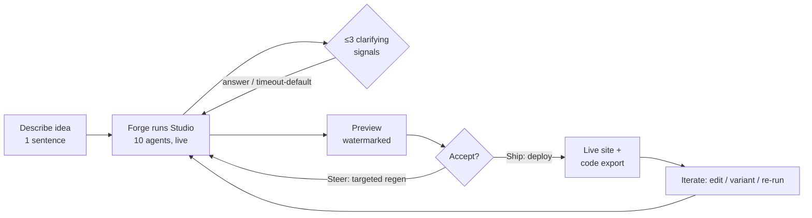
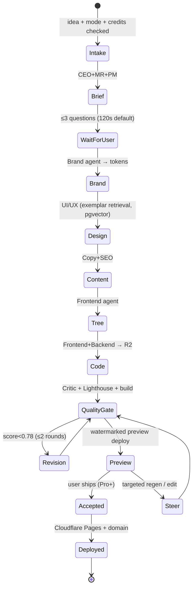

# Product Architecture

### 1. The Job & Core Value Loop

**Job-to-be-done:** *"I have a startup idea and need a website that looks like a funded company built it — without hiring a designer, copywriter, or engineer."* Forge is hired to collapse the 4–8 week, $15k–$50k agency engagement into a **single supervised run of ~8–25 minutes**.

The value loop is a tight `Describe → Watch → Steer → Ship → Iterate` cycle:

The retained-value object is the **Project**: a durable, editable startup-website workspace, not a one-shot artifact. Every regeneration, edit, and deploy accrues to it.

### 2. Product Object Model

Distinct from the *data* entities in the brief, these are the objects a **user reasons about and manipulates** in the UI:

| Product object | What the user sees | Backed by (brief entities) | Mutability |
|---|---|---|---|
| **Project** | The startup workspace (one idea) | `Project` | Renamable, archivable |
| **Generation** | A run timeline with live agent activity | `GenerationRun` + `AgentTask[]` | Immutable once complete; re-runnable |
| **Site** | The previewable/deployable website | `Deployment` + `Code Bundle` | Editable post-gen |
| **Brand** | Editable brand kit (logo, palette, type, voice) | `BrandKit` (tokens) | Directly editable; cascades |
| **Pages & Sections** | Navigable page tree, section blocks | `ContentModel` + `DesignSpec` | Block-level editable |
| **Question card** | Batched clarifying prompts | Temporal signal | Answerable / dismissable |
| **Version** | Named snapshot of the whole Project | `Artifact` versions (pinned) | Restore / fork / compare |
| **Credits** | Remaining run budget | `CreditLedger` + `Subscription` | Consumed per run |

**Object relationships:** `Organization → Project (1:N) → Generation (1:N)`; the latest *accepted* Generation pins one `Brand`, one `Site`, and a `Version`. Editing forks a new `Version` without a full Generation.

### 3. Autonomy Spectrum

Forge defaults to **full-auto** but exposes three explicit modes, all built on the same Temporal Studio workflow:

| Mode | Human role | Checkpoints | Target user |
|---|---|---|---|
| **Autopilot** (default) | Sets idea, walks away | None — clarifying questions auto-default after **120s** timeout | First-time / Free & Pro |
| **Co-pilot** | Reviews at gates | Pauses at **Brand Kit approval** + **pre-deploy preview** | Pro power users |
| **Director** | Steers each phase | Pauses at all 6 artifact handoffs (Brief→Brand→Design→Content→Tree→Code) | Business / agencies |

The mode only changes **how many `WaitForUser` signal-gates are active**; the underlying pipeline is identical, so a run can be promoted mid-flight ("pause and let me review brand").

### 4. Where Clarifying Questions Occur

Questions are **front-loaded and bounded** — never a chat. The CEO+PM agents emit **≤3 batched questions** at exactly two points, surfaced as a Temporal signal → Question Card:

1. **Post-Brief (T+~45s):** scope disambiguation — *audience (B2B/B2C?), one must-have page, tone (bold vs. trustworthy)*.
2. **Optional post-Brand (Co-pilot/Director only):** *pick among 2 candidate logo/palette directions*.

If unanswered within 120s, the Director agent **auto-selects defaults** (logged on the Version) so a run never stalls — satisfying the brief's no-stall guarantee. No questions are asked during code/asset generation.

### 5. Definition of "Done"

A Generation reaches `done` only when it clears the **automated quality gate** (brief §4/§7), not when the LLM stops:

- **Design Critic score ≥ 0.78** on the bespokeness rubric (palette/type/spacing fingerprint uniqueness vs. exemplar corpus, hierarchy, contrast, AI-tell heuristics).
- **Lighthouse:** Performance ≥ 90, Accessibility ≥ 95, SEO ≥ 95.
- **Build gate:** `tsc` typecheck + ESLint + `next build` pass in sandbox; security lint clean.
- **Contrast:** WCAG AA on all text/CTA pairs.

Below threshold → **forced revision loop** (max 2 rounds, brief's bounded-debate rule) routed back to the offending agent, then Director override. The user only ever sees a *passing* site; failures are invisible and consume no extra user-facing credits beyond the run budget.

### 6. Preview / Edit / Iterate / Regenerate Model

**Preview:** Streamed via RSC. During the run, sections render progressively as artifacts complete (live "construction" view). Final preview is a real Cloudflare Pages **preview deploy** of the actual code bundle — WYSIWYG-to-prod, watermarked on Free.

**Three iteration tiers (cheapest first — credit-aligned):**

| Tier | Trigger | Scope | Cost | Mechanism |
|---|---|---|---|---|
| **Direct edit** | Inline UI (text, swap image, recolor) | Single block / token | 0 credits | Mutates `ContentModel`/`BrandKit`; live re-render, no agents |
| **Targeted regen** | "Regenerate this section / rewrite this copy / new hero" | One section or one agent's output | ~10–20% of full run | Sub-workflow re-runs *one* AgentTask against pinned `GenerationContext` |
| **Full re-run** | "Try a different direction" | Whole Project | Full credits | New `Generation`; prior Version preserved for compare/restore |

**Editing model after first generation:** Forge is **structured-edit, not free-canvas**. Edits operate on the typed object model:
- **Brand edits cascade** — recoloring the brand re-derives all component tokens; no orphaned styles (the anti-template guarantee holds post-edit).
- **Content edits are local** — typed per-section, validated against the section schema (e.g., `Hero { eyebrow, headline≤60ch, sub, cta[] }`).
- **Structural edits** (add/remove/reorder pages & sections) manipulate the Component Tree; re-binding to tokens is automatic.
- Every save **forks a Version**; users compare, restore, or fork to A/B variants (Business tier). Direct edits never break the build because the export re-runs the same build gate before any deploy.

### 7. End-to-End Generation Lifecycle

Each transition is a Temporal checkpoint, so a crashed run resumes from the last completed artifact and the live progress UI is driven by workflow queries — making "watch your company get built" the core, trust-building product experience.

