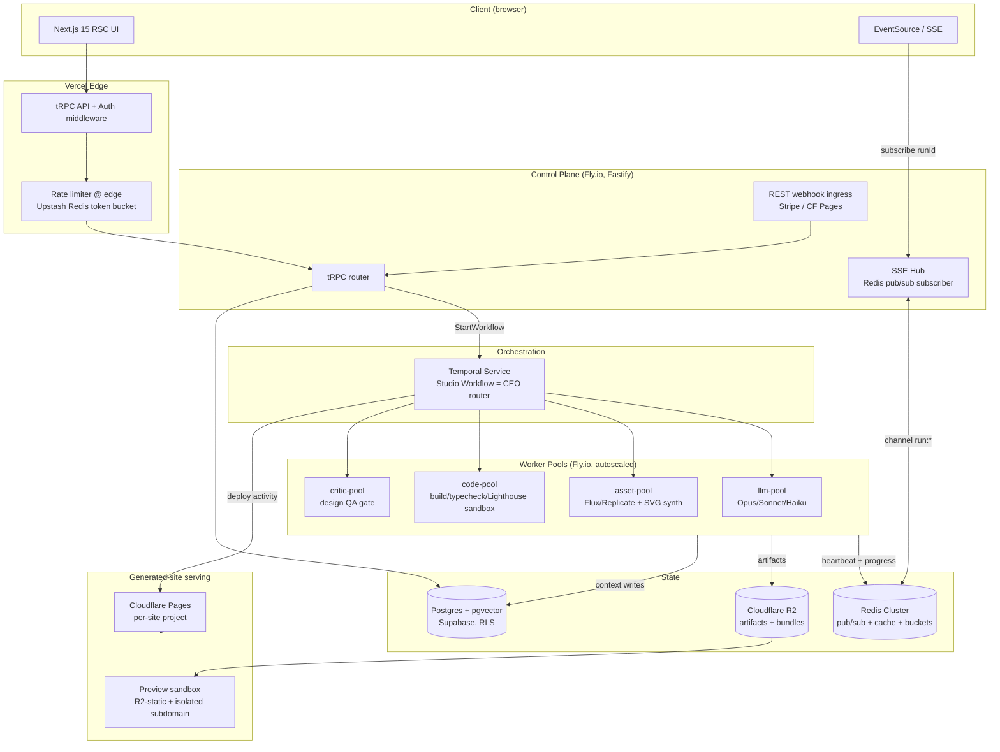

# System Architecture

Forge is two systems wearing one domain: a **low-latency control plane** (Next.js + tRPC, p95 < 200ms) and a **durable generation plane** (Temporal + worker pools) where a single run spans 4–12 minutes, 40–80 LLM calls, 6–15 Flux renders, and $0.40–$2.10 of marginal cost. The control plane never blocks on the generation plane; they communicate through Temporal handles, a Redis fan-out bus, and Postgres as the durable record.

### High-level component diagram

### Request path vs. async job path

| Path | Trigger | Mechanism | Latency target |
|---|---|---|---|
| Sync | CRUD, project list, billing, artifact reads | tRPC → Postgres (RLS) | p95 < 200ms |
| Job kickoff | "Generate site" | tRPC `run.start` → Temporal `StartWorkflowExecution`, returns `runId` immediately | < 400ms |
| Async progress | live run UI | SSE stream keyed by `runId`, fed by Redis pub/sub | < 1s propagation |
| External callbacks | Stripe, CF Pages build done | REST webhook → verify HMAC → Temporal `signalWorkflow` | n/a |

**Why SSE over WebSockets:** generation progress is one-directional server→client; SSE rides plain HTTP/2, survives Vercel edge, auto-reconnects with `Last-Event-ID` for gap-free resume. Bidirectional needs (user answers a clarifying question) go back through tRPC → Temporal signal, not the socket.

### Orchestration & worker pools

The **Studio workflow** is a deterministic Temporal state machine; the CEO agent is the router activity that decides the next stage. Each agent stage is a Temporal **activity** (or child workflow for debate rounds). Pools are separate **task queues** so heterogeneous resources scale independently:

| Pool | Task queue | Concurrency model | Autoscale signal |
|---|---|---|---|
| `llm-pool` | `studio-llm` | 50 activities/worker, bounded by per-tier token budget | Temporal queue backlog + Anthropic 429 rate |
| `asset-pool` | `studio-asset` | 8/worker (Replicate concurrency cap) | Flux queue depth |
| `code-pool` | `studio-code` | 2/worker (each build = isolated Firecracker microVM) | build backlog |
| `critic-pool` | `studio-critic` | 20/worker | inline, low volume |

Activities set **heartbeat timeouts** (LLM 90s, build 240s); a dead worker's activity is rescheduled on another. Debate is a child workflow capped at 2 rounds, then CEO arbitrates — bounded so cost is deterministic.

### Caching layers

| Layer | What | TTL / key | Hit value |
|---|---|---|---|
| Anthropic prompt cache | system + rubric + exemplar prefix | per-run | ~70% input-token discount on multi-call stages |
| Redis semantic cache | brief/brand for near-duplicate ideas (cosine > 0.97 on pgvector) | 7d | skips full strategy stage |
| Exemplar embeddings | curated Stripe/Linear refs | static, warmed | retrieval grounding |
| R2 + CF CDN | rendered Flux assets, site bundles | immutable, content-hashed | dedupe identical hero renders |
| RSC / Next data cache | dashboard reads | tag-invalidated on mutation | sub-200ms UI |

### Rate limiting & cost controls

- **Edge token bucket** (Upstash): per-IP 60 rpm, per-org tiered (Free 5 concurrent runs blocked → 1; Business 20).
- **Credit ledger as the real governor:** `run.start` does an atomic `SELECT ... FOR UPDATE` debit-reservation against `credit_ledger`; insufficient balance → reject before any LLM call. Mid-run, a **budget guard activity** tallies actual token+image spend; on exceeding the reserved cap it signals the workflow to degrade (Sonnet→Haiku) or halt gracefully, refunding the unused reservation.
- **Per-tier model routing** enforced in `llm-pool`: routing/validation on Haiku, bulk copy/SEO on Sonnet, reasoning/code/debate on Opus.
- **Provider 429 backpressure:** worker concurrency throttles on Anthropic/Replicate rate-limit headers, surfacing as queue backlog rather than failed runs.

### Idempotency & job resumption

- Temporal **workflow ID = `run:{generationRunId}`** with reject-duplicate policy — a retried `run.start` (double-click, webhook replay) attaches to the existing run, never forks.
- Every activity is keyed by `(runId, stage, version)`; artifact writes to R2/Postgres are content-addressed and upsert, so replay after worker crash is a no-op, not a duplicate render.
- **Stripe/CF webhooks** are deduped on event ID in a `processed_events` table before signaling.
- Crash recovery is native: Temporal replays event history and resumes from the last completed activity — no custom checkpoint code, no re-running paid LLM stages.

### Multi-tenancy & isolation

- **Org = tenant boundary.** Postgres **RLS** policies key every row on `organization_id`; the JWT carries the active org claim. No cross-tenant read is possible even on a bug in app code.
- R2 keys namespaced `org/{id}/run/{id}/...`; signed URLs scoped per object, 15-min expiry.
- Code builds run in **per-build Firecracker microVMs** (no shared filesystem, no network egress except the package registry mirror) — generated/untrusted code never touches a shared worker.

### Observability

- **Traces:** OpenTelemetry; the Temporal `runId` is the root trace ID. Every activity span carries `agent`, `model`, `tokens_in/out`, `usd_cost`, `attempt`. One run = one waterfall from idea to deploy.
- **Metrics:** Prometheus — per-stage p50/p95 latency, cost/run, credit burn, Design-Critic pass rate, build-gate failure rate, queue depth per pool.
- **Logs:** structured JSON to Loki, correlated by `runId`/`agentTaskId`; agent prompts/outputs persisted as versioned `Artifact` rows for replay and audit.

### Preview sandboxing & serving

- **Preview** (pre-deploy, all tiers): the Code Bundle is built in-sandbox, exported as static output to R2, and served from an **isolated `{runId}.preview.forge.app` subdomain** with a strict CSP and watermark overlay for Free tier. No tenant code executes on Forge's own origin — XSS/script in generated copy is contained to a throwaway subdomain.
- **Publish** (Pro+): a Temporal deploy activity pushes the validated bundle to a **per-site Cloudflare Pages project**, isolated per tenant with its own custom domain — only after typecheck + lint + build + Lighthouse + security-lint all pass the quality gate; any failure routes back to the Frontend/Backend agents, never to the user.

