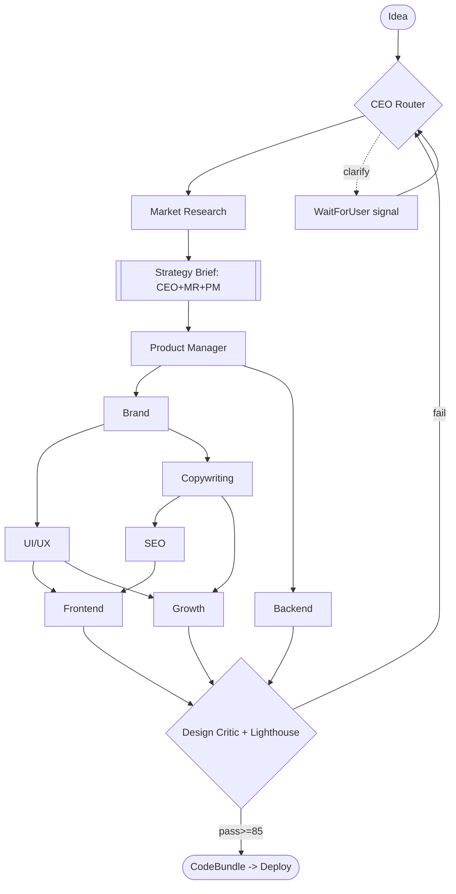

# Agent Architecture

Forge runs **10 specialized agents** as Temporal activities/child-workflows orchestrated by the **CEO agent (router)** inside the durable `StudioWorkflow`. Every agent reads/writes one typed blackboard — the `GenerationContext` — and emits exactly one versioned `Artifact`. Model tier per agent follows the brief's routing (Opus = reason/code, Sonnet = bulk content, Haiku = classify/validate).

### 1. The 10 Agents

| Agent | Tier | Responsibility | Inputs (ctx slice) | Output Artifact | Tools |
|---|---|---|---|---|---|
| **CEO (Orchestrator)** | Opus | Routes the DAG, batches clarifying questions, arbitrates debates, enforces credit budget, final ship/abort. | `idea`, all artifacts | `RunPlan` + `Verdict` | Temporal signals/queries, `creditLedger.check`, `route()` |
| **Product Manager** | Opus | Defines site goals, page set, success metrics; co-owns Strategy Brief; secondary debate arbiter. | `idea`, `MarketReport` | `ProductSpec` (page list, conversion goals) | pgvector (industry patterns), Haiku validator |
| **Market Research** | Sonnet | ICP, competitors, positioning angles, differentiation. | `idea` | `MarketReport` | `WebSearch`, `WebFetch`, pgvector exemplar lookup |
| **Brand** | Opus | Name, SVG logo, color system, type pairing, voice → **design tokens**. | `Brief`, `MarketReport` | `BrandKit` (token JSON + logo.svg) | SVG synth lib, Flux (mood refs), pgvector |
| **Copywriting** | Sonnet | All on-page copy per section, in brand voice. | `BrandKit`, `ProductSpec` | `ContentModel.copy` | Haiku tone-checker, readability lint |
| **UI/UX** | Opus | Layout system, per-section blueprints, motion/spacing rules — references tokens only. | `BrandKit`, `ProductSpec` | `DesignSpec` | pgvector exemplars, token resolver |
| **SEO** | Sonnet | Meta, schema.org JSON-LD, slugs, heading hierarchy, keyword map. | `MarketReport`, `ContentModel.copy` | `ContentModel.seo` | keyword API, schema validator (Haiku) |
| **Frontend** | Opus | Component tree → production Next.js 15 code bound to tokens+content. | `DesignSpec`, `ContentModel` | `CodeBundle` (R2) | shadcn registry, `tsc`, `eslint`, `next build` in sandbox |
| **Backend** | Opus | Backend stubs: forms, contact, newsletter, API routes, env schema. | `ProductSpec`, `ContentModel` | `BackendStubs` (R2) | Fastify scaffolder, `tsc`, security lint |
| **Growth** | Sonnet | Conversion CTAs, analytics events, A/B variant slots, OG/social cards. | `ContentModel`, `DesignSpec` | `GrowthLayer` (events + variants) | OG image gen (Flux/SVG), analytics schema |
| *(virtual)* **Design Critic** | Opus | Quality gate role (not a 10th seat) — scores bespokeness/contrast/AI-tell. | `CodeBundle` render + tokens | `CritiqueScore` | Lighthouse, visual-diff, AI-tell heuristics |

### 2. Orchestration Graph



**Parallelism (Temporal `Promise.all`):**
- After `BrandKit`: **UI/UX ∥ Copywriting** fan out.
- **Backend ∥ (UI/UX→Frontend chain)** — Backend depends only on `ProductSpec`+`ContentModel`, so it runs alongside design.
- **Growth ∥ Frontend** once `DesignSpec`+`copy` exist.
- Critical path ≈ MR → Brief → Brand → UX → FE → Gate (≈6 hops; target wall-clock 4–8 min on Sonnet bulk, ~12 min if 2 revision loops fire).

### 3. Blackboard Contract (`GenerationContext`)

Single typed object, `runId`-keyed, persisted in Postgres (metadata/pointers) + R2 (large blobs). Agents never call each other directly — they read/CAS-write slices.

```ts
interface GenerationContext {
  runId: string; version: number;            // optimistic concurrency
  idea: string; clarifications: QA[];
  brief?: StrategyBrief;  market?: MarketReport;
  product?: ProductSpec;  brandKit?: BrandKit;     // tokens + logo R2 ref
  designSpec?: DesignSpec; content?: ContentModel; // {copy, seo}
  growth?: GrowthLayer;
  codeBundleRef?: R2Ref;  backendRef?: R2Ref;
  critiques: CritiqueScore[]; creditsSpent: number;
}
```

- **Write protocol:** each activity returns a partial; the workflow merges via CAS on `version`. Temporal serializes writes, so no lock contention — determinism preserved on replay.
- **Each artifact is immutable + versioned** (`Artifact` row: `runId, type, version, r2Ref, producedBy`). Revisions append `v+1`; rollback = repoint context.

### 4. Validation Before Handoff

Every artifact passes a **typed gate** before the next agent reads it:
1. **Schema check (Haiku/Zod):** output parses against the artifact's `zod` schema — reject → 1 retry with the validation error injected.
2. **Semantic check:** e.g. `DesignSpec` must reference only token keys that exist in `BrandKit` (no hardcoded hex); `ContentModel.copy` must cover every section in `ProductSpec.pages`.
3. **Build gate (code only):** `tsc --noEmit`, `eslint`, `next build`, security lint run in a **Firecracker/Fly sandbox**; failure routes back to Frontend/Backend (never to the user), max 2 build-fix loops.

### 5. Debate & Consensus

Per the brief: **bounded structured critique, ≤2 rounds**.
- **Trigger:** any artifact where a Critic role scores < rubric threshold (Design ≥85/100; Copy ≥80; Brief ≥80).
- **Flow:** Proposer emits candidate → Critic (Opus, separate prompt) scores against a rubric and emits structured deltas → Proposer revises (round 2) → if still failing, **Director decides**: CEO arbitrates brand/strategy/design; PM arbitrates scope/content. Director's pick is final, logged to `critiques[]`.
- **Veto power:** **Design Critic gate has a hard veto** — nothing below bespokeness/contrast/AI-tell threshold deploys. CEO can veto on budget (credit cap hit → ship best passing artifact or abort to draft).

### 6. Human-in-the-Loop

- CEO collects ambiguities (e.g. "B2B or B2C?", "tone: playful vs. authoritative?") into **≤3 batched questions**, fires a Temporal **`WaitForUser` signal**, workflow parks.
- UI streams questions via workflow **query**; user answer arrives as a signal → resume.
- **Timeout 10 min →** Haiku auto-selects defaults from `MarketReport`, annotates `clarifications` as `auto`, continues. Jobs never stall.

### 7. Checkpointing & Resume

- **Temporal event history is the checkpoint** — every activity completion, signal, and timer is durably logged. A worker crash mid-`Frontend` resumes from the last completed activity (`UI/UX`+`SEO`), replaying deterministic state, **not re-spending credits** on completed agents.
- **Idempotency:** each activity keyed `runId:agent:version`; artifact writes are CAS, so retried activities don't duplicate.
- **Retry policy:** activities `maximumAttempts: 3`, exponential backoff (1s→30s); LLM 429/5xx retried, schema-validation failures retried once with error context, then escalate to debate/Director.
- Users watch live progress via `workflow.query('status')` → streamed to the RSC dashboard; resume is invisible to them.

