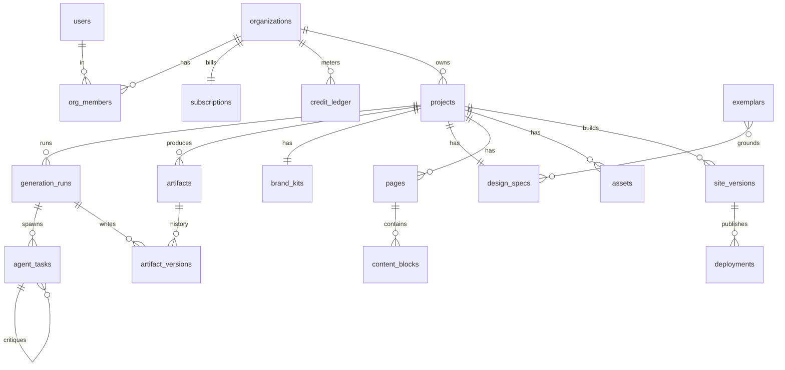

# Database Schema

**DB:** PostgreSQL 15 (Supabase) · extensions `pgcrypto` (UUID v7-ish), `pgvector`, `pg_trgm`. All tenant tables carry `org_id` and are guarded by **RLS** (see end). Money in integer minor units; credits in integer units. Timestamps `timestamptz`. Mutable artifacts use **append-only versioning** (`*_versions`) so a `GenerationRun` is fully reproducible.

### Conventions
- PK: `id uuid PRIMARY KEY DEFAULT gen_random_uuid()`.
- Every row: `created_at timestamptz NOT NULL DEFAULT now()`, plus `updated_at` on mutable tables (trigger-maintained).
- Enums via Postgres `CREATE TYPE` for cheap, indexable state machines.

```sql
-- ===== ENUMS =====
CREATE TYPE plan_tier        AS ENUM ('free','pro','business','scale');
CREATE TYPE run_status       AS ENUM ('queued','running','waiting_user','revising','succeeded','failed','canceled');
CREATE TYPE agent_role       AS ENUM ('ceo','pm','market','brand','copy','seo','uiux','frontend','backend','growth','critic');
CREATE TYPE task_status      AS ENUM ('pending','running','blocked','succeeded','failed','skipped');
CREATE TYPE artifact_kind    AS ENUM ('strategy_brief','brand_kit','design_spec','content_model','component_tree','code_bundle','asset');
CREATE TYPE deploy_status    AS ENUM ('building','live','failed','rolled_back','torn_down');
CREATE TYPE ledger_reason    AS ENUM ('grant_monthly','grant_topup','debit_llm','debit_image','debit_build','refund','adjustment');

-- ===== IDENTITY & TENANCY =====
CREATE TABLE users (              -- mirrors supabase auth.users
  id uuid PRIMARY KEY REFERENCES auth.users(id) ON DELETE CASCADE,
  email citext UNIQUE NOT NULL,
  display_name text, avatar_url text,
  created_at timestamptz NOT NULL DEFAULT now()
);

CREATE TABLE organizations (
  id uuid PRIMARY KEY DEFAULT gen_random_uuid(),
  name text NOT NULL,
  slug citext UNIQUE NOT NULL,
  owner_id uuid NOT NULL REFERENCES users(id),
  stripe_customer_id text UNIQUE,
  created_at timestamptz NOT NULL DEFAULT now(),
  updated_at timestamptz NOT NULL DEFAULT now()
);

CREATE TABLE org_members (
  org_id uuid REFERENCES organizations(id) ON DELETE CASCADE,
  user_id uuid REFERENCES users(id) ON DELETE CASCADE,
  role text NOT NULL DEFAULT 'member',         -- owner|admin|member
  PRIMARY KEY (org_id, user_id)
);

-- ===== PROJECTS & RUNS =====
CREATE TABLE projects (
  id uuid PRIMARY KEY DEFAULT gen_random_uuid(),
  org_id uuid NOT NULL REFERENCES organizations(id) ON DELETE CASCADE,
  created_by uuid NOT NULL REFERENCES users(id),
  idea_prompt text NOT NULL,                    -- the one-sentence input
  industry text,                                -- routes exemplar retrieval
  name text,                                    -- chosen by Brand agent
  status text NOT NULL DEFAULT 'draft',
  current_run_id uuid,                          -- FK added post-creation
  current_version_id uuid,
  created_at timestamptz NOT NULL DEFAULT now(),
  updated_at timestamptz NOT NULL DEFAULT now()
);
CREATE INDEX ON projects (org_id, updated_at DESC);

CREATE TABLE generation_runs (
  id uuid PRIMARY KEY DEFAULT gen_random_uuid(),
  project_id uuid NOT NULL REFERENCES projects(id) ON DELETE CASCADE,
  org_id uuid NOT NULL REFERENCES organizations(id),
  temporal_workflow_id text UNIQUE NOT NULL,    -- durability anchor
  temporal_run_id text,
  status run_status NOT NULL DEFAULT 'queued',
  credit_budget int NOT NULL,                   -- hard cap per run (risk #2)
  credits_spent int NOT NULL DEFAULT 0,
  context jsonb NOT NULL DEFAULT '{}',          -- the typed blackboard (GenerationContext pointer + summary)
  error jsonb,
  started_at timestamptz, finished_at timestamptz,
  created_at timestamptz NOT NULL DEFAULT now()
);
CREATE INDEX ON generation_runs (project_id, created_at DESC);
CREATE INDEX ON generation_runs (status) WHERE status IN ('running','waiting_user','revising');

-- one agent's unit of work (AgentTask) + fine-grained steps
CREATE TABLE agent_tasks (
  id uuid PRIMARY KEY DEFAULT gen_random_uuid(),
  run_id uuid NOT NULL REFERENCES generation_runs(id) ON DELETE CASCADE,
  org_id uuid NOT NULL REFERENCES organizations(id),
  role agent_role NOT NULL,
  status task_status NOT NULL DEFAULT 'pending',
  parent_task_id uuid REFERENCES agent_tasks(id),  -- child workflows / critique
  debate_round smallint NOT NULL DEFAULT 0,        -- max 2 (brief §3)
  model text,                                       -- 'claude-opus-4.x' | sonnet | haiku
  input_tokens int, output_tokens int, credits int NOT NULL DEFAULT 0,
  latency_ms int,
  io jsonb,                                          -- prompt refs, rubric scores
  created_at timestamptz NOT NULL DEFAULT now()
);
CREATE INDEX ON agent_tasks (run_id, role);
```

### Artifacts (versioned blackboard outputs)
A single `artifacts` row is the logical artifact per project+kind; `artifact_versions` is the immutable history each run appends to. Specialized tables denormalize the *current* structured payload for fast querying.

```sql
CREATE TABLE artifacts (
  id uuid PRIMARY KEY DEFAULT gen_random_uuid(),
  project_id uuid NOT NULL REFERENCES projects(id) ON DELETE CASCADE,
  org_id uuid NOT NULL REFERENCES organizations(id),
  kind artifact_kind NOT NULL,
  latest_version int NOT NULL DEFAULT 0,
  UNIQUE (project_id, kind)
);

CREATE TABLE artifact_versions (
  id uuid PRIMARY KEY DEFAULT gen_random_uuid(),
  artifact_id uuid NOT NULL REFERENCES artifacts(id) ON DELETE CASCADE,
  run_id uuid NOT NULL REFERENCES generation_runs(id),
  version int NOT NULL,
  produced_by agent_role NOT NULL,
  payload jsonb NOT NULL,           -- full typed artifact (small/medium)
  r2_key text,                      -- for large blobs (code_bundle, assets)
  quality_score numeric(4,2),       -- Design Critic gate score
  passed_gate boolean,
  UNIQUE (artifact_id, version)
);
CREATE INDEX ON artifact_versions USING gin (payload jsonb_path_ops);

-- BrandKit: design tokens (risk #1: token uniqueness)
CREATE TABLE brand_kits (
  project_id uuid PRIMARY KEY REFERENCES projects(id) ON DELETE CASCADE,
  version_id uuid NOT NULL REFERENCES artifact_versions(id),
  logo_svg text,                    -- SVG, not raster
  tokens jsonb NOT NULL,            -- {color,type,space,radius,shadow,motion}
  voice jsonb,                      -- tone descriptors
  palette_fingerprint text          -- hash to enforce no-two-sites-alike
);

CREATE TABLE design_specs (
  project_id uuid PRIMARY KEY REFERENCES projects(id) ON DELETE CASCADE,
  version_id uuid NOT NULL REFERENCES artifact_versions(id),
  layout jsonb NOT NULL,            -- section blueprints, grid, motion rules
  exemplar_ids uuid[]               -- grounding provenance
);

-- ContentModel decomposed for editability
CREATE TABLE pages (
  id uuid PRIMARY KEY DEFAULT gen_random_uuid(),
  project_id uuid NOT NULL REFERENCES projects(id) ON DELETE CASCADE,
  org_id uuid NOT NULL REFERENCES organizations(id),
  slug text NOT NULL, kind text NOT NULL,         -- landing|pricing|faq|blog...
  seo jsonb,                                       -- title,meta,schema.org
  position int NOT NULL DEFAULT 0,
  UNIQUE (project_id, slug)
);

CREATE TABLE content_blocks (
  id uuid PRIMARY KEY DEFAULT gen_random_uuid(),
  page_id uuid NOT NULL REFERENCES pages(id) ON DELETE CASCADE,
  org_id uuid NOT NULL REFERENCES organizations(id),
  section_type text NOT NULL,                      -- hero|features|cta...
  component_ref text NOT NULL,                     -- owned shadcn component
  props jsonb NOT NULL,                            -- copy + token bindings
  position int NOT NULL DEFAULT 0
);
CREATE INDEX ON content_blocks (page_id, position);

CREATE TABLE assets (                              -- Flux images / SVGs
  id uuid PRIMARY KEY DEFAULT gen_random_uuid(),
  project_id uuid NOT NULL REFERENCES projects(id) ON DELETE CASCADE,
  org_id uuid NOT NULL REFERENCES organizations(id),
  type text NOT NULL,                              -- hero|illustration|logo|icon
  r2_key text NOT NULL, mime text, width int, height int,
  source text,                                     -- 'flux' | 'svg_synth'
  meta jsonb,
  created_at timestamptz NOT NULL DEFAULT now()
);
```

### Site versions, deploys
```sql
CREATE TABLE site_versions (
  id uuid PRIMARY KEY DEFAULT gen_random_uuid(),
  project_id uuid NOT NULL REFERENCES projects(id) ON DELETE CASCADE,
  org_id uuid NOT NULL REFERENCES organizations(id),
  run_id uuid REFERENCES generation_runs(id),
  semver text NOT NULL,                            -- v1, v2 (A/B variants)
  code_bundle_r2_key text NOT NULL,
  lighthouse jsonb,                                -- perf/a11y/seo scores
  gate_passed boolean NOT NULL DEFAULT false,      -- typecheck/lint/build/sec
  created_at timestamptz NOT NULL DEFAULT now()
);

CREATE TABLE deployments (
  id uuid PRIMARY KEY DEFAULT gen_random_uuid(),
  site_version_id uuid NOT NULL REFERENCES site_versions(id),
  project_id uuid NOT NULL REFERENCES projects(id) ON DELETE CASCADE,
  org_id uuid NOT NULL REFERENCES organizations(id),
  provider text NOT NULL DEFAULT 'cloudflare_pages',
  cf_project_name text, deploy_url text, custom_domain citext,
  status deploy_status NOT NULL DEFAULT 'building',
  created_at timestamptz NOT NULL DEFAULT now()
);
CREATE UNIQUE INDEX ON deployments (custom_domain) WHERE custom_domain IS NOT NULL;
```

### Billing, credits, exemplars
```sql
CREATE TABLE subscriptions (
  org_id uuid PRIMARY KEY REFERENCES organizations(id) ON DELETE CASCADE,
  tier plan_tier NOT NULL DEFAULT 'free',
  stripe_subscription_id text UNIQUE,
  stripe_price_id text,
  status text NOT NULL,                            -- active|past_due|canceled
  monthly_credit_grant int NOT NULL DEFAULT 50,
  seats int NOT NULL DEFAULT 1,
  current_period_end timestamptz
);

-- append-only; org balance = SUM(delta)
CREATE TABLE credit_ledger (
  id bigint GENERATED ALWAYS AS IDENTITY PRIMARY KEY,
  org_id uuid NOT NULL REFERENCES organizations(id) ON DELETE CASCADE,
  delta int NOT NULL,                              -- +grant / -debit
  reason ledger_reason NOT NULL,
  run_id uuid REFERENCES generation_runs(id),
  stripe_invoice_id text,
  idempotency_key text UNIQUE,                     -- dedupe webhook/debit
  created_at timestamptz NOT NULL DEFAULT now()
);
CREATE INDEX ON credit_ledger (org_id, created_at DESC);

CREATE TABLE exemplars (
  id uuid PRIMARY KEY DEFAULT gen_random_uuid(),
  industry text NOT NULL, source_url text, label text,
  tokens jsonb,                                    -- distilled design DNA
  embedding vector(1536) NOT NULL                  -- Claude/voyage embeddings
);
CREATE INDEX ON exemplars USING hnsw (embedding vector_cosine_ops);
CREATE INDEX ON exemplars (industry);
```

### ER diagram


### RLS & multi-tenancy
- **Tenant boundary = `org_id`.** Every tenant table denormalizes `org_id` (avoids multi-join RLS predicates → fast policies + simple GIN indexes).
- Pattern: `ALTER TABLE x ENABLE ROW LEVEL SECURITY;` + policy `USING (org_id IN (SELECT org_id FROM org_members WHERE user_id = auth.uid()))`. The membership lookup is wrapped in a `STABLE SECURITY DEFINER` function and cached per-statement.
- **Service role** (Temporal workers, Stripe webhook handler) uses the Supabase service key, bypassing RLS — writes to `generation_runs`, `agent_tasks`, `credit_ledger` happen server-side, never from the browser.
- **Balance integrity:** credit debits run inside the run's DB transaction with the `idempotency_key` unique constraint; a `BEFORE` trigger rejects a debit that would push `SUM(delta)` below the tier floor, enforcing the per-run `credit_budget` cap (risk #2).
- **Tenant deploys** (`deployments`, generated site data) are physically isolated per Cloudflare Pages project; Postgres only stores pointers (`r2_key`, `cf_project_name`), keeping generated-site blobs out of the relational tier.

