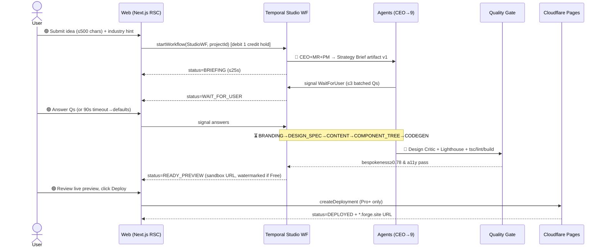
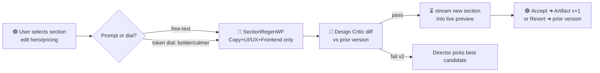
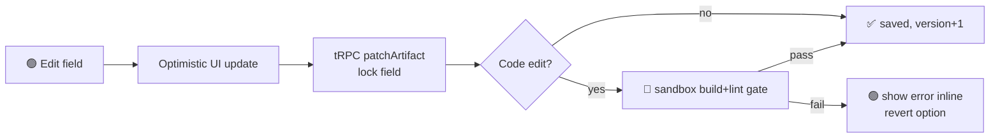
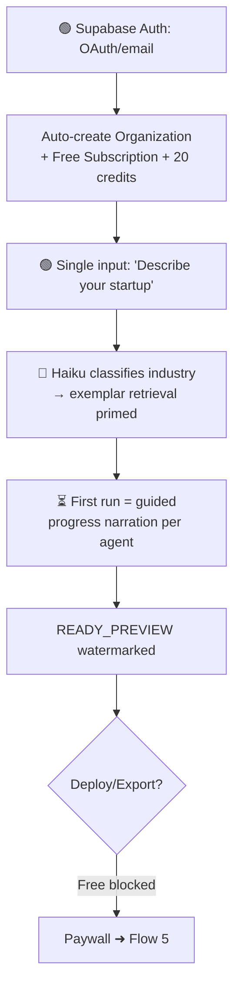
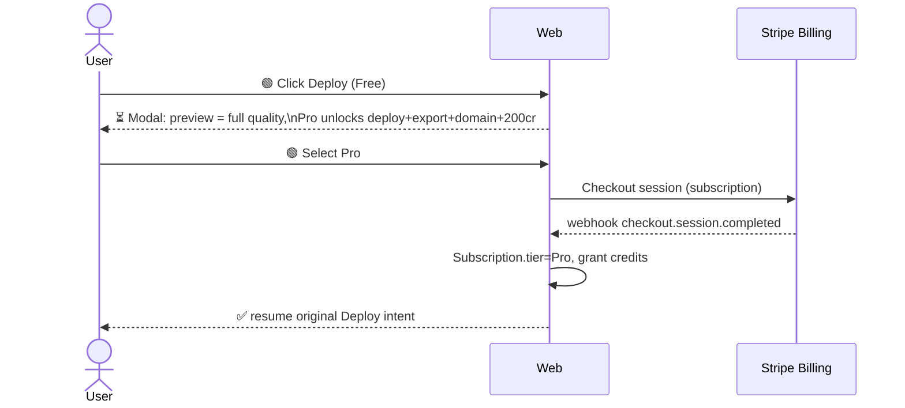
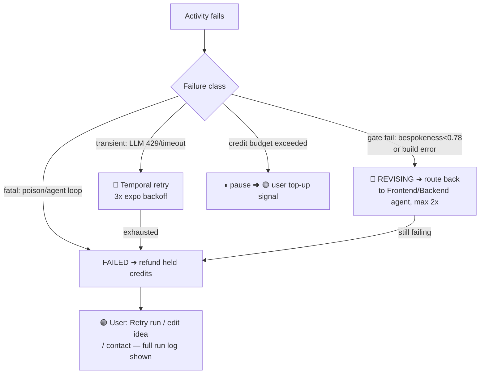

# User Flows

All flows operate against the canonical entity set (`Project`, `GenerationRun`, `AgentTask`, `Artifact`, `Deployment`, `Subscription`, `CreditLedger`) and the **Temporal "Studio" workflow** (CEO-orchestrated state machine). `GenerationRun.status` is the master FSM; the UI subscribes via `workflow.query()` → tRPC subscription → RSC stream. Convention below: 🟢 **user acts**, ⏳ **user waits** (live progress streamed), 🤖 **autonomous**.

### Canonical `GenerationRun.status` FSM

```
QUEUED → BRIEFING → WAIT_FOR_USER → BRANDING → DESIGN_SPEC → CONTENT
       → COMPONENT_TREE → CODEGEN → QUALITY_GATE → READY_PREVIEW
       → DEPLOYING → DEPLOYED
   �‹ FAILED / RETRYING (from any state) · REVISING (gate/iteration loop)
```

---

### Flow 1 — Golden Path: Idea → Deploy



| Stage | Wait/Act | Latency budget | Credits |
|---|---|---|---|
| Brief + clarifying | 🟢 act once | ~25s + answer | 0 (held) |
| Brand→Code | ⏳ wait | 90–180s streamed | 8–15 |
| Quality gate | ⏳ wait | 20–40s | 1 |
| Review | 🟢 act | user-paced | 0 |
| Deploy | 🟢 act → ⏳ | 30–60s | 1 (Pro+) |

**Key decision:** credit is **held** at start, **committed** only on `READY_PREVIEW`; a `FAILED` run before gate refunds the hold to `CreditLedger`. User never pays for a broken run.

---

### Flow 2 — Section Regeneration / Iteration Loop

Scoped re-run: only the targeted section's `AgentTask` subtree re-executes via a Temporal **child workflow**, reusing the existing `GenerationContext` blackboard so brand tokens stay locked (no palette drift).



- **State:** parent `GenerationRun` stays `DEPLOYED`/`READY_PREVIEW`; child run = `REVISING`. New `Artifact` row, `version=n+1`, `parent_version` set — full version tree retained for one-click revert.
- **Cost:** 2–4 credits (section-only, not full run). Max 2 debate rounds enforced.
- **User:** 🟢 trigger + accept; ⏳ waits ~20–40s.

---

### Flow 3 — Manual Override / Direct Edit

User bypasses agents to hand-edit an artifact (copy string, hex token, swap logo SVG). Edits write directly to the typed artifact JSON and **pin** the field so future regenerations don't overwrite it.

| Artifact | Editor surface | Persistence |
|---|---|---|
| ContentModel | inline rich-text on preview | patch JSON, `field.locked=true` |
| BrandKit token | color/type picker | token override, re-derives dependent CSS vars |
| Logo (SVG) | upload or SVG code edit | replaces asset in R2, bumps version |
| Code Bundle | Monaco diff (Business+) | branch in R2, re-runs build gate only |



**Decision:** locked fields are excluded from agent write-scope on subsequent runs (merge policy: user-pin > agent output). Editing code re-runs **only** the security/build gate, never the design critic.

---

### Flow 4 — Onboarding & First-Run



- **No empty dashboard.** First screen is the idea box; org/credits provisioned silently. Time-to-first-preview is the activation metric (<3 min target).
- First run shows **per-agent narration** ("Brand agent chose Söhne + cobalt because…") to build trust; suppressible on later runs.

---

### Flow 5 — Upgrade / Paywall Moment

Paywall fires at **intent-to-extract** (Deploy/Export/custom-domain), not at signup — the user has already seen Stripe-quality output.



| Trigger | Gate | Upsell |
|---|---|---|
| Deploy / Export | Free → Pro | $/mo + 200 credits |
| Credits exhausted mid-run | hold fails | top-up or upgrade tier |
| A/B variants, API | Pro → Business | seats + concurrency |

**Decision:** the blocked action is **stashed** and auto-resumed post-`checkout.session.completed` webhook — no re-navigation. Watermark removed on tier flip without re-generation.

---

### Flow 6 — Failure / Retry Path

Temporal owns durability: each activity is checkpointed, so a worker crash resumes from the last completed `AgentTask` — invisible to the user.



- **User never sees raw stack traces or broken code** — gate failures loop back to agents autonomously; only terminal `FAILED` surfaces, with a plain-language cause and one-click **Retry** (re-runs from `QUEUED`, reusing prior valid artifacts via blackboard).
- **State:** `GenerationRun.failure_reason` + `last_completed_activity` persisted for resumable retry. Credit hold auto-refunded on `FAILED` before commit.
- **Wait/act:** ⏳ during all auto-retry/revision; 🟢 only on budget top-up or terminal retry decision.

