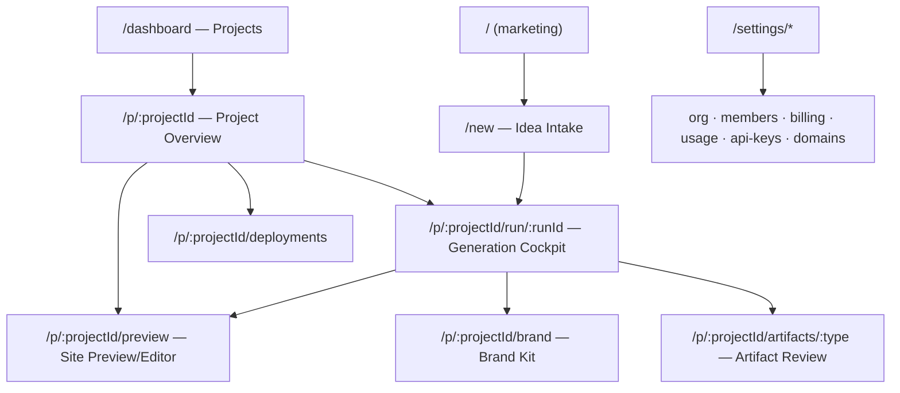

# UI/UX Structure

The Forge platform UI is a **Next.js 15 App Router** application: marketing routes are statically rendered at the edge (Vercel), authenticated app routes are RSC-streamed, and the live generation surface is driven by a persistent transport (Temporal workflow query → SSE) hydrating client islands. The platform's own UI is held to the same Stripe/Linear bar we demand of generated sites — it is the first proof of the product.

### Information Architecture & Route Map

| Route | Auth | Render | Purpose | Key states |
|---|---|---|---|---|
| `/` `/pricing` `/showcase` | public | SSG/edge | Conversion; live showcase of generated sites | — |
| `/new` | required | RSC + client form | Idea intake → starts `GenerationRun` | empty, validating, submitting |
| `/dashboard` | required | RSC stream | Project grid, run status chips, credit meter | empty (0 projects), loading skeletons |
| `/p/:id` | required | RSC | Project overview: artifacts, history, deployments | — |
| `/p/:id/run/:runId` | required | client + SSE | **Generation Cockpit** (the hero screen) | connecting, running, paused (WaitForUser), failed, complete |
| `/p/:id/preview` | required | iframe + RSC | Live site preview + in-context editor | building, ready, diff-pending |
| `/p/:id/brand` | required | RSC | Brand Kit: tokens, logo SVG, type, voice | locked (Free), editable (Pro+) |
| `/p/:id/artifacts/:type` | required | RSC | Versioned artifact diff/approve | needs-review, approved, superseded |
| `/p/:id/deployments` | required | RSC + REST poll | Cloudflare Pages deploy log, domains | none, building, live, failed |
| `/settings/billing` | required | RSC | Stripe portal, tier, usage credits | — |

URL convention: `/p/:projectId` for project scope; runs are nested (`/run/:runId`) so a crashed run is deep-linkable and resumes via Temporal `describeWorkflowExecution`.

### The Generation Cockpit (primary screen)

Three-pane layout, 1440px reference grid: **left rail (280px)** agent roster, **center (fluid)** live artifact stream, **right rail (360px)** inspector/diff. The cockpit subscribes to one SSE channel keyed by `runId`; events are typed `{type, agent, runId, taskId, payload, ts}` and reduce into a client store (Zustand).

- **Agent roster (left):** 10 agents as status rows (CEO, PM, Market Research, Brand, Copy, UI/UX, Frontend, Backend, SEO, Growth). Each shows live state: `queued · thinking · debating · waiting · done · error`, an animated token-throughput sparkline, and elapsed time. The active agent pulses; debate rounds render a paired "Critic ⇄ Director" badge.
- **Activity stream (center):** reverse-chronological event cards with 120ms staggered entrance. Card types: `reasoning` (streamed thinking, collapsible), `artifact-emitted` (rich preview), `debate` (candidate A vs B with rubric scores 0–100), `quality-gate` (pass/fail with contrast/Lighthouse/AI-tell sub-scores), `signal-request` (the WaitForUser prompt). Auto-scroll with a "jump to live" pill when the user scrolls up.
- **Pipeline progress (top):** a horizontal stepper for the 8 canonical artifacts (Brief → Brand Kit → Design Spec → Content Model → Component Tree → Code → Quality Gate → Deploy) with per-step % and a global ETA derived from historical run medians.
- **Human-in-the-loop:** when the workflow hits `WaitForUser`, a non-blocking but prominent modal-sheet surfaces ≤3 batched questions with smart defaults pre-selected and a countdown ("auto-continues in 4:00"); answering sends a Temporal signal via tRPC mutation.

### Artifact Review / Approve UX

Each `Artifact` is versioned; the review surface is a **split diff** (previous version ⇄ candidate) tailored per type: Brand Kit shows swatch/type/logo diffs; Content Model shows field-level text diff; Code Bundle shows a Monaco file-tree diff. Actions: **Approve**, **Request changes** (free-text → routed back to the owning agent as a revision signal, bounded to the 2-round debate cap), **Revert to v(n)**. Approvals are optional in autonomous mode (defaults auto-approve on timeout) but gate deploy on Pro+.

### In-Context Editing UX (Preview/Editor)

The generated site renders in a sandboxed iframe (the R2 bundle served from a preview origin). A Framer-style overlay enables **click-to-select** any section → the right inspector binds to that node's tokens + content. Edits are token/content mutations (never raw CSS), preserving the anti-generic guarantee: changing a color edits the `BrandKit` token, re-themes globally, and writes a new `ContentModel`/`BrandKit` version. A "Regenerate this section" button re-invokes the relevant agent for that node only. Responsive toggle (desktop/tablet/mobile) and a per-edit undo stack backed by artifact versions.

### Navigation Model

- **Global top bar:** org/project switcher (⌘K command palette — Linear-style, fuzzy over projects/artifacts/actions), credit-balance meter, run-status indicator, avatar menu.
- **Project-scoped left nav** (inside `/p/:id`): Overview · Cockpit · Preview · Brand · Artifacts · Deployments.
- **Command palette** is the power-user spine: "New project", "Re-run from Design Spec", "Deploy", "Open brand tokens".

### Empty / Loading / Error States

| Surface | Empty | Loading | Error |
|---|---|---|---|
| Dashboard | Illustrated CTA → `/new`, sample showcase | Skeleton grid (6 cards) | Retry banner + last-known cache |
| Cockpit | "Igniting the forge…" pre-first-event | Per-agent shimmer rows, streamed tokens | Failed step card with "Resume run" (Temporal retry) — never raw stack traces |
| Preview | "Build in progress" with stepper | iframe skeleton + progress | Build-failed → routes to Frontend agent, user sees "fixing automatically" |
| Billing | Free-tier upsell | — | Stripe webhook lag toast |

### Design Language (platform itself)

- **Tokens:** Tailwind + CSS vars. Base radius `10px`; spacing scale `4/8/12/16/24/32/48`; type via **Inter** (UI) + **Geist Mono** (code/metrics). Neutral-forward dark-first palette (`#0B0C0E` bg, `#E6E8EB` fg) with a single electric accent (`#FF5A1F` — "forge ember").
- **Motion:** 120–180ms ease-out for entrances; agent pulses use a 1.2s breathing loop; respects `prefers-reduced-motion`. No gratuitous animation — motion signals state change only.
- **Components built on shadcn/ui (owned source)**, never a locked dependency.

### Component Inventory

| Domain | Components |
|---|---|
| Shell | `TopBar`, `OrgProjectSwitcher`, `CommandPalette`, `ProjectNav`, `CreditMeter`, `RunStatusPill` |
| Cockpit | `AgentRoster`, `AgentStatusRow`, `TokenSparkline`, `PipelineStepper`, `ActivityStream`, `EventCard` (reasoning/artifact/debate/gate variants), `DebatePanel`, `QualityGateCard`, `SignalRequestSheet`, `JumpToLivePill` |
| Artifacts | `ArtifactDiff`, `BrandKitDiff`, `ContentDiff`, `CodeDiff` (Monaco), `VersionTimeline`, `ApproveBar` |
| Preview/Editor | `PreviewFrame`, `SelectionOverlay`, `TokenInspector`, `ContentInspector`, `ResponsiveToggle`, `RegenerateSectionButton`, `UndoStack` |
| Brand | `PaletteGrid`, `TypePairingCard`, `LogoSVGViewer`, `VoiceCard`, `TokenTable` |
| Billing | `TierCard`, `UsageGraph`, `CreditLedgerTable`, `StripePortalButton` |
| Primitives | shadcn-derived `Button`, `Sheet`, `Dialog`, `Tooltip`, `Skeleton`, `Toast`, `Tabs`, `ScrollArea` |

