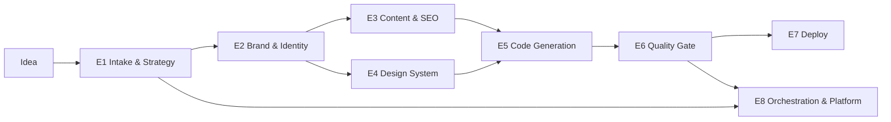

# Feature Breakdown

Organized into 8 epics. Owning agents map to the 10-agent roster (CEO, Market Research, PM, Brand, Copywriting, SEO, UI/UX, Frontend, Backend, Growth) plus the **Design Critic** quality role. Artifacts are versioned rows in the `Artifact` table (type-discriminated, R2-backed for blobs). All acceptance criteria are machine-checkable so the automated quality gate can enforce them.

### Epic 1 — Idea Intake & Strategy

| Feature | Owner | Artifact | Acceptance Criteria | MoSCoW |
|---|---|---|---|---|
| Parse plain-English idea into typed `IdeaSpec` (industry, ICP, problem, business model) | CEO (Haiku classify → Opus) | `Artifact:idea_spec` | Valid JSON schema; industry classified to 1 of ~40 NAICS-derived buckets; confidence ≥0.7 or triggers clarifier | **Must** |
| Batched clarifying questions (≤3) via Temporal `WaitForUser` signal | CEO | signal payload on `GenerationRun` | Workflow pauses ≤3 Qs; auto-defaults applied after 10-min timeout; resumes deterministically | **Must** |
| Market research: TAM/competitor/positioning synthesis | Market Research (Sonnet + WebSearch) | `Artifact:market_brief` | ≥3 named competitors, ≥2 differentiation angles, sourced positioning statement | **Should** |
| Audience/ICP definition (persona, jobs-to-be-done, tone targets) | PM | `Artifact:audience_profile` | ≥1 primary persona with pains/gains; feeds tone tokens into Brand Kit | **Must** |
| Strategy Brief assembly (value props, site goals, page list) | CEO + PM (Director arbitration) | `Artifact:strategy_brief` | Locks required page set; ≥3 value props; passes PM rubric ≥7/10 | **Must** |
| Live web competitive screenshot exemplar pull | Market Research | exemplar refs | Could be deferred; uses pgvector `Exemplar` instead for MVP | **Could** |

### Epic 2 — Brand & Identity

| Feature | Owner | Artifact | Acceptance Criteria | MoSCoW |
|---|---|---|---|---|
| Startup name generation + availability heuristic | Brand (Opus) | `BrandKit.name` | 3 candidates scored; chosen name ≤2 words preferred; .com-style heuristic check | **Must** |
| Logo concept as **crisp SVG** (programmatic synthesis, not raster) | Brand | `BrandKit.logo_svg` | Valid SVG, renders ≤1 viewBox, monochrome + color variants, ≤8KB | **Must** |
| Color system → design tokens (HSL ramps, semantic roles) | Brand | `BrandKit.tokens.color` | WCAG AA contrast on text/bg pairs; ≥9-step ramp per hue; unique palette fingerprint (not in last-N dedupe cache) | **Must** |
| Type pairing (display + body) from curated foundry set | Brand | `BrandKit.tokens.type` | 2 families, modular scale (1.2–1.333 ratio), variable-font where available | **Must** |
| Brand voice + messaging pillars | Brand + Copywriting | `BrandKit.voice` | 3 tone attributes, do/don't examples; consumed by Copy agent | **Should** |
| Full brand identity sheet (spacing, radius, elevation, motion tokens) | Brand | `BrandKit.tokens.*` | Complete token set validates against `BrandKitSchema`; no hardcoded styles downstream | **Must** |

### Epic 3 — Content & SEO

| Feature | Owner | Artifact | Acceptance Criteria | MoSCoW |
|---|---|---|---|---|
| Typed content model per page/section | Copywriting (Sonnet) | `ContentModel` | Every section slot filled; validates against page schema; no lorem-ipsum/placeholder strings | **Must** |
| Marketing copy (hero, value props, CTAs, social proof) | Copywriting | `ContentModel.landing` | Hero ≤12 words; ≥2 CTAs; reading grade ≤9; on-brand voice check passes | **Must** |
| Page content: Product, Pricing, Contact, FAQ | Copywriting | `ContentModel.{product,pricing,contact,faq}` | Pricing ≥2 tiers w/ feature matrix; FAQ ≥6 Q&A; Contact form schema defined | **Must** |
| SEO metadata + schema.org JSON-LD per page | SEO (Sonnet) | `ContentModel.meta` | Unique title ≤60ch + desc ≤155ch per page; valid Organization/FAQPage JSON-LD; canonical URLs | **Must** |
| Blog content (3 seed posts, keyword-targeted) | SEO + Copywriting | `ContentModel.blog[]` | ≥3 posts ≥600 words, internal links, target keyword in H1/meta | **Should** |
| Hero/section imagery via Flux (Replicate) | UI/UX | R2 image assets | Industry-appropriate, ≥1200px, brand-color-coherent; alt text generated | **Should** |
| Programmatic SVG graphics/icons (non-logo) | Brand/UI/UX | SVG asset set | Stroke/fill bound to tokens; ≤10KB each | **Could** |

### Epic 4 — Design System & UI/UX

| Feature | Owner | Artifact | Acceptance Criteria | MoSCoW |
|---|---|---|---|---|
| Layout system + section blueprints per page | UI/UX (Opus) | `DesignSpec.layout` | References tokens only; responsive grid spec; ≥5 distinct section archetypes | **Must** |
| Exemplar retrieval grounding (pgvector, industry-scoped) | UI/UX | retrieved `Exemplar[]` | Top-k=5 by cosine on industry+style embedding; influences layout choice (logged) | **Must** |
| Motion/interaction rules (scroll, hover, transitions) | UI/UX | `DesignSpec.motion` | Reduced-motion fallback defined; durations/easing as tokens | **Should** |
| Component tree composition bound to content+tokens | Frontend | `Artifact:component_tree` | Every node maps to owned shadcn primitive + content slot; no orphan content | **Must** |
| Dark mode / theme variants | UI/UX | `DesignSpec.themes` | Token-swapped; AA contrast both modes | **Could** |

### Epic 5 — Code Generation

| Feature | Owner | Artifact | Acceptance Criteria | MoSCoW |
|---|---|---|---|---|
| Production Next.js 15 (App Router) project synthesis | Frontend (Opus) | `Artifact:code_bundle` (R2) | `tsc --noEmit` passes; `next build` succeeds; Tailwind tokens wired | **Must** |
| Component code from tree (owned shadcn/ui source) | Frontend | code_bundle `/components` | RSC where static; no unused imports; lint clean (eslint 0 errors) | **Must** |
| Backend architecture stubs (API routes, form handlers, contact/email) | Backend | code_bundle `/app/api` + schema | Typed handlers; contact form → email/webhook stub; env-var manifest | **Should** |
| Data model / DB schema for site-specific entities | Backend | `schema.sql` | Valid Postgres DDL; only if idea implies app data | **Could** |
| Sitemap.xml + robots.txt + OG image generation | SEO/Frontend | bundle static | Valid sitemap; OG image per page | **Should** |

### Epic 6 — Quality Gate (anti-generic enforcement)

| Feature | Owner | Artifact | Acceptance Criteria | MoSCoW |
|---|---|---|---|---|
| Design Critic bespokeness scoring vs rubric | Design Critic (Opus) | `Artifact:critic_report` | Scores bespokeness/hierarchy/contrast/AI-tell each 0–10; <7 → forced revision loop (max 2) | **Must** |
| Lighthouse + visual-diff automated check | Platform CI | gate result | Perf ≥90, A11y ≥95, SEO ≥95; below → route back to Frontend | **Must** |
| Sandboxed build + security lint | Backend/Platform | gate result | Isolated container; `npm audit` no high/critical; semgrep clean; failures never surface to user | **Must** |
| Token-uniqueness dedupe check | Platform | gate result | Palette+type+spacing hash not within Hamming threshold of last 500 runs | **Should** |

### Epic 7 — Deployment

| Feature | Owner | Artifact | Acceptance Criteria | MoSCoW |
|---|---|---|---|---|
| Deploy generated site to Cloudflare Pages (per-tenant project) | Backend | `Deployment` | Live URL ≤90s post-gate; isolated CF project; status tracked | **Must** |
| Custom domain binding (Pro+) | Backend | `Deployment.domain` | DNS/CNAME instructions + verification; SSL provisioned | **Should** |
| Code export (zip from R2) | Backend | signed R2 URL | Pro+ gated; runs `npm install && build` clean | **Must** |
| Watermarked free-tier preview (no deploy/export) | Platform | preview render | Free tier blocked from deploy/export; visible watermark | **Must** |

### Epic 8 — Orchestration & Platform

| Feature | Owner | Artifact | Acceptance Criteria | MoSCoW |
|---|---|---|---|---|
| Temporal "Studio" workflow (CEO router → 9 activities) | Platform | `GenerationRun` | Every step checkpointed; crash resumes from last activity; deterministic replay | **Must** |
| Typed blackboard `GenerationContext` (Postgres + R2) | Platform | `GenerationContext` | Single source of truth; all agents read/write versioned artifacts | **Must** |
| Structured debate (Critic + Director, max 2 rounds) | CEO/PM | critique rounds | Bounded ≤2 rounds then Director decides; logged scores | **Must** |
| Live progress streaming (workflow query → UI) | Platform | SSE/RSC stream | Per-activity status to UI ≤2s latency | **Must** |
| Per-tier model routing + credit budget cap per run | Platform | `CreditLedger` | Opus/Sonnet/Haiku routed by task; run aborts at credit cap; debit logged | **Must** |
| Stripe billing (tiers + metered usage) | Growth/Platform | `Subscription` | Free/Pro/Business/Scale gates enforced; usage metering on credits | **Should** |
| Concurrency: 1000s of runs (Fly.io worker pool + priority queue) | Platform | infra | Business tier priority queue; horizontal worker scaling | **Should** |
| A/B site variants | Growth | `Artifact` variants | Business+ gated; 2 variants per run | **Won't (MVP)** |
| Multi-seat org / API access / white-label | Platform | `Organization` | Deferred post-MVP | **Won't (MVP)** |

