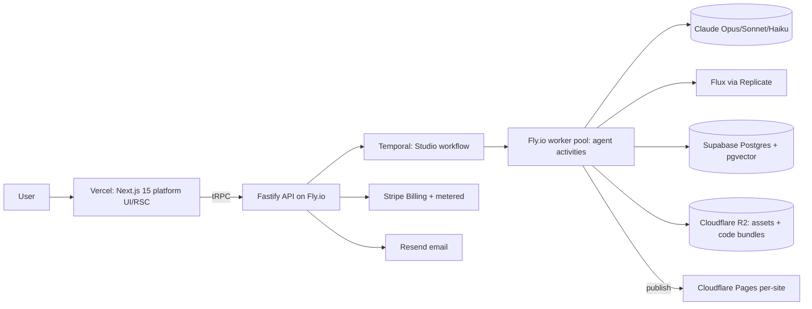

# Technical Stack Recommendations

This expands the Canonical Decision Brief into a fully-justified stack. Every canonical choice is preserved; alternatives are shown only to explain *why we didn't pick them*. Two distinct surfaces exist — the **Platform** (Forge itself) and the **Generated Sites** (tenant output) — and they have deliberately different stacks.

### System topology

### Layer-by-layer comparison

| Layer | Chosen | Alternatives (why not) |
|---|---|---|
| Platform frontend | **Next.js 15 App Router** | Remix (smaller RSC streaming story); SvelteKit (off-ecosystem from generated sites); Astro (weak for highly-interactive job dashboards). |
| Styling | **Tailwind + design tokens** | CSS Modules (no token-to-theme mapping); Chakra/MUI (runtime cost, opinionated look fights bespokeness). |
| Components (platform) | **shadcn/ui (owned source)** | Radix-only (more wiring); MUI (locked dep, can't fork). Owning source lets the Frontend agent emit the *same* primitives into tenant code. |
| Backend runtime | **Node 20 + Fastify** | NestJS (DI overhead); Express (~2x slower, no schema); Go/Bun (breaks shared-types story). Fastify ~45–70k req/s, JSON-schema validation built in. |
| API style | **tRPC internal + REST webhooks** | GraphQL (resolver/N+1 complexity, no end-to-end TS inference); gRPC (browser friction). REST reserved for Stripe + Cloudflare deploy callbacks. |
| Orchestration | **Temporal** | BullMQ/Redis (no durable multi-hour replay); Inngest (good but less control over signals/child-workflows); AWS Step Functions (vendor lock, weak local dev). Temporal gives checkpoint/resume + signals for HITL. |
| Primary DB | **PostgreSQL (Supabase)** | PlanetScale/MySQL (no pgvector, weaker JSONB); Mongo (loses relational integrity across 13 entities); Firestore (poor analytics joins). |
| Vector/search | **pgvector (HNSW)** | Pinecone/Weaviate (second datastore + egress + sync drift). At <5M exemplar vectors pgvector HNSW is sub-20ms — no separate store earns its keep. |
| Object storage | **Cloudflare R2** | S3 (egress fees kill per-site bundle + asset serving); GCS (egress). R2 zero-egress + native Pages/Workers binding. |
| Auth | **Supabase Auth** | Clerk/Auth0 (extra vendor + cost, RLS integration weaker). Bundled with DB enables row-level tenant isolation directly. |
| Payments | **Stripe Billing + metered usage** | Paddle/Lemon Squeezy (MoR simplifies tax but weaker metered-usage + credit primitives). Stripe meters map 1:1 to `CreditLedger`. |
| Image gen | **Flux (Replicate) + programmatic SVG** | DALL·E/Midjourney (no API/SLA control); raster logos (blurry at scale). SVG logos stay crisp and editable as tokens. |
| Email | **Resend** | SendGrid/SES (clunky DX, raw SES needs reputation mgmt). Resend + React Email renders branded transactional mail with shared components. |
| Analytics | **PostHog (self-host on Fly) + Vercel Web Analytics** | Mixpanel/Amplitude (cost at event volume); GA4 (privacy + poor product analytics). PostHog covers funnels, session replay, and feature flags for tier gating. |
| CI/CD | **GitHub Actions + Turborepo** | CircleCI/Jenkins (heavier). Turborepo remote cache keeps the monorepo (platform + agent pkgs + shared types) builds fast. |
| IaC | **Terraform + Fly/Cloudflare/Supabase providers** | Pulumi (TS is nice but smaller provider coverage for Fly); manual console (non-reproducible). Temporal namespaces, R2 buckets, Fly apps all codified. |
| Hosting — platform | **Vercel (UI) + Fly.io (Fastify/Temporal workers)** | All-Vercel (no long-running stateful workers, 60–300s function caps); all-Fly (loses edge RSC). Split matches workload shape. |
| Hosting — generated sites | **Cloudflare Pages per project** | Vercel per-tenant (cost + project-limit ceilings); Netlify (pricier at scale). Pages gives isolated projects, custom domains, free SSL, global edge. |

### LLM routing by task tier (the cost lever)

Per-run LLM spend is the dominant marginal cost, so route aggressively. Approximate 2026 pricing: Haiku ~$0.80/$4, Sonnet ~$3/$15, Opus ~$15/$75 per Mtok (in/out).

| Task | Tier | Model | Why |
|---|---|---|---|
| CEO orchestration, debate arbitration, backend/frontend code | Frontier | **Opus 4.x** | Reasoning + correct code justify cost; ~10–15% of token volume. |
| Marketing copy, SEO content, page drafts, brand voice | Bulk | **Sonnet 4.x** | 5x cheaper than Opus; quality sufficient with good prompts + exemplars. |
| Intent classification, input extraction, schema/JSON validation, routing, content-model field fills | Cheap | **Haiku 4.x** | ~18x cheaper than Opus; high-volume, low-judgment. |

Cost-control rules:
- **Default to the cheapest tier; escalate only on Critic failure.** A Sonnet draft that fails the Design Critic gate retries once on Sonnet, then escalates to Opus — not the reverse.
- **Prompt caching** on the system prompt + `GenerationContext` blackboard (large, stable per run) cuts input cost ~90% across an agent's calls.
- **Batch Haiku validation/extraction** calls where latency-insensitive (50% discount).
- **`CreditLedger` enforces a hard per-run token/$ ceiling** (Brief risk #2); the workflow halts and signals the user rather than overrunning budget.
- **Flux**: generate hero imagery once, cache derivatives in R2; never re-render on revision unless tokens (palette/subject) change.

### Generated-site stack (tenant output)

Emitted sites use a deliberately lean, edge-deployable subset so they are cheap to host and dependency-light:

| Concern | Choice |
|---|---|
| Framework | **Next.js 15 static export / RSC** (same ecosystem; Frontend agent reuses owned shadcn primitives) |
| Styling | **Tailwind compiled with the site's unique token set** (no two sites share palette/type/spacing) |
| Assets | Flux raster + synthesized **SVG logos/icons**, served from R2/Pages |
| Backend stubs | Fastify route handlers / Cloudflare Workers for forms + contact |
| Deploy | **Cloudflare Pages project per site**, custom domain via Cloudflare for SaaS |
| Quality gate (pre-publish) | typecheck → ESLint → `next build` → Lighthouse (perf/a11y/SEO ≥90) → visual-diff + Design Critic bespokeness score; failures route back to agents, never to the user (Brief risk #3) |

### Why this stack holds at scale

- **One language (TypeScript) end to end** — shared types flow from Postgres → tRPC → agents → emitted site code, eliminating a whole class of contract bugs.
- **Stateless edge (Vercel) + durable stateful core (Temporal on Fly)** scales the two workloads independently to thousands of concurrent runs.
- **Zero-egress R2 + per-tenant Pages** keeps the marginal hosting cost of each generated site near zero, protecting margin under the credit model.

