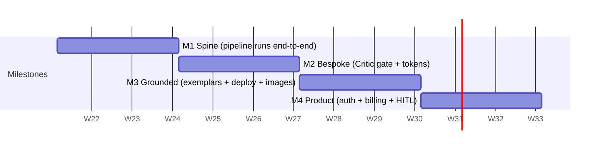

# MVP Roadmap

### MVP Thesis

> **The smallest thing that proves "idea → genuinely good custom website" is a single durable Temporal run that takes one plain-English idea and emits ONE deployed, multi-page Next.js site that a skeptic cannot distinguish from a hand-built Stripe/Linear-class landing page — passing a hard Design Critic gate.**

We prove *quality and autonomy first*, scale and monetization second. The wedge is **bespokeness, not breadth**: better to ship 1 industry vertical that looks bespoke than 10 verticals that look templated. If the Critic gate + token-uniqueness loop works, the company is real; everything else (multi-tenant, billing, A/B, API) is execution.

**Explicit non-goals for the entire MVP:** no white-label, no API access, no multi-seat orgs, no A/B variants, no custom domains, no blog CMS, no backend-app generation (marketing site only — backend agent emits *stubs/schema*, not a running app).

---

### The 22 Capabilities — MVP Mapping

We bucket the 22 platform capabilities into in-scope (✓), thin-version (◐), deferred (✗):

| # | Capability | M1 | M2 | M3 | M4 |
|---|---|---|---|---|---|
| 1 | Idea intake / NL parsing | ✓ | ✓ | ✓ | ✓ |
| 2 | Strategy Brief (ICP/positioning) | ◐ | ✓ | ✓ | ✓ |
| 3 | Market Research grounding | ✗ | ◐ | ✓ | ✓ |
| 4 | Brand Kit (name/voice/color/type) | ◐ | ✓ | ✓ | ✓ |
| 5 | Logo synthesis (SVG) | ✗ | ◐ | ✓ | ✓ |
| 6 | Design Spec (layout/sections/motion) | ◐ | ✓ | ✓ | ✓ |
| 7 | Design token generation (uniqueness) | ✗ | ✓ | ✓ | ✓ |
| 8 | Content Model (copy per section) | ◐ | ✓ | ✓ | ✓ |
| 9 | SEO content + schema.org | ✗ | ✗ | ◐ | ✓ |
| 10 | Image gen (Flux hero/imagery) | ✗ | ◐ | ✓ | ✓ |
| 11 | Component Tree (owned components) | ◐ | ✓ | ✓ | ✓ |
| 12 | Production code bundle (Next.js) | ◐ | ✓ | ✓ | ✓ |
| 13 | Backend architecture/stubs | ✗ | ✗ | ◐ | ◐ |
| 14 | Temporal orchestration / resume | ✓ | ✓ | ✓ | ✓ |
| 15 | Blackboard `GenerationContext` | ✓ | ✓ | ✓ | ✓ |
| 16 | Structured debate / critique rounds | ✗ | ◐ | ✓ | ✓ |
| 17 | Design Critic quality gate | ✗ | ✓ | ✓ | ✓ |
| 18 | Build/typecheck/lint/Lighthouse gate | ✗ | ◐ | ✓ | ✓ |
| 19 | pgvector exemplar retrieval | ✗ | ✗ | ✓ | ✓ |
| 20 | Human-in-loop signals (`WaitForUser`) | ✗ | ✗ | ◐ | ✓ |
| 21 | Deploy to Cloudflare Pages | ✗ | ✗ | ◐ | ✓ |
| 22 | Auth + credits + Stripe billing | ✗ | ✗ | ✗ | ◐ |

---

### Phased Plan (12 weeks, team of 4: 2 full-stack, 1 design-eng, 1 AI/infra)

#### M1 — The Spine (Weeks 1–3)
- **Goal:** One hardcoded vertical (B2B SaaS) flows `idea → deployed-locally site` through a real Temporal workflow with a typed blackboard. Ugly is acceptable; *autonomous and durable* is not optional.
- **Agents shipped:** CEO (router), PM, Brand (thin), Copy, Frontend. Run as Temporal activities; Opus for CEO/Frontend, Sonnet for Copy.
- **Tech proof:** `GenerationContext` schema in Postgres (`generation_runs`, `agent_tasks`, `artifacts` tables); R2 bucket for code bundles; Fastify + tRPC; kill the worker mid-run and confirm resume from last activity.
- **Demo:** Type an idea in a dev console → watch live activity log → open a generated 3-section Next.js project in localhost.
- **Cut-line:** No tokens, no images, no logo, no Critic, no deploy. Styling can be a single shared theme.

#### M2 — Bespoke (Weeks 4–6) — *the make-or-break milestone*
- **Goal:** Two runs of the *same* idea produce visibly different, genuinely good sites. Ship the **token engine** (per-run unique palette/type-scale/spacing/radius/motion fingerprint) and the **Design Critic gate** with a forced ≤2-round revision loop.
- **Agents shipped:** UI/UX (Design Spec → tokens), Design Critic, Brand upgraded (full kit incl. SVG logo ◐), structured critique between Frontend↔Critic.
- **Tech proof:** Critic rubric (bespokeness, contrast WCAG AA, hierarchy, "AI-tell" heuristics) scored 0–100; threshold ≥ 80 to pass; headless Playwright screenshot fed to Critic. CI gate: `tsc` + `eslint` + `next build` must pass.
- **Demo:** Run idea twice → side-by-side two distinct bespoke sites; show a run that *failed* the gate and self-revised to pass.
- **Cut-line:** No exemplar retrieval yet (Critic uses rubric heuristics only). No real deploy. Flux images optional/stubbed.

#### M3 — Grounded & Deployable (Weeks 7–9)
- **Goal:** Quality jumps from "good" to "industry-bespoke" via **pgvector exemplar retrieval** (50–100 curated Stripe/Linear/Notion-class references tagged by industry), plus **Flux hero imagery**, **SVG logos**, **SEO/schema.org**, and a real **Cloudflare Pages deploy** with a public URL.
- **Agents shipped:** Market Research, SEO, Image pipeline (Flux via Replicate), Backend (stubs ◐). Full debate rounds operational.
- **Tech proof:** Exemplar embeddings via Haiku-extracted design descriptors; retrieval-by-industry feeds Design Spec. Full build gate adds **Lighthouse ≥ 90 perf / ≥ 95 a11y** + security lint before publish; failures route back to agents, never the user.
- **Demo:** 3 different verticals (SaaS, fitness, fintech) → 3 live `*.pages.dev` URLs, each feeling native to its industry.
- **Cut-line:** Single shared org/account (no auth), no billing, no custom domains, backend stays stubs.

#### M4 — Product (Weeks 10–12)
- **Goal:** A stranger can sign up and get a watermarked site free, or pay to deploy. Wrap the engine in a real product shell.
- **Agents shipped:** All 10 stable; growth-copy variants minimal. **HITL `WaitForUser` signal** (≤3 batched clarifying questions, auto-default after 5-min timeout).
- **Tech proof:** Supabase Auth + RLS; Stripe Billing with `credit_ledger`; Free (watermark, no deploy) vs Pro (deploy + export) gating; live progress via Temporal query → streamed RSC UI.
- **Demo:** Public sign-up → free watermarked preview → upgrade → deploy unwatermarked. End-to-end on a fresh account.
- **Cut-line (deferred to v1.1+):** Business/Scale tiers, multi-seat, A/B variants, API, white-label, custom domains, blog CMS, generated running backend.

---

### Definition of "MVP Done"

MVP is **done** when **all** hold on a fresh public account:

1. **Autonomy:** An unseen plain-English idea in ≥3 distinct industries produces a deployed multi-page site (landing/product/pricing/contact/FAQ) with **zero human edits**.
2. **Quality bar:** ≥ **70%** of generated sites pass a blind reviewer test ("hand-built or AI?") *and* every deployed site clears Critic ≥ 80, Lighthouse a11y ≥ 95, WCAG AA contrast.
3. **Uniqueness:** Two runs of one idea yield distinct token fingerprints (no shared palette/type/spacing hash).
4. **Durability:** A worker killed mid-run resumes and completes without restarting from zero.
5. **Cost/latency:** Median run ≤ **12 min** and ≤ **$2.50** LLM+image cost, enforced by a per-run credit budget.
6. **Monetization loop:** Sign-up → free watermarked preview → paid upgrade → live deploy works end-to-end through Stripe.

