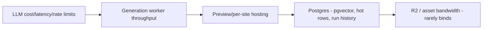

# Scaling Roadmap

Forge's scaling problem is unusual: each unit of work is a **multi-hour, multi-agent, LLM- and GPU-bound workflow**, not a cheap CRUD request. A "user" at peak does not hammer the API — they trigger one expensive `GenerationRun` (a Temporal workflow) that fans out ~40-60 LLM calls + 3-8 Flux renders + a sandboxed build. So we scale **concurrent runs and cost-per-run**, not RPS. Target shape: ~8-12% of users running concurrently at peak; a full site run = ~6-9 min wall-clock, ~$0.85-$1.40 raw cost at MVP.

### Bottlenecks in priority order

LLM is bottleneck #1 by both **cost** (70-80% of COGS) and **rate limits** (Anthropic org TPM/RPM caps throttle concurrency long before CPU does). Workers are #2 (Temporal activity slots + Flux GPU queue). Postgres is #3, deferred by design (single store, pgvector co-located).

### Staged plan: 0 → 1k → 10k → 100k users

| Dimension | Stage 0 (MVP, <100 users) | 1k users (~80-120 concurrent runs) | 10k users (~800-1.2k concurrent) | 100k users (~8-12k concurrent) |
|---|---|---|---|---|
| **LLM access** | Single Anthropic org key, default tier | Tier-4 throughput; per-tier model routing enforced (Opus only for CEO/critique/code) | Multi-key/account pool + token-bucket gateway; prompt caching on system/exemplar prefixes | Provisioned/committed throughput; **prefix-cache hit >55%**; semantic dedupe of sub-prompts |
| **LLM cost levers** | None (eat it) | Routing + Haiku for classify/extract | + Batch API for non-interactive content (SEO, alt-text, blog) at 50% off; cache brand/design system prompts | + cross-run exemplar embedding cache; distilled Haiku for Design-Critic pre-screen |
| **Workers** | 1 Fly.io worker, ~10 activity slots | 3-5 Fly machines, Temporal task-queue per agent class | KEDA-style autoscale on Temporal **schedule-to-start latency**; separate queues: `reasoning`, `bulk`, `image`, `build` | Multi-region worker pools; GPU image queue isolated w/ its own backpressure + spot Flux capacity |
| **Image gen** | Replicate on-demand | Concurrency cap + retry/backoff | Dedicated Replicate throughput + R2-cached renders by (industry, prompt-hash) | Reserved GPU pool / fallback provider; SVG-first to cut raster volume |
| **Preview hosting** | Vercel preview of platform; sites built in-memory | Ephemeral preview containers on Fly, TTL 30 min, watermarked | Cloudflare Pages per-site (Pro+); preview = signed R2 static bundle behind Worker | Per-tenant CF Pages projects; previews fully static off R2 + edge cache (near-zero marginal) |
| **Postgres** | Single Supabase instance | Connection pooler (pgBouncer/Supavisor), indexes on run/task hot paths | **Read replicas** for dashboards/run-history queries; move `AgentTask` event log to append-only partitioned table | Partition `GenerationRun`/`AgentTask`/`CreditLedger` by month; **tenant sharding by Organization**; pgvector → dedicated replica or Pinecone if >50M exemplar vectors |
| **State/queue** | Temporal Cloud starter | Temporal Cloud, single namespace | Namespace per environment; archival of completed runs to R2 | Multi-namespace by region/shard; history GC tuned |
| **Cost / generation (raw)** | ~$1.10 | ~$0.80 | ~$0.45 | ~$0.28 |
| **SLO: run success** | 95% | 99.0% | 99.5% | 99.9% |
| **SLO: time-to-first-artifact** | <30s | <20s | <15s | <12s |
| **SLO: full-run p95** | <12 min | <10 min | <9 min | <8 min |
| **Platform API availability** | 99.0% | 99.5% | 99.9% | 99.95% |
| **Team size** | 3-4 founders | ~10 | ~30 | ~80+ |

### Cost-per-generation economics

Raw cost drops ~75% (≈$1.10 → $0.28) through compounding levers, in impact order:

| Lever | Stage on | Savings on run |
|---|---|---|
| Model routing (Opus→Sonnet→Haiku by task tier) | 1k | 30-40% |
| Prompt caching (system + brand + exemplar prefixes, ~60% of input tokens are stable) | 10k | 20-30% of input cost |
| Batch API for async content (copy, SEO, alt-text) | 10k | ~50% on ~25% of calls |
| R2 render cache by prompt-hash + SVG-first logos | 10k | 40-60% of image cost |
| Distilled Haiku Critic pre-screen (Opus only on borderline) | 100k | cuts critique tokens ~50% |
| Provisioned throughput (commit discount) | 100k | 15-25% on remaining LLM |

**Margin:** Pro at ~$39/mo with ~25 runs/mo costs ~$7 (10k stage) → ~83% gross margin. Credit budgets (Risk #2 mitigation) hard-cap any single run, so a pathological debate loop can't blow unit economics — the workflow aborts at budget ceiling and routes to revision-with-cheaper-tier.

### Reliability by stage

- **0→1k:** Temporal durability is the SLO engine — crashed activities resume, so "success" ≈ "eventually completes." Focus: idempotent activities, retry policies, dead-letter on poison runs.
- **1k→10k:** Add **schedule-to-start latency** alerting (queue starvation = the real outage), circuit-breaker on LLM 429s with exponential backoff + key rotation, per-queue concurrency caps so image GPU stalls don't block reasoning.
- **10k→100k:** Multi-region active-active workers; per-tenant rate limits (noisy-neighbor isolation); error budgets per org tier (Scale/Business get priority queue + SLA credits on breach). Synthetic canary runs every 5 min validate the full pipeline end-to-end.

### Org / team evolution

| Stage | Structure |
|---|---|
| MVP | Founders own everything; one "agent quality" owner |
| 1k | Split **Platform/Infra** (Temporal, Fly, DB) vs **Agent/Quality** (prompts, routing, Critic rubric) |
| 10k | Add **Cost/Reliability (SRE-style)** team owning the LLM gateway + SLOs; dedicated **Design-Quality** team owning exemplar curation + anti-generic gate |
| 100k | Per-domain pods (Orchestration, Generation Pipeline, Hosting/Deploy, Growth/Billing) + a **FinOps/LLM-economics** function whose KPI is cost-per-successful-run |

**Sequencing rule:** never optimize a downstream bottleneck before the upstream one binds. LLM routing + caching pay back first and biggest; DB sharding is deliberately last because the single-Postgres + pgvector decision buys runway to ~10k before relational pressure forces partitioning.

