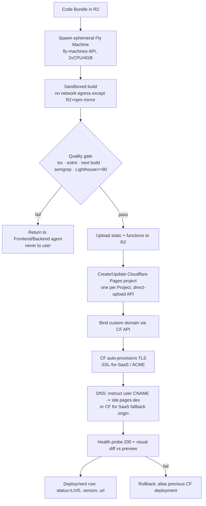

# Deployment Architecture

Two deployment surfaces with deliberately different operational models: **(A) the Forge platform** — a long-lived, stateful, low-cardinality estate we own; and **(B) generated tenant sites** — high-cardinality (target 50k+ live sites), fully programmatic, per-customer deploys we never touch by hand. The hard problem is (B): isolated builds, custom domains, automatic TLS, and blast-radius containment at scale.

### Targets (conform to brief)

| Concern | Platform (A) | Generated sites (B) |
|---|---|---|
| Frontend/UI | **Vercel** (Next.js 15, edge) | **Cloudflare Pages** (one project per site) |
| Workers (Fastify + Temporal) | **Fly.io** (stateful, multi-region) | n/a |
| DB / state | Supabase Postgres + pgvector | none at edge; site = static + edge functions |
| Artifacts / bundles | **Cloudflare R2** | R2 → Pages deploy |
| Orchestration | Temporal Cloud | Temporal child workflow `DeploySite` |

### Environments

| Env | Platform frontend | Workers | Data | Tenant deploys |
|---|---|---|---|---|
| **dev** | Vercel preview per PR | Fly app `forge-workers-dev` (1 machine) | Supabase branch DB | Pages project `forge-dev-*`, subdomain only |
| **stage** | `stage.forge.dev` | Fly `forge-workers-stage` (2 machines, 1 region) | Supabase stage project | real Pages deploy, `*.stage-sites.forge.dev`, no custom domains |
| **prod** | `app.forge.dev` | Fly `forge-workers-prod` (≥6 machines, iad+cdg+sin) | Supabase prod + read replicas | Pages prod, custom domains + TLS live |

Env parity enforced by a single Terraform root module parameterized by `workspace`. No env-specific code paths — only config + secrets differ.

### CI/CD (platform)

GitHub Actions, trunk-based, `main` always deployable.

```
PR open ─► lint+typecheck (tsc) ─► unit (vitest) ─► build ─► Vercel Preview URL
                                                         └─► Temporal replay test (determinism gate)
merge ─► Fly deploy (rolling, canary 1 machine 10min) ─► smoke ─► promote │ auto-rollback
     └─► Vercel prod promote (instant alias swap)
```

- **Temporal determinism gate**: every PR replays the last 200 prod workflow histories against new worker code. A non-deterministic change (reordered activities) fails CI — protects in-flight multi-hour generation runs from corruption on deploy.
- **Worker deploys are versioned** via Temporal Worker Versioning (Build IDs). Old runs pin to their Build ID; new runs route to the new one. No "stop the world."
- Migrations: `supabase db push` gated, expand/contract only (add column → backfill → drop in later release). Never destructive in same deploy as code using it.

### IaC & containers

- **Terraform** owns: Fly apps, Supabase projects, Cloudflare (R2 buckets, Pages projects template, DNS zone, API tokens), Vercel project, Temporal namespaces. State in Terraform Cloud, locked.
- **Fly workers** are containers (`Dockerfile`, distroless Node 22, ~180MB). Temporal Worker + Fastify run as separate Fly **process groups** in one app so they share the image but scale independently (`web=2`, `worker=8`).
- **Tenant builds run in ephemeral Fly Machines** (see below), not the persistent worker pool — build load never competes with orchestration.

### Secrets management

- **Doppler** as source of truth → synced to Fly secrets, Vercel env, GitHub OIDC. No long-lived cloud creds in CI (GitHub OIDC → short-lived tokens).
- **Per-tenant secrets isolation**: a generated site's runtime env (e.g. its own Stripe key if the user wires one) is stored encrypted in Postgres (`Deployment.encrypted_env`, AES-GCM, key in Doppler), injected into the Cloudflare Pages project at deploy via API — never logged, never in the bundle, scoped to that one Pages project.

### Per-site deployment pipeline (the hard part)

`DeploySite` is a Temporal child workflow off the main Studio run. Steps are activities, each idempotent & checkpointed:



- **Build isolation**: each build is a fresh, single-use Fly Machine destroyed after run. No shared filesystem, no shared node_modules across tenants. Egress firewalled to R2 + a private npm proxy (Verdaccio) — prevents a malicious generated `postinstall` from exfiltrating or attacking. `--ignore-scripts` + allowlisted deps.
- **Custom domain + TLS**: **Cloudflare SSL for SaaS** (`/custom_hostnames`). User points `CNAME app.theirstartup.com → sites.forge.dev`; CF validates ownership (TXT/HTTP) and issues a per-hostname cert automatically. No per-cert ops work; scales to tens of thousands of hostnames. Apex domains use CNAME-flattening or CF-as-registrar.
- **Serving**: static assets + edge functions served from Cloudflare's global edge (Pages). No origin server per tenant → cost ≈ storage + requests only; zero idle compute per site. R2 zero-egress keeps asset cost flat.

### Rollback

| Surface | Mechanism | RTO |
|---|---|---|
| Platform UI (Vercel) | Instant alias rollback to prior immutable deployment | <30s |
| Workers (Fly) | Canary auto-abort; `fly deploy --image <prev>` | <2min |
| DB | Expand/contract = forward-only; PITR restore for disasters | minutes–hours |
| **Tenant site** | Every deploy is an immutable CF Pages deployment; rollback = re-alias previous deployment ID (stored on `Deployment`) | <10s |

Tenant rollback is one API call and needs no rebuild — prior bundles persist in R2 (retain last 10 versions/project).

### Preview deploys

- Platform: Vercel PR previews (standard).
- **Tenant previews**: every GenerationRun publishes to `<run-id>.preview.forge-sites.dev` (CF Pages preview alias) — watermarked for Free tier. The "publish" action on Pro **promotes** that exact immutable deployment to prod + binds the custom domain. Preview == prod artifact, so no "works in preview, breaks live."

### Blast-radius isolation between tenants

1. **One Cloudflare Pages project per Project** — a poisoned/abusive site is paused/deleted independently; cannot affect siblings.
2. **No shared runtime** — static + isolated edge functions (Workers isolates, per-request, no cross-tenant memory).
3. **Per-hostname certs** — one domain's cert/validation failure never touches others.
4. **Builds are single-use VMs** — a build OOM/hang/exploit dies with its machine; concurrency capped per org by tier (Free 1, Business 5, Scale metered) so one tenant can't starve the build pool.
5. **Egress-locked builds + npm proxy** — supply-chain attack from generated code is contained.
6. **Platform/tenant separation** — generated sites never share infra, DB, or network with `app.forge.dev`; a tenant site compromise has no path to platform data (Supabase RLS + separate Cloudflare account/zone for tenant sites).

