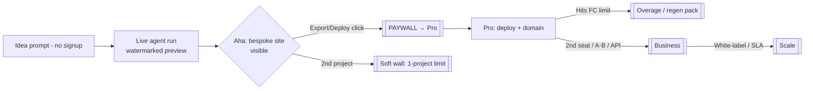

# Monetization Strategy

**Model (per brief §6):** usage credits + subscription tiers. Subscriptions gate *capability and concurrency*; credits gate *marginal compute* (LLM tokens + Flux renders). This decouples the value metric (a shipped site) from the cost driver (tokens/renders), which is the only way to hold margin as model mix shifts.

### 1. Unit of consumption — the Forge Credit (FC)

One **GenerationRun** debits `CreditLedger`. We price in FC, not dollars, so we can re-tune the FC→USD peg without renaming SKUs.

- **Peg:** 1 FC = $0.01 of *budgeted* marginal cost. A full site run is metered, not flat-billed, against a per-run cost ceiling.
- **Metering points (Temporal activity → `CreditLedger` debit):** Claude Opus/Sonnet/Haiku tokens (in+out), Flux renders, build/Lighthouse sandbox minutes.

| Cost component | Real driver | Typical full run | Notes |
|---|---|---|---|
| Opus 4.x (CEO/PM/debate/code) | ~250–400K tok | ~$3.50–5.50 | Bounded to **2 debate rounds** (brief §3) |
| Sonnet 4.x (copy/SEO/content) | ~600K–1M tok | ~$2.00–3.50 | Bulk tier |
| Haiku 4.x (routing/validate) | ~300K tok | ~$0.10–0.20 | Cheap tier |
| Flux via Replicate | 6–12 images | ~$0.30–0.70 | SVG logos synthesized = $0 |
| Sandbox build/Lighthouse (Fly) | 3–6 min | ~$0.05–0.10 | Per quality gate |
| **Total marginal COGS / first full run** | | **≈ $6–10** | Target blended **$7.50** |
| **Regeneration (section/page, cached context)** | | **≈ $1.20–2.50** | Re-uses `GenerationContext` blackboard |

**Credit pricing:** a full new site = **800 FC** (≈$8 cost, sold inside tiers); a section regen = **150 FC**; a full-site regen = **400 FC** (context cached in R2). Overage FC sold at **$0.02/FC** (≈2.5× COGS → ~60% margin on overage).

### 2. Pricing tiers

| | **Free** | **Pro** | **Business** | **Scale (Enterprise/usage)** |
|---|---|---|---|---|
| **Price** | $0 | **$39/mo** ($390/yr) | **$149/mo/seat min 3** ($1,490/yr) | **Custom**, $1.5K+/mo + metered |
| **Included FC/mo** | 800 (1 run) | 4,000 (~5 sites) | 20,000 (~25 sites) | 100K+ pooled, then metered |
| **Projects** | 1 | 25 | Unlimited | Unlimited |
| **Output** | Watermarked preview, **no export/deploy** | Full code export | + A/B variants | + white-label removal |
| **Deploy** | — | Cloudflare Pages, 1 custom domain | 10 domains | Unlimited + dedicated subnet |
| **Concurrency** | 1 run, low priority | 2 runs | 8 runs, **priority queue** | Reserved capacity, SLA 99.9% |
| **Seats / org** | 1 | 1 | 3+ (multi-seat) | SSO/SAML, unlimited |
| **API access** | — | — | ✅ (rate-limited) | ✅ (white-label API) |
| **Overage FC** | n/a | $0.025/FC | $0.020/FC | $0.015/FC (committed-use) |
| **Support** | community | email | priority | SLA + CSM |

Margin check: Pro at $39 ships ~5 sites × $7.50 = $37.50 COGS at *full* utilization — but median user runs ~2 full sites + regens (~$22 COGS), yielding **~44% gross margin**; the included-FC buffer is deliberately sized so the *median* user is profitable and power users push into overage. Business pools FC across seats → predictable ~55–65% margin.

### 3. Anti-margin-erosion controls

1. **Per-run credit budget cap (brief §3, risk #2):** Temporal workflow carries a hard FC ceiling; the CEO router degrades model tier (Opus→Sonnet on non-critical activities) as budget depletes, and aborts before overrun. No run can silently 10× its cost.
2. **Context caching:** `GenerationContext` blackboard + Anthropic prompt caching on stable brief/exemplar context cuts repeat-run input tokens ~40–60%. Regens never re-pay for discovery.
3. **Model routing as a margin lever:** routing/validation on Haiku, bulk content on Sonnet, only reasoning/code/debate/critic on Opus. Tier mix is the single biggest COGS dial.
4. **Quality-gate cost containment:** revision loops (brief §4 Design Critic) are FC-metered and capped (max 2), so the bespokeness guarantee can't become an unbounded token sink.
5. **Flux only for photoreal; logos/icons as SVG** = zero raster cost, also a quality win.

### 4. Deploy / hosting upsell + add-ons

Export-and-deploy is the **primary paywall** — it's the moment of realized value and the cleanest Free→Pro trigger.

| Add-on | Price | Gate / rationale |
|---|---|---|
| Custom domain (registration via integration) | $14–22/yr passthrough + $5/yr mgmt | Pro+ only |
| Managed hosting (per published site) | $9/mo per live site beyond included | Recurring, sticky; Cloudflare Pages COGS ~$0.50 → ~94% margin |
| Extra regeneration packs | 2,000 FC for $30 | Pro buyers nearing limit |
| White-label (remove "Forged by Forge") | $99/mo (Business), included in Scale | High willingness-to-pay, near-zero COGS |
| API access | metered, $0.02/FC, $99/mo min | Business+; programmatic site generation |
| Priority queue / reserved concurrency | $79/mo | Agencies in batch crunch |

### 5. Conversion funnel & paywall placement

- **Top of funnel is free and instant** — full generation runs *before* signup; the watermarked, non-exportable preview is the hook. Cost of a free run (~$7.50) is the CAC; gated export/deploy is where it converts.
- **Hard walls:** export, deploy, custom domain, watermark removal. **Soft walls:** project count, concurrency, FC depletion (in-product "add credits" nudge, never a hard stop mid-run — finish the run, then bill).

### 6. Expansion revenue (NRR levers)

- **Usage expansion:** overage FC + regen packs (the natural SaaS metered tail).
- **Seat expansion:** Business is per-seat → agencies grow seats as accounts grow.
- **Per-site hosting MRR:** every deployed site is recurring $9/mo — converts one-time generation into an annuity and is the biggest NRR driver.
- **Tier climb:** A/B variants → API → white-label → SLA each map to a discrete upgrade. Target **NRR >120%** driven by hosting annuity + overage, with agencies (Business/Scale) as the >130% cohort.

