# AutoFounder AI — Complete Architecture Blueprint

_Autonomous startup website builder: a startup idea in plain English becomes a complete, production-ready, custom-designed website._

---

## Executive Summary

**Forge turns a single sentence into a Stripe-quality startup website — brand, copy, design, and production code — autonomously, in under 25 minutes.** Today, looking like a funded company costs a $15k–$50k agency engagement and 4–8 weeks. Ten specialized AI agents (CEO, Market Research, PM, Brand, Copy, SEO, UI/UX, Frontend, Backend, Growth) collapse that into one supervised run that ships a live, multi-page site plus exportable code. The market is every founder, indie hacker, and SMB that needs a real web presence and cannot afford — or wait for — a studio.

**The single biggest technical bet is that we can make generated sites genuinely non-generic — and that bet is the whole company.** "AI website builder" usually means templated, recognizably-AI output. We win by refusing templates. Three mechanisms enforce bespokeness: (1) **token-driven generation** — every site derives a unique design-token set (palette, type pairing, spacing, motion), so no two sites share a fingerprint and components consume tokens rather than fixed styles; (2) **pgvector exemplar retrieval** — design and copy decisions are grounded in curated Stripe/Linear/Notion-class references retrieved *by industry*, not in generic defaults; and (3) **a hard Design Critic quality gate** — an automated rubric scoring bespokeness, contrast, hierarchy, "AI-tell" heuristics, plus Lighthouse and a sandboxed build, that *blocks deploy* and forces a bounded revision loop until the bar is cleared. Nothing ships below threshold.

**The architecture, in five sentences.** Forge is two systems under one domain: a low-latency **control plane** (Next.js 15, tRPC, p95 < 200ms on Vercel) and a durable **generation plane** (Temporal workflows on Fly.io workers). The CEO agent orchestrates a `StudioWorkflow` as a directed state machine; each agent runs as a Temporal activity reading and writing one typed blackboard (`GenerationContext`) and emitting one versioned `Artifact` along the pipeline **Idea → Brief → Brand Kit → Design Spec → Content Model → Component Tree → Code → Deployed Site**. Temporal gives us native durability — every step is checkpointed, crashed runs resume, clarifying questions are workflow signals, and debate is bounded to two critique rounds before the Director decides. State lives in Supabase Postgres + pgvector; assets and code bundles in Cloudflare R2; generated sites deploy isolated to Cloudflare Pages; LLM work is tiered across Claude Opus/Sonnet/Haiku to hold margin. Model routing, credit budgets per run, and per-tenant deploy isolation are first-class, not afterthoughts.

**The wedge is bespokeness, not breadth.** MVP proves one thing: a single durable run that takes one idea and emits one deployed, multi-page site a skeptic cannot tell from hand-built — passing the Critic gate in one vertical. If that loop holds, the company is real; multi-tenant, billing, A/B, and API are execution.

**Path to scale and revenue.** We scale *concurrent runs and cost-per-run*, not RPS — Temporal worker pools, per-tier model routing, and credit budgets that cap marginal cost ($0.40–$2.10/run today). Monetization is **usage credits + subscription tiers**: subscriptions gate capability and concurrency; metered Forge Credits gate compute, decoupling the value metric (a shipped site) from the cost driver (tokens/renders). Free funnels; Pro unlocks export, deploy, and custom domains; Business adds seats, variants, and priority; Scale adds metered overage, white-label, and SLA — margin holds as the model mix shifts.


---

## AutoFounder AI — Canonical Decision Brief (v1.0)

**Status:** Source of truth. Every other architecture doc MUST conform. Conflicts resolve in favor of this document. Date: 2026-05-31.

---

### 1. Product Name + Positioning
**Name:** **Forge.** &nbsp;**Positioning:** *Describe your startup in a sentence. Forge ships a Stripe-quality website — brand, copy, design, and production code — autonomously.*
*Rationale: "Forge" connotes craftsmanship + creation, signaling bespoke output over template assembly.*

---

### 2. Canonical Tech Stack (one choice each)

| Layer | Decision | Rationale |
|---|---|---|
| Frontend framework (platform) | **Next.js 15 (App Router)** | RSC + streaming for live agent/job UIs; one ecosystem for platform and generated sites. |
| Language | **TypeScript everywhere** | One language across agents, pipeline, frontend; shared types. |
| Styling | **Tailwind CSS + design tokens** | Token-driven utility CSS maps cleanly to per-brand generated themes. |
| Component strategy (platform) | **shadcn/ui (owned source)** | Editable primitives, not a locked dependency. |
| Backend runtime | **Node.js (TypeScript) on Fastify** | Shared types with frontend; Fastify for throughput. |
| API style | **tRPC (internal) + REST webhooks (external)** | End-to-end typesafety internally; REST for Stripe/deploy callbacks. |
| Primary DB | **PostgreSQL (Supabase)** | Relational integrity for entities + RLS + managed auth. |
| Vector / search store | **pgvector (in Postgres)** | Avoids a second datastore; brand/design-exemplar retrieval co-located. |
| Queue / orchestration layer | **Temporal** | Durable, resumable long-running agent workflows with retries/signals — the core requirement. |
| Object storage | **Cloudflare R2** | Zero egress fees for generated assets and site bundles. |
| Auth | **Supabase Auth (OAuth + email)** | Bundled with DB + RLS. |
| Payments | **Stripe (Billing + metered usage)** | Subscriptions + usage metering for generation credits. |
| LLM — orchestration/reasoning tier | **Claude Opus 4.x** | Top-tier reasoning for CEO/PM/debate/code. |
| LLM — bulk/content tier | **Claude Sonnet 4.x** | Cost-efficient for copy, SEO, structured drafts. |
| LLM — cheap/classify tier | **Claude Haiku 4.x** | Routing, validation, extraction. |
| Image generation | **Flux (via Replicate) + programmatic SVG/logo synthesis** | Photoreal hero/imagery from Flux; logos/icons generated as crisp SVG, not raster. |
| Deployment — platform | **Vercel (frontend) + Fly.io (Fastify/Temporal workers)** | Vercel for edge UI; Fly for stateful long-running workers. |
| Deployment — generated sites | **Cloudflare Pages (per-site project)** | Cheap, fast, isolated tenant deploys with custom domains. |

---

### 3. Agent Orchestration Model
- **Topology:** **Temporal workflow as a directed state machine** (the "Studio" workflow). The **CEO agent is the orchestrator/router**; the other 9 are activities/child-workflows. *Rationale: durability + deterministic replay beats a free-form message bus for resumable multi-hour jobs.*
- **Shared state:** A **typed blackboard artifact** (the `GenerationContext`, persisted in Postgres + R2) that every agent reads/writes — single source of truth per project run.
- **Debate/consensus:** **Structured critique rounds.** A proposing agent emits a candidate; a designated **Critic role + Director (CEO/PM) arbitration** scores against a rubric. Max 2 debate rounds, then Director decides. *Rationale: bounded debate prevents infinite loops while improving quality.*
- **Human-in-the-loop:** Clarifying questions are **Temporal signals** — the workflow pauses at a `WaitForUser` state, surfaces ≤3 batched questions, resumes on answer. Defaults are auto-chosen after timeout so jobs never stall.
- **Job tracking/resume:** **Temporal handles durability natively** — every step is checkpointed; a crashed run resumes from last completed activity. Users see live progress via workflow query → streamed to UI.

---

### 4. Website Generation Pipeline (canonical artifact flow)
**Idea → Brief → Brand Kit → Design Spec → Content Model → Component Tree → Code → Deployed Site.**

| Artifact | Produced by | Definition |
|---|---|---|
| **Strategy Brief** | CEO + Market Research + PM | ICP, positioning, value props, site goals. |
| **Brand Kit** | Brand agent | Name, logo (SVG), color system, type pairing, voice — emitted as **design tokens**. |
| **Design Spec** | UI/UX agent | Layout system, section blueprints, motion rules — references tokens, never hardcoded styles. |
| **Content Model** | Copy + SEO | Typed content per page/section (headlines, body, meta, schema.org). |
| **Component Tree** | Frontend agent | Composition of owned components bound to content + tokens. |
| **Code Bundle** | Frontend + Backend | Production Next.js project + backend stubs, in R2. |

**Anti-generic enforcement (NOT templating):**
1. **Token-driven, not template-driven** — every site derives a *unique* token set; components consume tokens so no two sites share a palette/type/spacing fingerprint.
2. **Exemplar retrieval (pgvector)** — design choices are grounded in curated Stripe/Linear/Notion-class references retrieved by industry, not generic defaults.
3. **Automated quality gate** — a **Design Critic agent + Lighthouse/visual-diff check** scores bespokeness, contrast, hierarchy, and "AI-tell" heuristics; below threshold → forced revision loop before deploy.

---

### 5. Core Data Entities
- **User** — account owner/operator.
- **Organization** — billing + workspace tenant.
- **Project** — one startup idea → one generated site.
- **GenerationRun** — a single end-to-end pipeline execution (maps to a Temporal workflow).
- **AgentTask** — one agent's unit of work within a run.
- **Artifact** — versioned intermediate output (brief, brand kit, spec, content, code).
- **BrandKit** — canonical brand tokens for a project.
- **DesignSpec** — layout/design system for a project.
- **ContentModel** — structured page/section content.
- **Deployment** — a published site instance + domain + status.
- **Subscription** — Stripe plan + usage state.
- **CreditLedger** — generation-credit debits/credits.
- **Exemplar** — curated reference embeddings for retrieval.

---

### 6. Monetization Model
**Usage credits + subscription tiers.** Generation consumes credits (gated by LLM/image cost); tiers gate *capability and limits*.

| Tier | Gates |
|---|---|
| **Free** | 1 project, watermarked preview, no export/deploy, low credits. |
| **Pro** | Code export, deploy to Cloudflare, custom domain, more credits. |
| **Business** | Multi-seat org, A/B variants, higher concurrency, priority queue, API access. |
| **Scale (usage)** | Metered overage credits + white-label + SLA. |

*Rationale: aligns price with true marginal LLM/render cost while keeping a real free funnel.*

---

### 7. Three Hardest Risks + Mitigations
1. **Output looks AI-generated/generic.** → **Token uniqueness + pgvector exemplar grounding + a hard Design Critic quality gate** with mandatory revision loops; nothing deploys below the bespokeness threshold.
2. **Long, expensive multi-agent jobs failing/stalling mid-run.** → **Temporal durable workflows** (checkpoint/resume), bounded debate rounds, per-tier model routing, and **credit budgets that cap cost per run**.
3. **Generated code is insecure/broken at deploy.** → **Sandboxed build + automated gate**: typecheck, lint, build, Lighthouse, and security lint run before publish; failures route back to the Frontend/Backend agents, never to the user.


---

## Product Architecture

### 1. The Job & Core Value Loop

**Job-to-be-done:** *"I have a startup idea and need a website that looks like a funded company built it — without hiring a designer, copywriter, or engineer."* Forge is hired to collapse the 4–8 week, $15k–$50k agency engagement into a **single supervised run of ~8–25 minutes**.

The value loop is a tight `Describe → Watch → Steer → Ship → Iterate` cycle:

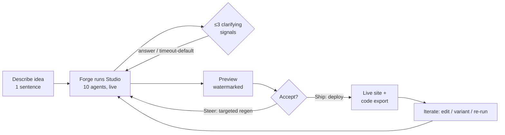

The retained-value object is the **Project**: a durable, editable startup-website workspace, not a one-shot artifact. Every regeneration, edit, and deploy accrues to it.

### 2. Product Object Model

Distinct from the *data* entities in the brief, these are the objects a **user reasons about and manipulates** in the UI:

| Product object | What the user sees | Backed by (brief entities) | Mutability |
|---|---|---|---|
| **Project** | The startup workspace (one idea) | `Project` | Renamable, archivable |
| **Generation** | A run timeline with live agent activity | `GenerationRun` + `AgentTask[]` | Immutable once complete; re-runnable |
| **Site** | The previewable/deployable website | `Deployment` + `Code Bundle` | Editable post-gen |
| **Brand** | Editable brand kit (logo, palette, type, voice) | `BrandKit` (tokens) | Directly editable; cascades |
| **Pages & Sections** | Navigable page tree, section blocks | `ContentModel` + `DesignSpec` | Block-level editable |
| **Question card** | Batched clarifying prompts | Temporal signal | Answerable / dismissable |
| **Version** | Named snapshot of the whole Project | `Artifact` versions (pinned) | Restore / fork / compare |
| **Credits** | Remaining run budget | `CreditLedger` + `Subscription` | Consumed per run |

**Object relationships:** `Organization → Project (1:N) → Generation (1:N)`; the latest *accepted* Generation pins one `Brand`, one `Site`, and a `Version`. Editing forks a new `Version` without a full Generation.

### 3. Autonomy Spectrum

Forge defaults to **full-auto** but exposes three explicit modes, all built on the same Temporal Studio workflow:

| Mode | Human role | Checkpoints | Target user |
|---|---|---|---|
| **Autopilot** (default) | Sets idea, walks away | None — clarifying questions auto-default after **120s** timeout | First-time / Free & Pro |
| **Co-pilot** | Reviews at gates | Pauses at **Brand Kit approval** + **pre-deploy preview** | Pro power users |
| **Director** | Steers each phase | Pauses at all 6 artifact handoffs (Brief→Brand→Design→Content→Tree→Code) | Business / agencies |

The mode only changes **how many `WaitForUser` signal-gates are active**; the underlying pipeline is identical, so a run can be promoted mid-flight ("pause and let me review brand").

### 4. Where Clarifying Questions Occur

Questions are **front-loaded and bounded** — never a chat. The CEO+PM agents emit **≤3 batched questions** at exactly two points, surfaced as a Temporal signal → Question Card:

1. **Post-Brief (T+~45s):** scope disambiguation — *audience (B2B/B2C?), one must-have page, tone (bold vs. trustworthy)*.
2. **Optional post-Brand (Co-pilot/Director only):** *pick among 2 candidate logo/palette directions*.

If unanswered within 120s, the Director agent **auto-selects defaults** (logged on the Version) so a run never stalls — satisfying the brief's no-stall guarantee. No questions are asked during code/asset generation.

### 5. Definition of "Done"

A Generation reaches `done` only when it clears the **automated quality gate** (brief §4/§7), not when the LLM stops:

- **Design Critic score ≥ 0.78** on the bespokeness rubric (palette/type/spacing fingerprint uniqueness vs. exemplar corpus, hierarchy, contrast, AI-tell heuristics).
- **Lighthouse:** Performance ≥ 90, Accessibility ≥ 95, SEO ≥ 95.
- **Build gate:** `tsc` typecheck + ESLint + `next build` pass in sandbox; security lint clean.
- **Contrast:** WCAG AA on all text/CTA pairs.

Below threshold → **forced revision loop** (max 2 rounds, brief's bounded-debate rule) routed back to the offending agent, then Director override. The user only ever sees a *passing* site; failures are invisible and consume no extra user-facing credits beyond the run budget.

### 6. Preview / Edit / Iterate / Regenerate Model

**Preview:** Streamed via RSC. During the run, sections render progressively as artifacts complete (live "construction" view). Final preview is a real Cloudflare Pages **preview deploy** of the actual code bundle — WYSIWYG-to-prod, watermarked on Free.

**Three iteration tiers (cheapest first — credit-aligned):**

| Tier | Trigger | Scope | Cost | Mechanism |
|---|---|---|---|---|
| **Direct edit** | Inline UI (text, swap image, recolor) | Single block / token | 0 credits | Mutates `ContentModel`/`BrandKit`; live re-render, no agents |
| **Targeted regen** | "Regenerate this section / rewrite this copy / new hero" | One section or one agent's output | ~10–20% of full run | Sub-workflow re-runs *one* AgentTask against pinned `GenerationContext` |
| **Full re-run** | "Try a different direction" | Whole Project | Full credits | New `Generation`; prior Version preserved for compare/restore |

**Editing model after first generation:** Forge is **structured-edit, not free-canvas**. Edits operate on the typed object model:
- **Brand edits cascade** — recoloring the brand re-derives all component tokens; no orphaned styles (the anti-template guarantee holds post-edit).
- **Content edits are local** — typed per-section, validated against the section schema (e.g., `Hero { eyebrow, headline≤60ch, sub, cta[] }`).
- **Structural edits** (add/remove/reorder pages & sections) manipulate the Component Tree; re-binding to tokens is automatic.
- Every save **forks a Version**; users compare, restore, or fork to A/B variants (Business tier). Direct edits never break the build because the export re-runs the same build gate before any deploy.

### 7. End-to-End Generation Lifecycle

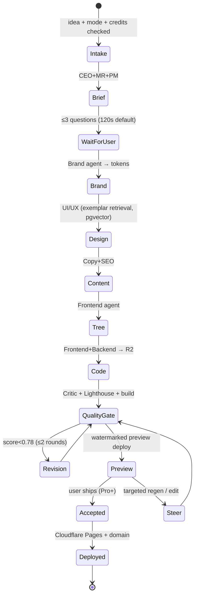

Each transition is a Temporal checkpoint, so a crashed run resumes from the last completed artifact and the live progress UI is driven by workflow queries — making "watch your company get built" the core, trust-building product experience.


---

## System Architecture

Forge is two systems wearing one domain: a **low-latency control plane** (Next.js + tRPC, p95 < 200ms) and a **durable generation plane** (Temporal + worker pools) where a single run spans 4–12 minutes, 40–80 LLM calls, 6–15 Flux renders, and $0.40–$2.10 of marginal cost. The control plane never blocks on the generation plane; they communicate through Temporal handles, a Redis fan-out bus, and Postgres as the durable record.

### High-level component diagram

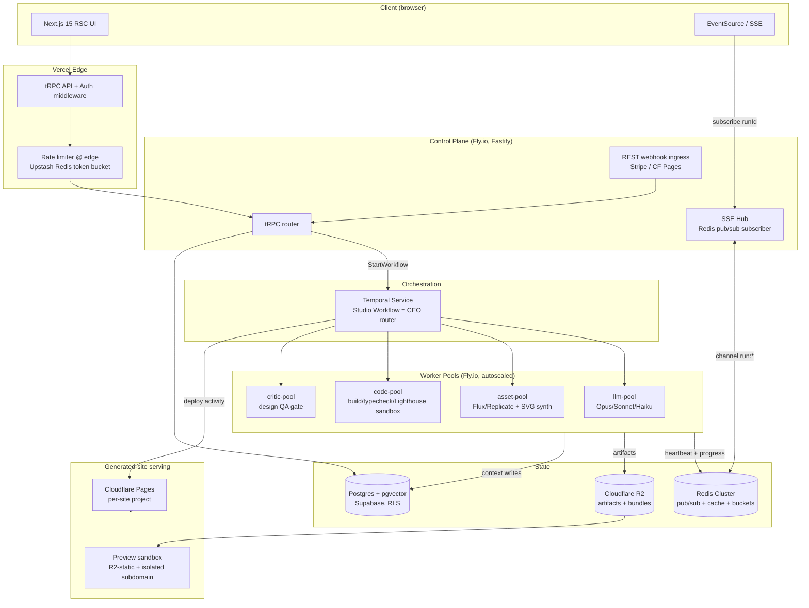

### Request path vs. async job path

| Path | Trigger | Mechanism | Latency target |
|---|---|---|---|
| Sync | CRUD, project list, billing, artifact reads | tRPC → Postgres (RLS) | p95 < 200ms |
| Job kickoff | "Generate site" | tRPC `run.start` → Temporal `StartWorkflowExecution`, returns `runId` immediately | < 400ms |
| Async progress | live run UI | SSE stream keyed by `runId`, fed by Redis pub/sub | < 1s propagation |
| External callbacks | Stripe, CF Pages build done | REST webhook → verify HMAC → Temporal `signalWorkflow` | n/a |

**Why SSE over WebSockets:** generation progress is one-directional server→client; SSE rides plain HTTP/2, survives Vercel edge, auto-reconnects with `Last-Event-ID` for gap-free resume. Bidirectional needs (user answers a clarifying question) go back through tRPC → Temporal signal, not the socket.

### Orchestration & worker pools

The **Studio workflow** is a deterministic Temporal state machine; the CEO agent is the router activity that decides the next stage. Each agent stage is a Temporal **activity** (or child workflow for debate rounds). Pools are separate **task queues** so heterogeneous resources scale independently:

| Pool | Task queue | Concurrency model | Autoscale signal |
|---|---|---|---|
| `llm-pool` | `studio-llm` | 50 activities/worker, bounded by per-tier token budget | Temporal queue backlog + Anthropic 429 rate |
| `asset-pool` | `studio-asset` | 8/worker (Replicate concurrency cap) | Flux queue depth |
| `code-pool` | `studio-code` | 2/worker (each build = isolated Firecracker microVM) | build backlog |
| `critic-pool` | `studio-critic` | 20/worker | inline, low volume |

Activities set **heartbeat timeouts** (LLM 90s, build 240s); a dead worker's activity is rescheduled on another. Debate is a child workflow capped at 2 rounds, then CEO arbitrates — bounded so cost is deterministic.

### Caching layers

| Layer | What | TTL / key | Hit value |
|---|---|---|---|
| Anthropic prompt cache | system + rubric + exemplar prefix | per-run | ~70% input-token discount on multi-call stages |
| Redis semantic cache | brief/brand for near-duplicate ideas (cosine > 0.97 on pgvector) | 7d | skips full strategy stage |
| Exemplar embeddings | curated Stripe/Linear refs | static, warmed | retrieval grounding |
| R2 + CF CDN | rendered Flux assets, site bundles | immutable, content-hashed | dedupe identical hero renders |
| RSC / Next data cache | dashboard reads | tag-invalidated on mutation | sub-200ms UI |

### Rate limiting & cost controls

- **Edge token bucket** (Upstash): per-IP 60 rpm, per-org tiered (Free 5 concurrent runs blocked → 1; Business 20).
- **Credit ledger as the real governor:** `run.start` does an atomic `SELECT ... FOR UPDATE` debit-reservation against `credit_ledger`; insufficient balance → reject before any LLM call. Mid-run, a **budget guard activity** tallies actual token+image spend; on exceeding the reserved cap it signals the workflow to degrade (Sonnet→Haiku) or halt gracefully, refunding the unused reservation.
- **Per-tier model routing** enforced in `llm-pool`: routing/validation on Haiku, bulk copy/SEO on Sonnet, reasoning/code/debate on Opus.
- **Provider 429 backpressure:** worker concurrency throttles on Anthropic/Replicate rate-limit headers, surfacing as queue backlog rather than failed runs.

### Idempotency & job resumption

- Temporal **workflow ID = `run:{generationRunId}`** with reject-duplicate policy — a retried `run.start` (double-click, webhook replay) attaches to the existing run, never forks.
- Every activity is keyed by `(runId, stage, version)`; artifact writes to R2/Postgres are content-addressed and upsert, so replay after worker crash is a no-op, not a duplicate render.
- **Stripe/CF webhooks** are deduped on event ID in a `processed_events` table before signaling.
- Crash recovery is native: Temporal replays event history and resumes from the last completed activity — no custom checkpoint code, no re-running paid LLM stages.

### Multi-tenancy & isolation

- **Org = tenant boundary.** Postgres **RLS** policies key every row on `organization_id`; the JWT carries the active org claim. No cross-tenant read is possible even on a bug in app code.
- R2 keys namespaced `org/{id}/run/{id}/...`; signed URLs scoped per object, 15-min expiry.
- Code builds run in **per-build Firecracker microVMs** (no shared filesystem, no network egress except the package registry mirror) — generated/untrusted code never touches a shared worker.

### Observability

- **Traces:** OpenTelemetry; the Temporal `runId` is the root trace ID. Every activity span carries `agent`, `model`, `tokens_in/out`, `usd_cost`, `attempt`. One run = one waterfall from idea to deploy.
- **Metrics:** Prometheus — per-stage p50/p95 latency, cost/run, credit burn, Design-Critic pass rate, build-gate failure rate, queue depth per pool.
- **Logs:** structured JSON to Loki, correlated by `runId`/`agentTaskId`; agent prompts/outputs persisted as versioned `Artifact` rows for replay and audit.

### Preview sandboxing & serving

- **Preview** (pre-deploy, all tiers): the Code Bundle is built in-sandbox, exported as static output to R2, and served from an **isolated `{runId}.preview.forge.app` subdomain** with a strict CSP and watermark overlay for Free tier. No tenant code executes on Forge's own origin — XSS/script in generated copy is contained to a throwaway subdomain.
- **Publish** (Pro+): a Temporal deploy activity pushes the validated bundle to a **per-site Cloudflare Pages project**, isolated per tenant with its own custom domain — only after typecheck + lint + build + Lighthouse + security-lint all pass the quality gate; any failure routes back to the Frontend/Backend agents, never to the user.


---

## Agent Architecture

Forge runs **10 specialized agents** as Temporal activities/child-workflows orchestrated by the **CEO agent (router)** inside the durable `StudioWorkflow`. Every agent reads/writes one typed blackboard — the `GenerationContext` — and emits exactly one versioned `Artifact`. Model tier per agent follows the brief's routing (Opus = reason/code, Sonnet = bulk content, Haiku = classify/validate).

### 1. The 10 Agents

| Agent | Tier | Responsibility | Inputs (ctx slice) | Output Artifact | Tools |
|---|---|---|---|---|---|
| **CEO (Orchestrator)** | Opus | Routes the DAG, batches clarifying questions, arbitrates debates, enforces credit budget, final ship/abort. | `idea`, all artifacts | `RunPlan` + `Verdict` | Temporal signals/queries, `creditLedger.check`, `route()` |
| **Product Manager** | Opus | Defines site goals, page set, success metrics; co-owns Strategy Brief; secondary debate arbiter. | `idea`, `MarketReport` | `ProductSpec` (page list, conversion goals) | pgvector (industry patterns), Haiku validator |
| **Market Research** | Sonnet | ICP, competitors, positioning angles, differentiation. | `idea` | `MarketReport` | `WebSearch`, `WebFetch`, pgvector exemplar lookup |
| **Brand** | Opus | Name, SVG logo, color system, type pairing, voice → **design tokens**. | `Brief`, `MarketReport` | `BrandKit` (token JSON + logo.svg) | SVG synth lib, Flux (mood refs), pgvector |
| **Copywriting** | Sonnet | All on-page copy per section, in brand voice. | `BrandKit`, `ProductSpec` | `ContentModel.copy` | Haiku tone-checker, readability lint |
| **UI/UX** | Opus | Layout system, per-section blueprints, motion/spacing rules — references tokens only. | `BrandKit`, `ProductSpec` | `DesignSpec` | pgvector exemplars, token resolver |
| **SEO** | Sonnet | Meta, schema.org JSON-LD, slugs, heading hierarchy, keyword map. | `MarketReport`, `ContentModel.copy` | `ContentModel.seo` | keyword API, schema validator (Haiku) |
| **Frontend** | Opus | Component tree → production Next.js 15 code bound to tokens+content. | `DesignSpec`, `ContentModel` | `CodeBundle` (R2) | shadcn registry, `tsc`, `eslint`, `next build` in sandbox |
| **Backend** | Opus | Backend stubs: forms, contact, newsletter, API routes, env schema. | `ProductSpec`, `ContentModel` | `BackendStubs` (R2) | Fastify scaffolder, `tsc`, security lint |
| **Growth** | Sonnet | Conversion CTAs, analytics events, A/B variant slots, OG/social cards. | `ContentModel`, `DesignSpec` | `GrowthLayer` (events + variants) | OG image gen (Flux/SVG), analytics schema |
| *(virtual)* **Design Critic** | Opus | Quality gate role (not a 10th seat) — scores bespokeness/contrast/AI-tell. | `CodeBundle` render + tokens | `CritiqueScore` | Lighthouse, visual-diff, AI-tell heuristics |

### 2. Orchestration Graph

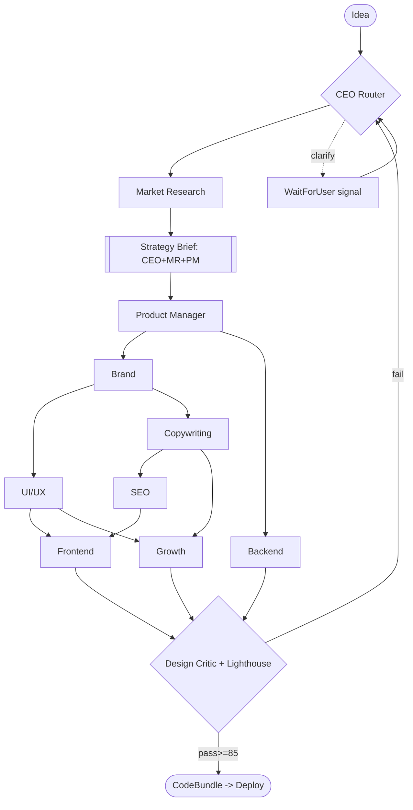

**Parallelism (Temporal `Promise.all`):**
- After `BrandKit`: **UI/UX ∥ Copywriting** fan out.
- **Backend ∥ (UI/UX→Frontend chain)** — Backend depends only on `ProductSpec`+`ContentModel`, so it runs alongside design.
- **Growth ∥ Frontend** once `DesignSpec`+`copy` exist.
- Critical path ≈ MR → Brief → Brand → UX → FE → Gate (≈6 hops; target wall-clock 4–8 min on Sonnet bulk, ~12 min if 2 revision loops fire).

### 3. Blackboard Contract (`GenerationContext`)

Single typed object, `runId`-keyed, persisted in Postgres (metadata/pointers) + R2 (large blobs). Agents never call each other directly — they read/CAS-write slices.

```ts
interface GenerationContext {
  runId: string; version: number;            // optimistic concurrency
  idea: string; clarifications: QA[];
  brief?: StrategyBrief;  market?: MarketReport;
  product?: ProductSpec;  brandKit?: BrandKit;     // tokens + logo R2 ref
  designSpec?: DesignSpec; content?: ContentModel; // {copy, seo}
  growth?: GrowthLayer;
  codeBundleRef?: R2Ref;  backendRef?: R2Ref;
  critiques: CritiqueScore[]; creditsSpent: number;
}
```

- **Write protocol:** each activity returns a partial; the workflow merges via CAS on `version`. Temporal serializes writes, so no lock contention — determinism preserved on replay.
- **Each artifact is immutable + versioned** (`Artifact` row: `runId, type, version, r2Ref, producedBy`). Revisions append `v+1`; rollback = repoint context.

### 4. Validation Before Handoff

Every artifact passes a **typed gate** before the next agent reads it:
1. **Schema check (Haiku/Zod):** output parses against the artifact's `zod` schema — reject → 1 retry with the validation error injected.
2. **Semantic check:** e.g. `DesignSpec` must reference only token keys that exist in `BrandKit` (no hardcoded hex); `ContentModel.copy` must cover every section in `ProductSpec.pages`.
3. **Build gate (code only):** `tsc --noEmit`, `eslint`, `next build`, security lint run in a **Firecracker/Fly sandbox**; failure routes back to Frontend/Backend (never to the user), max 2 build-fix loops.

### 5. Debate & Consensus

Per the brief: **bounded structured critique, ≤2 rounds**.
- **Trigger:** any artifact where a Critic role scores < rubric threshold (Design ≥85/100; Copy ≥80; Brief ≥80).
- **Flow:** Proposer emits candidate → Critic (Opus, separate prompt) scores against a rubric and emits structured deltas → Proposer revises (round 2) → if still failing, **Director decides**: CEO arbitrates brand/strategy/design; PM arbitrates scope/content. Director's pick is final, logged to `critiques[]`.
- **Veto power:** **Design Critic gate has a hard veto** — nothing below bespokeness/contrast/AI-tell threshold deploys. CEO can veto on budget (credit cap hit → ship best passing artifact or abort to draft).

### 6. Human-in-the-Loop

- CEO collects ambiguities (e.g. "B2B or B2C?", "tone: playful vs. authoritative?") into **≤3 batched questions**, fires a Temporal **`WaitForUser` signal**, workflow parks.
- UI streams questions via workflow **query**; user answer arrives as a signal → resume.
- **Timeout 10 min →** Haiku auto-selects defaults from `MarketReport`, annotates `clarifications` as `auto`, continues. Jobs never stall.

### 7. Checkpointing & Resume

- **Temporal event history is the checkpoint** — every activity completion, signal, and timer is durably logged. A worker crash mid-`Frontend` resumes from the last completed activity (`UI/UX`+`SEO`), replaying deterministic state, **not re-spending credits** on completed agents.
- **Idempotency:** each activity keyed `runId:agent:version`; artifact writes are CAS, so retried activities don't duplicate.
- **Retry policy:** activities `maximumAttempts: 3`, exponential backoff (1s→30s); LLM 429/5xx retried, schema-validation failures retried once with error context, then escalate to debate/Director.
- Users watch live progress via `workflow.query('status')` → streamed to the RSC dashboard; resume is invisible to them.


---

## Database Schema

**DB:** PostgreSQL 15 (Supabase) · extensions `pgcrypto` (UUID v7-ish), `pgvector`, `pg_trgm`. All tenant tables carry `org_id` and are guarded by **RLS** (see end). Money in integer minor units; credits in integer units. Timestamps `timestamptz`. Mutable artifacts use **append-only versioning** (`*_versions`) so a `GenerationRun` is fully reproducible.

### Conventions
- PK: `id uuid PRIMARY KEY DEFAULT gen_random_uuid()`.
- Every row: `created_at timestamptz NOT NULL DEFAULT now()`, plus `updated_at` on mutable tables (trigger-maintained).
- Enums via Postgres `CREATE TYPE` for cheap, indexable state machines.

```sql
-- ===== ENUMS =====
CREATE TYPE plan_tier        AS ENUM ('free','pro','business','scale');
CREATE TYPE run_status       AS ENUM ('queued','running','waiting_user','revising','succeeded','failed','canceled');
CREATE TYPE agent_role       AS ENUM ('ceo','pm','market','brand','copy','seo','uiux','frontend','backend','growth','critic');
CREATE TYPE task_status      AS ENUM ('pending','running','blocked','succeeded','failed','skipped');
CREATE TYPE artifact_kind    AS ENUM ('strategy_brief','brand_kit','design_spec','content_model','component_tree','code_bundle','asset');
CREATE TYPE deploy_status    AS ENUM ('building','live','failed','rolled_back','torn_down');
CREATE TYPE ledger_reason    AS ENUM ('grant_monthly','grant_topup','debit_llm','debit_image','debit_build','refund','adjustment');

-- ===== IDENTITY & TENANCY =====
CREATE TABLE users (              -- mirrors supabase auth.users
  id uuid PRIMARY KEY REFERENCES auth.users(id) ON DELETE CASCADE,
  email citext UNIQUE NOT NULL,
  display_name text, avatar_url text,
  created_at timestamptz NOT NULL DEFAULT now()
);

CREATE TABLE organizations (
  id uuid PRIMARY KEY DEFAULT gen_random_uuid(),
  name text NOT NULL,
  slug citext UNIQUE NOT NULL,
  owner_id uuid NOT NULL REFERENCES users(id),
  stripe_customer_id text UNIQUE,
  created_at timestamptz NOT NULL DEFAULT now(),
  updated_at timestamptz NOT NULL DEFAULT now()
);

CREATE TABLE org_members (
  org_id uuid REFERENCES organizations(id) ON DELETE CASCADE,
  user_id uuid REFERENCES users(id) ON DELETE CASCADE,
  role text NOT NULL DEFAULT 'member',         -- owner|admin|member
  PRIMARY KEY (org_id, user_id)
);

-- ===== PROJECTS & RUNS =====
CREATE TABLE projects (
  id uuid PRIMARY KEY DEFAULT gen_random_uuid(),
  org_id uuid NOT NULL REFERENCES organizations(id) ON DELETE CASCADE,
  created_by uuid NOT NULL REFERENCES users(id),
  idea_prompt text NOT NULL,                    -- the one-sentence input
  industry text,                                -- routes exemplar retrieval
  name text,                                    -- chosen by Brand agent
  status text NOT NULL DEFAULT 'draft',
  current_run_id uuid,                          -- FK added post-creation
  current_version_id uuid,
  created_at timestamptz NOT NULL DEFAULT now(),
  updated_at timestamptz NOT NULL DEFAULT now()
);
CREATE INDEX ON projects (org_id, updated_at DESC);

CREATE TABLE generation_runs (
  id uuid PRIMARY KEY DEFAULT gen_random_uuid(),
  project_id uuid NOT NULL REFERENCES projects(id) ON DELETE CASCADE,
  org_id uuid NOT NULL REFERENCES organizations(id),
  temporal_workflow_id text UNIQUE NOT NULL,    -- durability anchor
  temporal_run_id text,
  status run_status NOT NULL DEFAULT 'queued',
  credit_budget int NOT NULL,                   -- hard cap per run (risk #2)
  credits_spent int NOT NULL DEFAULT 0,
  context jsonb NOT NULL DEFAULT '{}',          -- the typed blackboard (GenerationContext pointer + summary)
  error jsonb,
  started_at timestamptz, finished_at timestamptz,
  created_at timestamptz NOT NULL DEFAULT now()
);
CREATE INDEX ON generation_runs (project_id, created_at DESC);
CREATE INDEX ON generation_runs (status) WHERE status IN ('running','waiting_user','revising');

-- one agent's unit of work (AgentTask) + fine-grained steps
CREATE TABLE agent_tasks (
  id uuid PRIMARY KEY DEFAULT gen_random_uuid(),
  run_id uuid NOT NULL REFERENCES generation_runs(id) ON DELETE CASCADE,
  org_id uuid NOT NULL REFERENCES organizations(id),
  role agent_role NOT NULL,
  status task_status NOT NULL DEFAULT 'pending',
  parent_task_id uuid REFERENCES agent_tasks(id),  -- child workflows / critique
  debate_round smallint NOT NULL DEFAULT 0,        -- max 2 (brief §3)
  model text,                                       -- 'claude-opus-4.x' | sonnet | haiku
  input_tokens int, output_tokens int, credits int NOT NULL DEFAULT 0,
  latency_ms int,
  io jsonb,                                          -- prompt refs, rubric scores
  created_at timestamptz NOT NULL DEFAULT now()
);
CREATE INDEX ON agent_tasks (run_id, role);
```

### Artifacts (versioned blackboard outputs)
A single `artifacts` row is the logical artifact per project+kind; `artifact_versions` is the immutable history each run appends to. Specialized tables denormalize the *current* structured payload for fast querying.

```sql
CREATE TABLE artifacts (
  id uuid PRIMARY KEY DEFAULT gen_random_uuid(),
  project_id uuid NOT NULL REFERENCES projects(id) ON DELETE CASCADE,
  org_id uuid NOT NULL REFERENCES organizations(id),
  kind artifact_kind NOT NULL,
  latest_version int NOT NULL DEFAULT 0,
  UNIQUE (project_id, kind)
);

CREATE TABLE artifact_versions (
  id uuid PRIMARY KEY DEFAULT gen_random_uuid(),
  artifact_id uuid NOT NULL REFERENCES artifacts(id) ON DELETE CASCADE,
  run_id uuid NOT NULL REFERENCES generation_runs(id),
  version int NOT NULL,
  produced_by agent_role NOT NULL,
  payload jsonb NOT NULL,           -- full typed artifact (small/medium)
  r2_key text,                      -- for large blobs (code_bundle, assets)
  quality_score numeric(4,2),       -- Design Critic gate score
  passed_gate boolean,
  UNIQUE (artifact_id, version)
);
CREATE INDEX ON artifact_versions USING gin (payload jsonb_path_ops);

-- BrandKit: design tokens (risk #1: token uniqueness)
CREATE TABLE brand_kits (
  project_id uuid PRIMARY KEY REFERENCES projects(id) ON DELETE CASCADE,
  version_id uuid NOT NULL REFERENCES artifact_versions(id),
  logo_svg text,                    -- SVG, not raster
  tokens jsonb NOT NULL,            -- {color,type,space,radius,shadow,motion}
  voice jsonb,                      -- tone descriptors
  palette_fingerprint text          -- hash to enforce no-two-sites-alike
);

CREATE TABLE design_specs (
  project_id uuid PRIMARY KEY REFERENCES projects(id) ON DELETE CASCADE,
  version_id uuid NOT NULL REFERENCES artifact_versions(id),
  layout jsonb NOT NULL,            -- section blueprints, grid, motion rules
  exemplar_ids uuid[]               -- grounding provenance
);

-- ContentModel decomposed for editability
CREATE TABLE pages (
  id uuid PRIMARY KEY DEFAULT gen_random_uuid(),
  project_id uuid NOT NULL REFERENCES projects(id) ON DELETE CASCADE,
  org_id uuid NOT NULL REFERENCES organizations(id),
  slug text NOT NULL, kind text NOT NULL,         -- landing|pricing|faq|blog...
  seo jsonb,                                       -- title,meta,schema.org
  position int NOT NULL DEFAULT 0,
  UNIQUE (project_id, slug)
);

CREATE TABLE content_blocks (
  id uuid PRIMARY KEY DEFAULT gen_random_uuid(),
  page_id uuid NOT NULL REFERENCES pages(id) ON DELETE CASCADE,
  org_id uuid NOT NULL REFERENCES organizations(id),
  section_type text NOT NULL,                      -- hero|features|cta...
  component_ref text NOT NULL,                     -- owned shadcn component
  props jsonb NOT NULL,                            -- copy + token bindings
  position int NOT NULL DEFAULT 0
);
CREATE INDEX ON content_blocks (page_id, position);

CREATE TABLE assets (                              -- Flux images / SVGs
  id uuid PRIMARY KEY DEFAULT gen_random_uuid(),
  project_id uuid NOT NULL REFERENCES projects(id) ON DELETE CASCADE,
  org_id uuid NOT NULL REFERENCES organizations(id),
  type text NOT NULL,                              -- hero|illustration|logo|icon
  r2_key text NOT NULL, mime text, width int, height int,
  source text,                                     -- 'flux' | 'svg_synth'
  meta jsonb,
  created_at timestamptz NOT NULL DEFAULT now()
);
```

### Site versions, deploys
```sql
CREATE TABLE site_versions (
  id uuid PRIMARY KEY DEFAULT gen_random_uuid(),
  project_id uuid NOT NULL REFERENCES projects(id) ON DELETE CASCADE,
  org_id uuid NOT NULL REFERENCES organizations(id),
  run_id uuid REFERENCES generation_runs(id),
  semver text NOT NULL,                            -- v1, v2 (A/B variants)
  code_bundle_r2_key text NOT NULL,
  lighthouse jsonb,                                -- perf/a11y/seo scores
  gate_passed boolean NOT NULL DEFAULT false,      -- typecheck/lint/build/sec
  created_at timestamptz NOT NULL DEFAULT now()
);

CREATE TABLE deployments (
  id uuid PRIMARY KEY DEFAULT gen_random_uuid(),
  site_version_id uuid NOT NULL REFERENCES site_versions(id),
  project_id uuid NOT NULL REFERENCES projects(id) ON DELETE CASCADE,
  org_id uuid NOT NULL REFERENCES organizations(id),
  provider text NOT NULL DEFAULT 'cloudflare_pages',
  cf_project_name text, deploy_url text, custom_domain citext,
  status deploy_status NOT NULL DEFAULT 'building',
  created_at timestamptz NOT NULL DEFAULT now()
);
CREATE UNIQUE INDEX ON deployments (custom_domain) WHERE custom_domain IS NOT NULL;
```

### Billing, credits, exemplars
```sql
CREATE TABLE subscriptions (
  org_id uuid PRIMARY KEY REFERENCES organizations(id) ON DELETE CASCADE,
  tier plan_tier NOT NULL DEFAULT 'free',
  stripe_subscription_id text UNIQUE,
  stripe_price_id text,
  status text NOT NULL,                            -- active|past_due|canceled
  monthly_credit_grant int NOT NULL DEFAULT 50,
  seats int NOT NULL DEFAULT 1,
  current_period_end timestamptz
);

-- append-only; org balance = SUM(delta)
CREATE TABLE credit_ledger (
  id bigint GENERATED ALWAYS AS IDENTITY PRIMARY KEY,
  org_id uuid NOT NULL REFERENCES organizations(id) ON DELETE CASCADE,
  delta int NOT NULL,                              -- +grant / -debit
  reason ledger_reason NOT NULL,
  run_id uuid REFERENCES generation_runs(id),
  stripe_invoice_id text,
  idempotency_key text UNIQUE,                     -- dedupe webhook/debit
  created_at timestamptz NOT NULL DEFAULT now()
);
CREATE INDEX ON credit_ledger (org_id, created_at DESC);

CREATE TABLE exemplars (
  id uuid PRIMARY KEY DEFAULT gen_random_uuid(),
  industry text NOT NULL, source_url text, label text,
  tokens jsonb,                                    -- distilled design DNA
  embedding vector(1536) NOT NULL                  -- Claude/voyage embeddings
);
CREATE INDEX ON exemplars USING hnsw (embedding vector_cosine_ops);
CREATE INDEX ON exemplars (industry);
```

### ER diagram
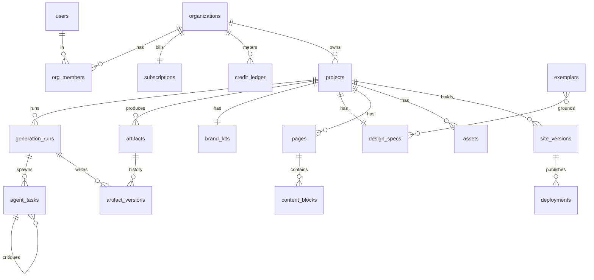

### RLS & multi-tenancy
- **Tenant boundary = `org_id`.** Every tenant table denormalizes `org_id` (avoids multi-join RLS predicates → fast policies + simple GIN indexes).
- Pattern: `ALTER TABLE x ENABLE ROW LEVEL SECURITY;` + policy `USING (org_id IN (SELECT org_id FROM org_members WHERE user_id = auth.uid()))`. The membership lookup is wrapped in a `STABLE SECURITY DEFINER` function and cached per-statement.
- **Service role** (Temporal workers, Stripe webhook handler) uses the Supabase service key, bypassing RLS — writes to `generation_runs`, `agent_tasks`, `credit_ledger` happen server-side, never from the browser.
- **Balance integrity:** credit debits run inside the run's DB transaction with the `idempotency_key` unique constraint; a `BEFORE` trigger rejects a debit that would push `SUM(delta)` below the tier floor, enforcing the per-run `credit_budget` cap (risk #2).
- **Tenant deploys** (`deployments`, generated site data) are physically isolated per Cloudflare Pages project; Postgres only stores pointers (`r2_key`, `cf_project_name`), keeping generated-site blobs out of the relational tier.


---

## User Flows

All flows operate against the canonical entity set (`Project`, `GenerationRun`, `AgentTask`, `Artifact`, `Deployment`, `Subscription`, `CreditLedger`) and the **Temporal "Studio" workflow** (CEO-orchestrated state machine). `GenerationRun.status` is the master FSM; the UI subscribes via `workflow.query()` → tRPC subscription → RSC stream. Convention below: 🟢 **user acts**, ⏳ **user waits** (live progress streamed), 🤖 **autonomous**.

### Canonical `GenerationRun.status` FSM

```
QUEUED → BRIEFING → WAIT_FOR_USER → BRANDING → DESIGN_SPEC → CONTENT
       → COMPONENT_TREE → CODEGEN → QUALITY_GATE → READY_PREVIEW
       → DEPLOYING → DEPLOYED
   �‹ FAILED / RETRYING (from any state) · REVISING (gate/iteration loop)
```

---

### Flow 1 — Golden Path: Idea → Deploy

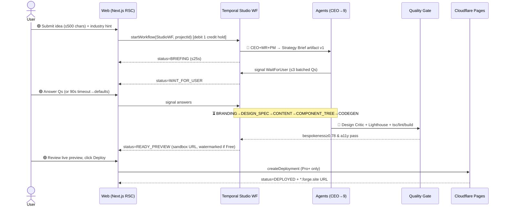

| Stage | Wait/Act | Latency budget | Credits |
|---|---|---|---|
| Brief + clarifying | 🟢 act once | ~25s + answer | 0 (held) |
| Brand→Code | ⏳ wait | 90–180s streamed | 8–15 |
| Quality gate | ⏳ wait | 20–40s | 1 |
| Review | 🟢 act | user-paced | 0 |
| Deploy | 🟢 act → ⏳ | 30–60s | 1 (Pro+) |

**Key decision:** credit is **held** at start, **committed** only on `READY_PREVIEW`; a `FAILED` run before gate refunds the hold to `CreditLedger`. User never pays for a broken run.

---

### Flow 2 — Section Regeneration / Iteration Loop

Scoped re-run: only the targeted section's `AgentTask` subtree re-executes via a Temporal **child workflow**, reusing the existing `GenerationContext` blackboard so brand tokens stay locked (no palette drift).

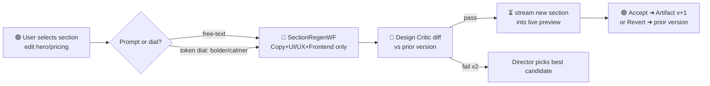

- **State:** parent `GenerationRun` stays `DEPLOYED`/`READY_PREVIEW`; child run = `REVISING`. New `Artifact` row, `version=n+1`, `parent_version` set — full version tree retained for one-click revert.
- **Cost:** 2–4 credits (section-only, not full run). Max 2 debate rounds enforced.
- **User:** 🟢 trigger + accept; ⏳ waits ~20–40s.

---

### Flow 3 — Manual Override / Direct Edit

User bypasses agents to hand-edit an artifact (copy string, hex token, swap logo SVG). Edits write directly to the typed artifact JSON and **pin** the field so future regenerations don't overwrite it.

| Artifact | Editor surface | Persistence |
|---|---|---|
| ContentModel | inline rich-text on preview | patch JSON, `field.locked=true` |
| BrandKit token | color/type picker | token override, re-derives dependent CSS vars |
| Logo (SVG) | upload or SVG code edit | replaces asset in R2, bumps version |
| Code Bundle | Monaco diff (Business+) | branch in R2, re-runs build gate only |

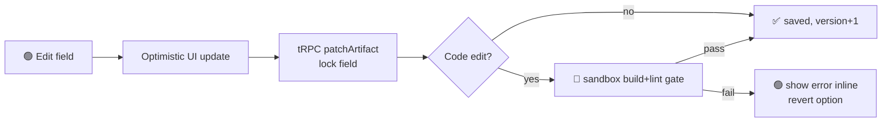

**Decision:** locked fields are excluded from agent write-scope on subsequent runs (merge policy: user-pin > agent output). Editing code re-runs **only** the security/build gate, never the design critic.

---

### Flow 4 — Onboarding & First-Run

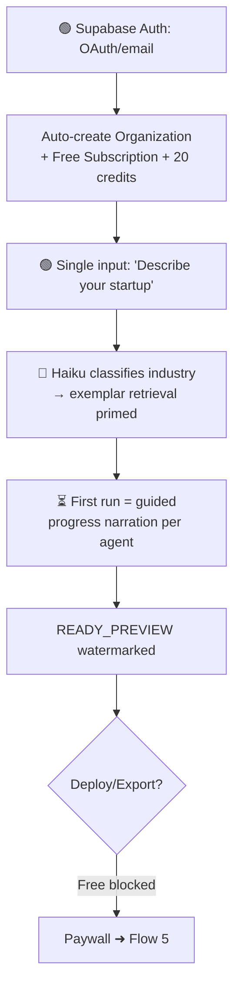

- **No empty dashboard.** First screen is the idea box; org/credits provisioned silently. Time-to-first-preview is the activation metric (<3 min target).
- First run shows **per-agent narration** ("Brand agent chose Söhne + cobalt because…") to build trust; suppressible on later runs.

---

### Flow 5 — Upgrade / Paywall Moment

Paywall fires at **intent-to-extract** (Deploy/Export/custom-domain), not at signup — the user has already seen Stripe-quality output.

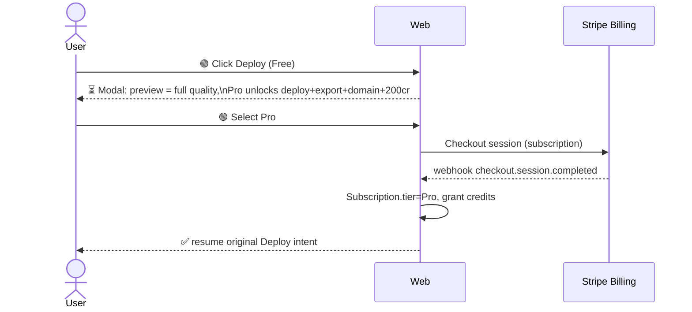

| Trigger | Gate | Upsell |
|---|---|---|
| Deploy / Export | Free → Pro | $/mo + 200 credits |
| Credits exhausted mid-run | hold fails | top-up or upgrade tier |
| A/B variants, API | Pro → Business | seats + concurrency |

**Decision:** the blocked action is **stashed** and auto-resumed post-`checkout.session.completed` webhook — no re-navigation. Watermark removed on tier flip without re-generation.

---

### Flow 6 — Failure / Retry Path

Temporal owns durability: each activity is checkpointed, so a worker crash resumes from the last completed `AgentTask` — invisible to the user.

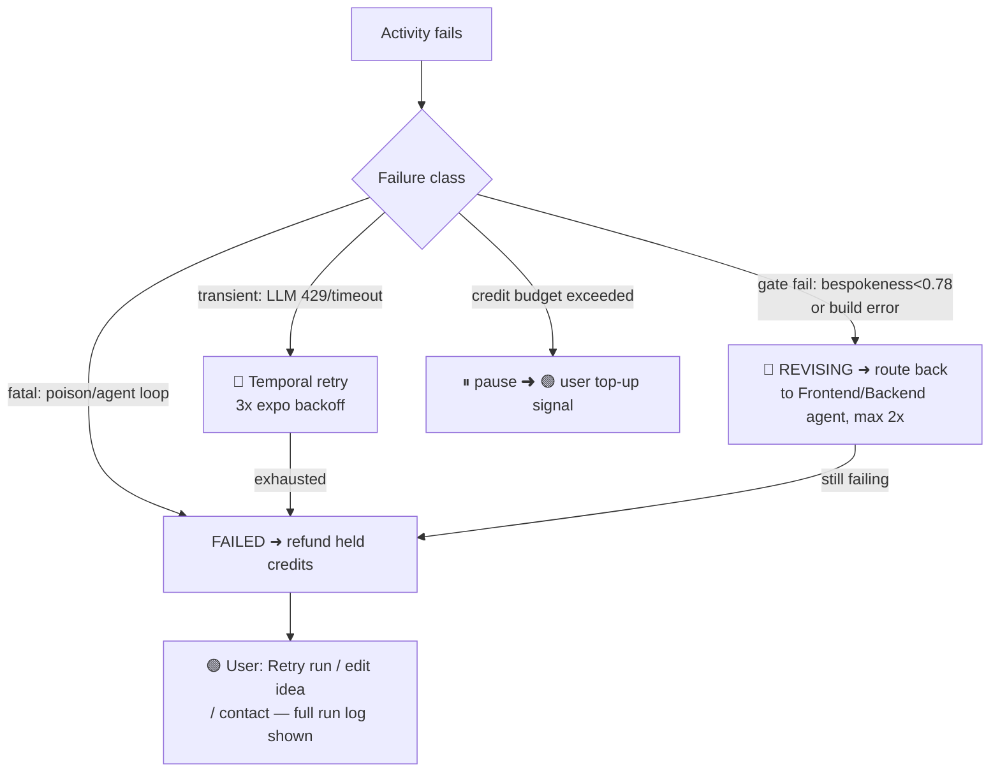

- **User never sees raw stack traces or broken code** — gate failures loop back to agents autonomously; only terminal `FAILED` surfaces, with a plain-language cause and one-click **Retry** (re-runs from `QUEUED`, reusing prior valid artifacts via blackboard).
- **State:** `GenerationRun.failure_reason` + `last_completed_activity` persisted for resumable retry. Credit hold auto-refunded on `FAILED` before commit.
- **Wait/act:** ⏳ during all auto-retry/revision; 🟢 only on budget top-up or terminal retry decision.


---

## UI/UX Structure

The Forge platform UI is a **Next.js 15 App Router** application: marketing routes are statically rendered at the edge (Vercel), authenticated app routes are RSC-streamed, and the live generation surface is driven by a persistent transport (Temporal workflow query → SSE) hydrating client islands. The platform's own UI is held to the same Stripe/Linear bar we demand of generated sites — it is the first proof of the product.

### Information Architecture & Route Map

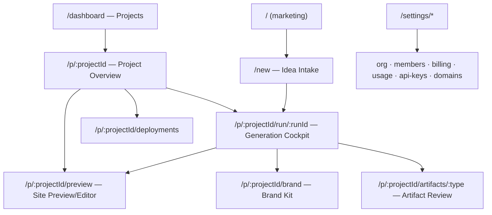

| Route | Auth | Render | Purpose | Key states |
|---|---|---|---|---|
| `/` `/pricing` `/showcase` | public | SSG/edge | Conversion; live showcase of generated sites | — |
| `/new` | required | RSC + client form | Idea intake → starts `GenerationRun` | empty, validating, submitting |
| `/dashboard` | required | RSC stream | Project grid, run status chips, credit meter | empty (0 projects), loading skeletons |
| `/p/:id` | required | RSC | Project overview: artifacts, history, deployments | — |
| `/p/:id/run/:runId` | required | client + SSE | **Generation Cockpit** (the hero screen) | connecting, running, paused (WaitForUser), failed, complete |
| `/p/:id/preview` | required | iframe + RSC | Live site preview + in-context editor | building, ready, diff-pending |
| `/p/:id/brand` | required | RSC | Brand Kit: tokens, logo SVG, type, voice | locked (Free), editable (Pro+) |
| `/p/:id/artifacts/:type` | required | RSC | Versioned artifact diff/approve | needs-review, approved, superseded |
| `/p/:id/deployments` | required | RSC + REST poll | Cloudflare Pages deploy log, domains | none, building, live, failed |
| `/settings/billing` | required | RSC | Stripe portal, tier, usage credits | — |

URL convention: `/p/:projectId` for project scope; runs are nested (`/run/:runId`) so a crashed run is deep-linkable and resumes via Temporal `describeWorkflowExecution`.

### The Generation Cockpit (primary screen)

Three-pane layout, 1440px reference grid: **left rail (280px)** agent roster, **center (fluid)** live artifact stream, **right rail (360px)** inspector/diff. The cockpit subscribes to one SSE channel keyed by `runId`; events are typed `{type, agent, runId, taskId, payload, ts}` and reduce into a client store (Zustand).

- **Agent roster (left):** 10 agents as status rows (CEO, PM, Market Research, Brand, Copy, UI/UX, Frontend, Backend, SEO, Growth). Each shows live state: `queued · thinking · debating · waiting · done · error`, an animated token-throughput sparkline, and elapsed time. The active agent pulses; debate rounds render a paired "Critic ⇄ Director" badge.
- **Activity stream (center):** reverse-chronological event cards with 120ms staggered entrance. Card types: `reasoning` (streamed thinking, collapsible), `artifact-emitted` (rich preview), `debate` (candidate A vs B with rubric scores 0–100), `quality-gate` (pass/fail with contrast/Lighthouse/AI-tell sub-scores), `signal-request` (the WaitForUser prompt). Auto-scroll with a "jump to live" pill when the user scrolls up.
- **Pipeline progress (top):** a horizontal stepper for the 8 canonical artifacts (Brief → Brand Kit → Design Spec → Content Model → Component Tree → Code → Quality Gate → Deploy) with per-step % and a global ETA derived from historical run medians.
- **Human-in-the-loop:** when the workflow hits `WaitForUser`, a non-blocking but prominent modal-sheet surfaces ≤3 batched questions with smart defaults pre-selected and a countdown ("auto-continues in 4:00"); answering sends a Temporal signal via tRPC mutation.

### Artifact Review / Approve UX

Each `Artifact` is versioned; the review surface is a **split diff** (previous version ⇄ candidate) tailored per type: Brand Kit shows swatch/type/logo diffs; Content Model shows field-level text diff; Code Bundle shows a Monaco file-tree diff. Actions: **Approve**, **Request changes** (free-text → routed back to the owning agent as a revision signal, bounded to the 2-round debate cap), **Revert to v(n)**. Approvals are optional in autonomous mode (defaults auto-approve on timeout) but gate deploy on Pro+.

### In-Context Editing UX (Preview/Editor)

The generated site renders in a sandboxed iframe (the R2 bundle served from a preview origin). A Framer-style overlay enables **click-to-select** any section → the right inspector binds to that node's tokens + content. Edits are token/content mutations (never raw CSS), preserving the anti-generic guarantee: changing a color edits the `BrandKit` token, re-themes globally, and writes a new `ContentModel`/`BrandKit` version. A "Regenerate this section" button re-invokes the relevant agent for that node only. Responsive toggle (desktop/tablet/mobile) and a per-edit undo stack backed by artifact versions.

### Navigation Model

- **Global top bar:** org/project switcher (⌘K command palette — Linear-style, fuzzy over projects/artifacts/actions), credit-balance meter, run-status indicator, avatar menu.
- **Project-scoped left nav** (inside `/p/:id`): Overview · Cockpit · Preview · Brand · Artifacts · Deployments.
- **Command palette** is the power-user spine: "New project", "Re-run from Design Spec", "Deploy", "Open brand tokens".

### Empty / Loading / Error States

| Surface | Empty | Loading | Error |
|---|---|---|---|
| Dashboard | Illustrated CTA → `/new`, sample showcase | Skeleton grid (6 cards) | Retry banner + last-known cache |
| Cockpit | "Igniting the forge…" pre-first-event | Per-agent shimmer rows, streamed tokens | Failed step card with "Resume run" (Temporal retry) — never raw stack traces |
| Preview | "Build in progress" with stepper | iframe skeleton + progress | Build-failed → routes to Frontend agent, user sees "fixing automatically" |
| Billing | Free-tier upsell | — | Stripe webhook lag toast |

### Design Language (platform itself)

- **Tokens:** Tailwind + CSS vars. Base radius `10px`; spacing scale `4/8/12/16/24/32/48`; type via **Inter** (UI) + **Geist Mono** (code/metrics). Neutral-forward dark-first palette (`#0B0C0E` bg, `#E6E8EB` fg) with a single electric accent (`#FF5A1F` — "forge ember").
- **Motion:** 120–180ms ease-out for entrances; agent pulses use a 1.2s breathing loop; respects `prefers-reduced-motion`. No gratuitous animation — motion signals state change only.
- **Components built on shadcn/ui (owned source)**, never a locked dependency.

### Component Inventory

| Domain | Components |
|---|---|
| Shell | `TopBar`, `OrgProjectSwitcher`, `CommandPalette`, `ProjectNav`, `CreditMeter`, `RunStatusPill` |
| Cockpit | `AgentRoster`, `AgentStatusRow`, `TokenSparkline`, `PipelineStepper`, `ActivityStream`, `EventCard` (reasoning/artifact/debate/gate variants), `DebatePanel`, `QualityGateCard`, `SignalRequestSheet`, `JumpToLivePill` |
| Artifacts | `ArtifactDiff`, `BrandKitDiff`, `ContentDiff`, `CodeDiff` (Monaco), `VersionTimeline`, `ApproveBar` |
| Preview/Editor | `PreviewFrame`, `SelectionOverlay`, `TokenInspector`, `ContentInspector`, `ResponsiveToggle`, `RegenerateSectionButton`, `UndoStack` |
| Brand | `PaletteGrid`, `TypePairingCard`, `LogoSVGViewer`, `VoiceCard`, `TokenTable` |
| Billing | `TierCard`, `UsageGraph`, `CreditLedgerTable`, `StripePortalButton` |
| Primitives | shadcn-derived `Button`, `Sheet`, `Dialog`, `Tooltip`, `Skeleton`, `Toast`, `Tabs`, `ScrollArea` |


---

## Feature Breakdown

Organized into 8 epics. Owning agents map to the 10-agent roster (CEO, Market Research, PM, Brand, Copywriting, SEO, UI/UX, Frontend, Backend, Growth) plus the **Design Critic** quality role. Artifacts are versioned rows in the `Artifact` table (type-discriminated, R2-backed for blobs). All acceptance criteria are machine-checkable so the automated quality gate can enforce them.

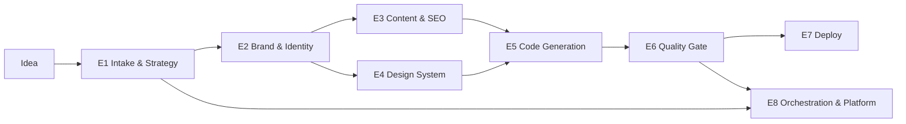

### Epic 1 — Idea Intake & Strategy

| Feature | Owner | Artifact | Acceptance Criteria | MoSCoW |
|---|---|---|---|---|
| Parse plain-English idea into typed `IdeaSpec` (industry, ICP, problem, business model) | CEO (Haiku classify → Opus) | `Artifact:idea_spec` | Valid JSON schema; industry classified to 1 of ~40 NAICS-derived buckets; confidence ≥0.7 or triggers clarifier | **Must** |
| Batched clarifying questions (≤3) via Temporal `WaitForUser` signal | CEO | signal payload on `GenerationRun` | Workflow pauses ≤3 Qs; auto-defaults applied after 10-min timeout; resumes deterministically | **Must** |
| Market research: TAM/competitor/positioning synthesis | Market Research (Sonnet + WebSearch) | `Artifact:market_brief` | ≥3 named competitors, ≥2 differentiation angles, sourced positioning statement | **Should** |
| Audience/ICP definition (persona, jobs-to-be-done, tone targets) | PM | `Artifact:audience_profile` | ≥1 primary persona with pains/gains; feeds tone tokens into Brand Kit | **Must** |
| Strategy Brief assembly (value props, site goals, page list) | CEO + PM (Director arbitration) | `Artifact:strategy_brief` | Locks required page set; ≥3 value props; passes PM rubric ≥7/10 | **Must** |
| Live web competitive screenshot exemplar pull | Market Research | exemplar refs | Could be deferred; uses pgvector `Exemplar` instead for MVP | **Could** |

### Epic 2 — Brand & Identity

| Feature | Owner | Artifact | Acceptance Criteria | MoSCoW |
|---|---|---|---|---|
| Startup name generation + availability heuristic | Brand (Opus) | `BrandKit.name` | 3 candidates scored; chosen name ≤2 words preferred; .com-style heuristic check | **Must** |
| Logo concept as **crisp SVG** (programmatic synthesis, not raster) | Brand | `BrandKit.logo_svg` | Valid SVG, renders ≤1 viewBox, monochrome + color variants, ≤8KB | **Must** |
| Color system → design tokens (HSL ramps, semantic roles) | Brand | `BrandKit.tokens.color` | WCAG AA contrast on text/bg pairs; ≥9-step ramp per hue; unique palette fingerprint (not in last-N dedupe cache) | **Must** |
| Type pairing (display + body) from curated foundry set | Brand | `BrandKit.tokens.type` | 2 families, modular scale (1.2–1.333 ratio), variable-font where available | **Must** |
| Brand voice + messaging pillars | Brand + Copywriting | `BrandKit.voice` | 3 tone attributes, do/don't examples; consumed by Copy agent | **Should** |
| Full brand identity sheet (spacing, radius, elevation, motion tokens) | Brand | `BrandKit.tokens.*` | Complete token set validates against `BrandKitSchema`; no hardcoded styles downstream | **Must** |

### Epic 3 — Content & SEO

| Feature | Owner | Artifact | Acceptance Criteria | MoSCoW |
|---|---|---|---|---|
| Typed content model per page/section | Copywriting (Sonnet) | `ContentModel` | Every section slot filled; validates against page schema; no lorem-ipsum/placeholder strings | **Must** |
| Marketing copy (hero, value props, CTAs, social proof) | Copywriting | `ContentModel.landing` | Hero ≤12 words; ≥2 CTAs; reading grade ≤9; on-brand voice check passes | **Must** |
| Page content: Product, Pricing, Contact, FAQ | Copywriting | `ContentModel.{product,pricing,contact,faq}` | Pricing ≥2 tiers w/ feature matrix; FAQ ≥6 Q&A; Contact form schema defined | **Must** |
| SEO metadata + schema.org JSON-LD per page | SEO (Sonnet) | `ContentModel.meta` | Unique title ≤60ch + desc ≤155ch per page; valid Organization/FAQPage JSON-LD; canonical URLs | **Must** |
| Blog content (3 seed posts, keyword-targeted) | SEO + Copywriting | `ContentModel.blog[]` | ≥3 posts ≥600 words, internal links, target keyword in H1/meta | **Should** |
| Hero/section imagery via Flux (Replicate) | UI/UX | R2 image assets | Industry-appropriate, ≥1200px, brand-color-coherent; alt text generated | **Should** |
| Programmatic SVG graphics/icons (non-logo) | Brand/UI/UX | SVG asset set | Stroke/fill bound to tokens; ≤10KB each | **Could** |

### Epic 4 — Design System & UI/UX

| Feature | Owner | Artifact | Acceptance Criteria | MoSCoW |
|---|---|---|---|---|
| Layout system + section blueprints per page | UI/UX (Opus) | `DesignSpec.layout` | References tokens only; responsive grid spec; ≥5 distinct section archetypes | **Must** |
| Exemplar retrieval grounding (pgvector, industry-scoped) | UI/UX | retrieved `Exemplar[]` | Top-k=5 by cosine on industry+style embedding; influences layout choice (logged) | **Must** |
| Motion/interaction rules (scroll, hover, transitions) | UI/UX | `DesignSpec.motion` | Reduced-motion fallback defined; durations/easing as tokens | **Should** |
| Component tree composition bound to content+tokens | Frontend | `Artifact:component_tree` | Every node maps to owned shadcn primitive + content slot; no orphan content | **Must** |
| Dark mode / theme variants | UI/UX | `DesignSpec.themes` | Token-swapped; AA contrast both modes | **Could** |

### Epic 5 — Code Generation

| Feature | Owner | Artifact | Acceptance Criteria | MoSCoW |
|---|---|---|---|---|
| Production Next.js 15 (App Router) project synthesis | Frontend (Opus) | `Artifact:code_bundle` (R2) | `tsc --noEmit` passes; `next build` succeeds; Tailwind tokens wired | **Must** |
| Component code from tree (owned shadcn/ui source) | Frontend | code_bundle `/components` | RSC where static; no unused imports; lint clean (eslint 0 errors) | **Must** |
| Backend architecture stubs (API routes, form handlers, contact/email) | Backend | code_bundle `/app/api` + schema | Typed handlers; contact form → email/webhook stub; env-var manifest | **Should** |
| Data model / DB schema for site-specific entities | Backend | `schema.sql` | Valid Postgres DDL; only if idea implies app data | **Could** |
| Sitemap.xml + robots.txt + OG image generation | SEO/Frontend | bundle static | Valid sitemap; OG image per page | **Should** |

### Epic 6 — Quality Gate (anti-generic enforcement)

| Feature | Owner | Artifact | Acceptance Criteria | MoSCoW |
|---|---|---|---|---|
| Design Critic bespokeness scoring vs rubric | Design Critic (Opus) | `Artifact:critic_report` | Scores bespokeness/hierarchy/contrast/AI-tell each 0–10; <7 → forced revision loop (max 2) | **Must** |
| Lighthouse + visual-diff automated check | Platform CI | gate result | Perf ≥90, A11y ≥95, SEO ≥95; below → route back to Frontend | **Must** |
| Sandboxed build + security lint | Backend/Platform | gate result | Isolated container; `npm audit` no high/critical; semgrep clean; failures never surface to user | **Must** |
| Token-uniqueness dedupe check | Platform | gate result | Palette+type+spacing hash not within Hamming threshold of last 500 runs | **Should** |

### Epic 7 — Deployment

| Feature | Owner | Artifact | Acceptance Criteria | MoSCoW |
|---|---|---|---|---|
| Deploy generated site to Cloudflare Pages (per-tenant project) | Backend | `Deployment` | Live URL ≤90s post-gate; isolated CF project; status tracked | **Must** |
| Custom domain binding (Pro+) | Backend | `Deployment.domain` | DNS/CNAME instructions + verification; SSL provisioned | **Should** |
| Code export (zip from R2) | Backend | signed R2 URL | Pro+ gated; runs `npm install && build` clean | **Must** |
| Watermarked free-tier preview (no deploy/export) | Platform | preview render | Free tier blocked from deploy/export; visible watermark | **Must** |

### Epic 8 — Orchestration & Platform

| Feature | Owner | Artifact | Acceptance Criteria | MoSCoW |
|---|---|---|---|---|
| Temporal "Studio" workflow (CEO router → 9 activities) | Platform | `GenerationRun` | Every step checkpointed; crash resumes from last activity; deterministic replay | **Must** |
| Typed blackboard `GenerationContext` (Postgres + R2) | Platform | `GenerationContext` | Single source of truth; all agents read/write versioned artifacts | **Must** |
| Structured debate (Critic + Director, max 2 rounds) | CEO/PM | critique rounds | Bounded ≤2 rounds then Director decides; logged scores | **Must** |
| Live progress streaming (workflow query → UI) | Platform | SSE/RSC stream | Per-activity status to UI ≤2s latency | **Must** |
| Per-tier model routing + credit budget cap per run | Platform | `CreditLedger` | Opus/Sonnet/Haiku routed by task; run aborts at credit cap; debit logged | **Must** |
| Stripe billing (tiers + metered usage) | Growth/Platform | `Subscription` | Free/Pro/Business/Scale gates enforced; usage metering on credits | **Should** |
| Concurrency: 1000s of runs (Fly.io worker pool + priority queue) | Platform | infra | Business tier priority queue; horizontal worker scaling | **Should** |
| A/B site variants | Growth | `Artifact` variants | Business+ gated; 2 variants per run | **Won't (MVP)** |
| Multi-seat org / API access / white-label | Platform | `Organization` | Deferred post-MVP | **Won't (MVP)** |


---

## Technical Stack Recommendations

This expands the Canonical Decision Brief into a fully-justified stack. Every canonical choice is preserved; alternatives are shown only to explain *why we didn't pick them*. Two distinct surfaces exist — the **Platform** (Forge itself) and the **Generated Sites** (tenant output) — and they have deliberately different stacks.

### System topology

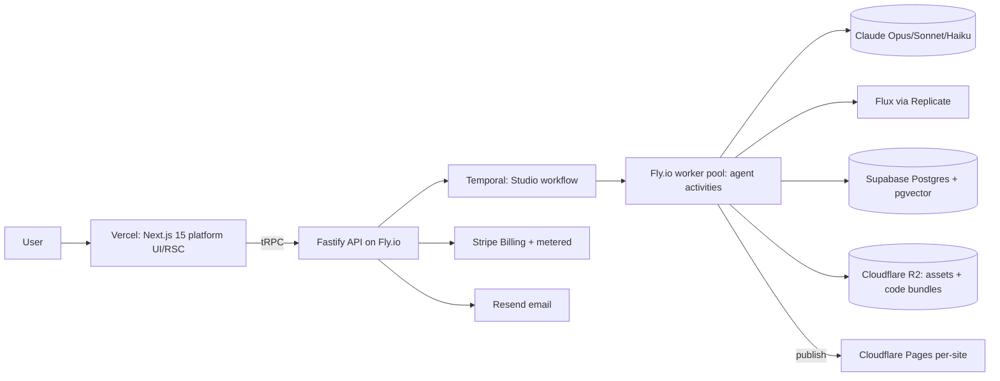

### Layer-by-layer comparison

| Layer | Chosen | Alternatives (why not) |
|---|---|---|
| Platform frontend | **Next.js 15 App Router** | Remix (smaller RSC streaming story); SvelteKit (off-ecosystem from generated sites); Astro (weak for highly-interactive job dashboards). |
| Styling | **Tailwind + design tokens** | CSS Modules (no token-to-theme mapping); Chakra/MUI (runtime cost, opinionated look fights bespokeness). |
| Components (platform) | **shadcn/ui (owned source)** | Radix-only (more wiring); MUI (locked dep, can't fork). Owning source lets the Frontend agent emit the *same* primitives into tenant code. |
| Backend runtime | **Node 20 + Fastify** | NestJS (DI overhead); Express (~2x slower, no schema); Go/Bun (breaks shared-types story). Fastify ~45–70k req/s, JSON-schema validation built in. |
| API style | **tRPC internal + REST webhooks** | GraphQL (resolver/N+1 complexity, no end-to-end TS inference); gRPC (browser friction). REST reserved for Stripe + Cloudflare deploy callbacks. |
| Orchestration | **Temporal** | BullMQ/Redis (no durable multi-hour replay); Inngest (good but less control over signals/child-workflows); AWS Step Functions (vendor lock, weak local dev). Temporal gives checkpoint/resume + signals for HITL. |
| Primary DB | **PostgreSQL (Supabase)** | PlanetScale/MySQL (no pgvector, weaker JSONB); Mongo (loses relational integrity across 13 entities); Firestore (poor analytics joins). |
| Vector/search | **pgvector (HNSW)** | Pinecone/Weaviate (second datastore + egress + sync drift). At <5M exemplar vectors pgvector HNSW is sub-20ms — no separate store earns its keep. |
| Object storage | **Cloudflare R2** | S3 (egress fees kill per-site bundle + asset serving); GCS (egress). R2 zero-egress + native Pages/Workers binding. |
| Auth | **Supabase Auth** | Clerk/Auth0 (extra vendor + cost, RLS integration weaker). Bundled with DB enables row-level tenant isolation directly. |
| Payments | **Stripe Billing + metered usage** | Paddle/Lemon Squeezy (MoR simplifies tax but weaker metered-usage + credit primitives). Stripe meters map 1:1 to `CreditLedger`. |
| Image gen | **Flux (Replicate) + programmatic SVG** | DALL·E/Midjourney (no API/SLA control); raster logos (blurry at scale). SVG logos stay crisp and editable as tokens. |
| Email | **Resend** | SendGrid/SES (clunky DX, raw SES needs reputation mgmt). Resend + React Email renders branded transactional mail with shared components. |
| Analytics | **PostHog (self-host on Fly) + Vercel Web Analytics** | Mixpanel/Amplitude (cost at event volume); GA4 (privacy + poor product analytics). PostHog covers funnels, session replay, and feature flags for tier gating. |
| CI/CD | **GitHub Actions + Turborepo** | CircleCI/Jenkins (heavier). Turborepo remote cache keeps the monorepo (platform + agent pkgs + shared types) builds fast. |
| IaC | **Terraform + Fly/Cloudflare/Supabase providers** | Pulumi (TS is nice but smaller provider coverage for Fly); manual console (non-reproducible). Temporal namespaces, R2 buckets, Fly apps all codified. |
| Hosting — platform | **Vercel (UI) + Fly.io (Fastify/Temporal workers)** | All-Vercel (no long-running stateful workers, 60–300s function caps); all-Fly (loses edge RSC). Split matches workload shape. |
| Hosting — generated sites | **Cloudflare Pages per project** | Vercel per-tenant (cost + project-limit ceilings); Netlify (pricier at scale). Pages gives isolated projects, custom domains, free SSL, global edge. |

### LLM routing by task tier (the cost lever)

Per-run LLM spend is the dominant marginal cost, so route aggressively. Approximate 2026 pricing: Haiku ~$0.80/$4, Sonnet ~$3/$15, Opus ~$15/$75 per Mtok (in/out).

| Task | Tier | Model | Why |
|---|---|---|---|
| CEO orchestration, debate arbitration, backend/frontend code | Frontier | **Opus 4.x** | Reasoning + correct code justify cost; ~10–15% of token volume. |
| Marketing copy, SEO content, page drafts, brand voice | Bulk | **Sonnet 4.x** | 5x cheaper than Opus; quality sufficient with good prompts + exemplars. |
| Intent classification, input extraction, schema/JSON validation, routing, content-model field fills | Cheap | **Haiku 4.x** | ~18x cheaper than Opus; high-volume, low-judgment. |

Cost-control rules:
- **Default to the cheapest tier; escalate only on Critic failure.** A Sonnet draft that fails the Design Critic gate retries once on Sonnet, then escalates to Opus — not the reverse.
- **Prompt caching** on the system prompt + `GenerationContext` blackboard (large, stable per run) cuts input cost ~90% across an agent's calls.
- **Batch Haiku validation/extraction** calls where latency-insensitive (50% discount).
- **`CreditLedger` enforces a hard per-run token/$ ceiling** (Brief risk #2); the workflow halts and signals the user rather than overrunning budget.
- **Flux**: generate hero imagery once, cache derivatives in R2; never re-render on revision unless tokens (palette/subject) change.

### Generated-site stack (tenant output)

Emitted sites use a deliberately lean, edge-deployable subset so they are cheap to host and dependency-light:

| Concern | Choice |
|---|---|
| Framework | **Next.js 15 static export / RSC** (same ecosystem; Frontend agent reuses owned shadcn primitives) |
| Styling | **Tailwind compiled with the site's unique token set** (no two sites share palette/type/spacing) |
| Assets | Flux raster + synthesized **SVG logos/icons**, served from R2/Pages |
| Backend stubs | Fastify route handlers / Cloudflare Workers for forms + contact |
| Deploy | **Cloudflare Pages project per site**, custom domain via Cloudflare for SaaS |
| Quality gate (pre-publish) | typecheck → ESLint → `next build` → Lighthouse (perf/a11y/SEO ≥90) → visual-diff + Design Critic bespokeness score; failures route back to agents, never to the user (Brief risk #3) |

### Why this stack holds at scale

- **One language (TypeScript) end to end** — shared types flow from Postgres → tRPC → agents → emitted site code, eliminating a whole class of contract bugs.
- **Stateless edge (Vercel) + durable stateful core (Temporal on Fly)** scales the two workloads independently to thousands of concurrent runs.
- **Zero-egress R2 + per-tenant Pages** keeps the marginal hosting cost of each generated site near zero, protecting margin under the credit model.


---

## MVP Roadmap

### MVP Thesis

> **The smallest thing that proves "idea → genuinely good custom website" is a single durable Temporal run that takes one plain-English idea and emits ONE deployed, multi-page Next.js site that a skeptic cannot distinguish from a hand-built Stripe/Linear-class landing page — passing a hard Design Critic gate.**

We prove *quality and autonomy first*, scale and monetization second. The wedge is **bespokeness, not breadth**: better to ship 1 industry vertical that looks bespoke than 10 verticals that look templated. If the Critic gate + token-uniqueness loop works, the company is real; everything else (multi-tenant, billing, A/B, API) is execution.

**Explicit non-goals for the entire MVP:** no white-label, no API access, no multi-seat orgs, no A/B variants, no custom domains, no blog CMS, no backend-app generation (marketing site only — backend agent emits *stubs/schema*, not a running app).

---

### The 22 Capabilities — MVP Mapping

We bucket the 22 platform capabilities into in-scope (✓), thin-version (◐), deferred (✗):

| # | Capability | M1 | M2 | M3 | M4 |
|---|---|---|---|---|---|
| 1 | Idea intake / NL parsing | ✓ | ✓ | ✓ | ✓ |
| 2 | Strategy Brief (ICP/positioning) | ◐ | ✓ | ✓ | ✓ |
| 3 | Market Research grounding | ✗ | ◐ | ✓ | ✓ |
| 4 | Brand Kit (name/voice/color/type) | ◐ | ✓ | ✓ | ✓ |
| 5 | Logo synthesis (SVG) | ✗ | ◐ | ✓ | ✓ |
| 6 | Design Spec (layout/sections/motion) | ◐ | ✓ | ✓ | ✓ |
| 7 | Design token generation (uniqueness) | ✗ | ✓ | ✓ | ✓ |
| 8 | Content Model (copy per section) | ◐ | ✓ | ✓ | ✓ |
| 9 | SEO content + schema.org | ✗ | ✗ | ◐ | ✓ |
| 10 | Image gen (Flux hero/imagery) | ✗ | ◐ | ✓ | ✓ |
| 11 | Component Tree (owned components) | ◐ | ✓ | ✓ | ✓ |
| 12 | Production code bundle (Next.js) | ◐ | ✓ | ✓ | ✓ |
| 13 | Backend architecture/stubs | ✗ | ✗ | ◐ | ◐ |
| 14 | Temporal orchestration / resume | ✓ | ✓ | ✓ | ✓ |
| 15 | Blackboard `GenerationContext` | ✓ | ✓ | ✓ | ✓ |
| 16 | Structured debate / critique rounds | ✗ | ◐ | ✓ | ✓ |
| 17 | Design Critic quality gate | ✗ | ✓ | ✓ | ✓ |
| 18 | Build/typecheck/lint/Lighthouse gate | ✗ | ◐ | ✓ | ✓ |
| 19 | pgvector exemplar retrieval | ✗ | ✗ | ✓ | ✓ |
| 20 | Human-in-loop signals (`WaitForUser`) | ✗ | ✗ | ◐ | ✓ |
| 21 | Deploy to Cloudflare Pages | ✗ | ✗ | ◐ | ✓ |
| 22 | Auth + credits + Stripe billing | ✗ | ✗ | ✗ | ◐ |

---

### Phased Plan (12 weeks, team of 4: 2 full-stack, 1 design-eng, 1 AI/infra)

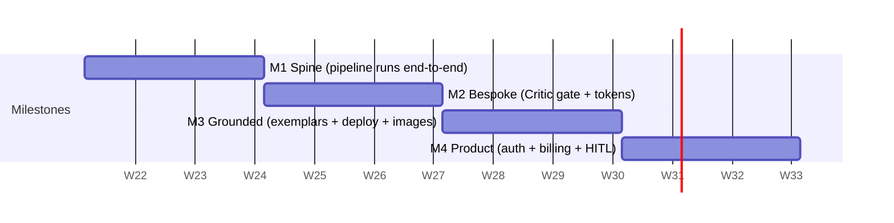

#### M1 — The Spine (Weeks 1–3)
- **Goal:** One hardcoded vertical (B2B SaaS) flows `idea → deployed-locally site` through a real Temporal workflow with a typed blackboard. Ugly is acceptable; *autonomous and durable* is not optional.
- **Agents shipped:** CEO (router), PM, Brand (thin), Copy, Frontend. Run as Temporal activities; Opus for CEO/Frontend, Sonnet for Copy.
- **Tech proof:** `GenerationContext` schema in Postgres (`generation_runs`, `agent_tasks`, `artifacts` tables); R2 bucket for code bundles; Fastify + tRPC; kill the worker mid-run and confirm resume from last activity.
- **Demo:** Type an idea in a dev console → watch live activity log → open a generated 3-section Next.js project in localhost.
- **Cut-line:** No tokens, no images, no logo, no Critic, no deploy. Styling can be a single shared theme.

#### M2 — Bespoke (Weeks 4–6) — *the make-or-break milestone*
- **Goal:** Two runs of the *same* idea produce visibly different, genuinely good sites. Ship the **token engine** (per-run unique palette/type-scale/spacing/radius/motion fingerprint) and the **Design Critic gate** with a forced ≤2-round revision loop.
- **Agents shipped:** UI/UX (Design Spec → tokens), Design Critic, Brand upgraded (full kit incl. SVG logo ◐), structured critique between Frontend↔Critic.
- **Tech proof:** Critic rubric (bespokeness, contrast WCAG AA, hierarchy, "AI-tell" heuristics) scored 0–100; threshold ≥ 80 to pass; headless Playwright screenshot fed to Critic. CI gate: `tsc` + `eslint` + `next build` must pass.
- **Demo:** Run idea twice → side-by-side two distinct bespoke sites; show a run that *failed* the gate and self-revised to pass.
- **Cut-line:** No exemplar retrieval yet (Critic uses rubric heuristics only). No real deploy. Flux images optional/stubbed.

#### M3 — Grounded & Deployable (Weeks 7–9)
- **Goal:** Quality jumps from "good" to "industry-bespoke" via **pgvector exemplar retrieval** (50–100 curated Stripe/Linear/Notion-class references tagged by industry), plus **Flux hero imagery**, **SVG logos**, **SEO/schema.org**, and a real **Cloudflare Pages deploy** with a public URL.
- **Agents shipped:** Market Research, SEO, Image pipeline (Flux via Replicate), Backend (stubs ◐). Full debate rounds operational.
- **Tech proof:** Exemplar embeddings via Haiku-extracted design descriptors; retrieval-by-industry feeds Design Spec. Full build gate adds **Lighthouse ≥ 90 perf / ≥ 95 a11y** + security lint before publish; failures route back to agents, never the user.
- **Demo:** 3 different verticals (SaaS, fitness, fintech) → 3 live `*.pages.dev` URLs, each feeling native to its industry.
- **Cut-line:** Single shared org/account (no auth), no billing, no custom domains, backend stays stubs.

#### M4 — Product (Weeks 10–12)
- **Goal:** A stranger can sign up and get a watermarked site free, or pay to deploy. Wrap the engine in a real product shell.
- **Agents shipped:** All 10 stable; growth-copy variants minimal. **HITL `WaitForUser` signal** (≤3 batched clarifying questions, auto-default after 5-min timeout).
- **Tech proof:** Supabase Auth + RLS; Stripe Billing with `credit_ledger`; Free (watermark, no deploy) vs Pro (deploy + export) gating; live progress via Temporal query → streamed RSC UI.
- **Demo:** Public sign-up → free watermarked preview → upgrade → deploy unwatermarked. End-to-end on a fresh account.
- **Cut-line (deferred to v1.1+):** Business/Scale tiers, multi-seat, A/B variants, API, white-label, custom domains, blog CMS, generated running backend.

---

### Definition of "MVP Done"

MVP is **done** when **all** hold on a fresh public account:

1. **Autonomy:** An unseen plain-English idea in ≥3 distinct industries produces a deployed multi-page site (landing/product/pricing/contact/FAQ) with **zero human edits**.
2. **Quality bar:** ≥ **70%** of generated sites pass a blind reviewer test ("hand-built or AI?") *and* every deployed site clears Critic ≥ 80, Lighthouse a11y ≥ 95, WCAG AA contrast.
3. **Uniqueness:** Two runs of one idea yield distinct token fingerprints (no shared palette/type/spacing hash).
4. **Durability:** A worker killed mid-run resumes and completes without restarting from zero.
5. **Cost/latency:** Median run ≤ **12 min** and ≤ **$2.50** LLM+image cost, enforced by a per-run credit budget.
6. **Monetization loop:** Sign-up → free watermarked preview → paid upgrade → live deploy works end-to-end through Stripe.


---

## Scaling Roadmap

Forge's scaling problem is unusual: each unit of work is a **multi-hour, multi-agent, LLM- and GPU-bound workflow**, not a cheap CRUD request. A "user" at peak does not hammer the API — they trigger one expensive `GenerationRun` (a Temporal workflow) that fans out ~40-60 LLM calls + 3-8 Flux renders + a sandboxed build. So we scale **concurrent runs and cost-per-run**, not RPS. Target shape: ~8-12% of users running concurrently at peak; a full site run = ~6-9 min wall-clock, ~$0.85-$1.40 raw cost at MVP.

### Bottlenecks in priority order

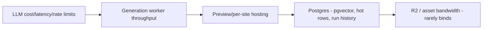

LLM is bottleneck #1 by both **cost** (70-80% of COGS) and **rate limits** (Anthropic org TPM/RPM caps throttle concurrency long before CPU does). Workers are #2 (Temporal activity slots + Flux GPU queue). Postgres is #3, deferred by design (single store, pgvector co-located).

### Staged plan: 0 → 1k → 10k → 100k users

| Dimension | Stage 0 (MVP, <100 users) | 1k users (~80-120 concurrent runs) | 10k users (~800-1.2k concurrent) | 100k users (~8-12k concurrent) |
|---|---|---|---|---|
| **LLM access** | Single Anthropic org key, default tier | Tier-4 throughput; per-tier model routing enforced (Opus only for CEO/critique/code) | Multi-key/account pool + token-bucket gateway; prompt caching on system/exemplar prefixes | Provisioned/committed throughput; **prefix-cache hit >55%**; semantic dedupe of sub-prompts |
| **LLM cost levers** | None (eat it) | Routing + Haiku for classify/extract | + Batch API for non-interactive content (SEO, alt-text, blog) at 50% off; cache brand/design system prompts | + cross-run exemplar embedding cache; distilled Haiku for Design-Critic pre-screen |
| **Workers** | 1 Fly.io worker, ~10 activity slots | 3-5 Fly machines, Temporal task-queue per agent class | KEDA-style autoscale on Temporal **schedule-to-start latency**; separate queues: `reasoning`, `bulk`, `image`, `build` | Multi-region worker pools; GPU image queue isolated w/ its own backpressure + spot Flux capacity |
| **Image gen** | Replicate on-demand | Concurrency cap + retry/backoff | Dedicated Replicate throughput + R2-cached renders by (industry, prompt-hash) | Reserved GPU pool / fallback provider; SVG-first to cut raster volume |
| **Preview hosting** | Vercel preview of platform; sites built in-memory | Ephemeral preview containers on Fly, TTL 30 min, watermarked | Cloudflare Pages per-site (Pro+); preview = signed R2 static bundle behind Worker | Per-tenant CF Pages projects; previews fully static off R2 + edge cache (near-zero marginal) |
| **Postgres** | Single Supabase instance | Connection pooler (pgBouncer/Supavisor), indexes on run/task hot paths | **Read replicas** for dashboards/run-history queries; move `AgentTask` event log to append-only partitioned table | Partition `GenerationRun`/`AgentTask`/`CreditLedger` by month; **tenant sharding by Organization**; pgvector → dedicated replica or Pinecone if >50M exemplar vectors |
| **State/queue** | Temporal Cloud starter | Temporal Cloud, single namespace | Namespace per environment; archival of completed runs to R2 | Multi-namespace by region/shard; history GC tuned |
| **Cost / generation (raw)** | ~$1.10 | ~$0.80 | ~$0.45 | ~$0.28 |
| **SLO: run success** | 95% | 99.0% | 99.5% | 99.9% |
| **SLO: time-to-first-artifact** | <30s | <20s | <15s | <12s |
| **SLO: full-run p95** | <12 min | <10 min | <9 min | <8 min |
| **Platform API availability** | 99.0% | 99.5% | 99.9% | 99.95% |
| **Team size** | 3-4 founders | ~10 | ~30 | ~80+ |

### Cost-per-generation economics

Raw cost drops ~75% (≈$1.10 → $0.28) through compounding levers, in impact order:

| Lever | Stage on | Savings on run |
|---|---|---|
| Model routing (Opus→Sonnet→Haiku by task tier) | 1k | 30-40% |
| Prompt caching (system + brand + exemplar prefixes, ~60% of input tokens are stable) | 10k | 20-30% of input cost |
| Batch API for async content (copy, SEO, alt-text) | 10k | ~50% on ~25% of calls |
| R2 render cache by prompt-hash + SVG-first logos | 10k | 40-60% of image cost |
| Distilled Haiku Critic pre-screen (Opus only on borderline) | 100k | cuts critique tokens ~50% |
| Provisioned throughput (commit discount) | 100k | 15-25% on remaining LLM |

**Margin:** Pro at ~$39/mo with ~25 runs/mo costs ~$7 (10k stage) → ~83% gross margin. Credit budgets (Risk #2 mitigation) hard-cap any single run, so a pathological debate loop can't blow unit economics — the workflow aborts at budget ceiling and routes to revision-with-cheaper-tier.

### Reliability by stage

- **0→1k:** Temporal durability is the SLO engine — crashed activities resume, so "success" ≈ "eventually completes." Focus: idempotent activities, retry policies, dead-letter on poison runs.
- **1k→10k:** Add **schedule-to-start latency** alerting (queue starvation = the real outage), circuit-breaker on LLM 429s with exponential backoff + key rotation, per-queue concurrency caps so image GPU stalls don't block reasoning.
- **10k→100k:** Multi-region active-active workers; per-tenant rate limits (noisy-neighbor isolation); error budgets per org tier (Scale/Business get priority queue + SLA credits on breach). Synthetic canary runs every 5 min validate the full pipeline end-to-end.

### Org / team evolution

| Stage | Structure |
|---|---|
| MVP | Founders own everything; one "agent quality" owner |
| 1k | Split **Platform/Infra** (Temporal, Fly, DB) vs **Agent/Quality** (prompts, routing, Critic rubric) |
| 10k | Add **Cost/Reliability (SRE-style)** team owning the LLM gateway + SLOs; dedicated **Design-Quality** team owning exemplar curation + anti-generic gate |
| 100k | Per-domain pods (Orchestration, Generation Pipeline, Hosting/Deploy, Growth/Billing) + a **FinOps/LLM-economics** function whose KPI is cost-per-successful-run |

**Sequencing rule:** never optimize a downstream bottleneck before the upstream one binds. LLM routing + caching pay back first and biggest; DB sharding is deliberately last because the single-Postgres + pgvector decision buys runway to ~10k before relational pressure forces partitioning.


---

## Deployment Architecture

Two deployment surfaces with deliberately different operational models: **(A) the Forge platform** — a long-lived, stateful, low-cardinality estate we own; and **(B) generated tenant sites** — high-cardinality (target 50k+ live sites), fully programmatic, per-customer deploys we never touch by hand. The hard problem is (B): isolated builds, custom domains, automatic TLS, and blast-radius containment at scale.

### Targets (conform to brief)

| Concern | Platform (A) | Generated sites (B) |
|---|---|---|
| Frontend/UI | **Vercel** (Next.js 15, edge) | **Cloudflare Pages** (one project per site) |
| Workers (Fastify + Temporal) | **Fly.io** (stateful, multi-region) | n/a |
| DB / state | Supabase Postgres + pgvector | none at edge; site = static + edge functions |
| Artifacts / bundles | **Cloudflare R2** | R2 → Pages deploy |
| Orchestration | Temporal Cloud | Temporal child workflow `DeploySite` |

### Environments

| Env | Platform frontend | Workers | Data | Tenant deploys |
|---|---|---|---|---|
| **dev** | Vercel preview per PR | Fly app `forge-workers-dev` (1 machine) | Supabase branch DB | Pages project `forge-dev-*`, subdomain only |
| **stage** | `stage.forge.dev` | Fly `forge-workers-stage` (2 machines, 1 region) | Supabase stage project | real Pages deploy, `*.stage-sites.forge.dev`, no custom domains |
| **prod** | `app.forge.dev` | Fly `forge-workers-prod` (≥6 machines, iad+cdg+sin) | Supabase prod + read replicas | Pages prod, custom domains + TLS live |

Env parity enforced by a single Terraform root module parameterized by `workspace`. No env-specific code paths — only config + secrets differ.

### CI/CD (platform)

GitHub Actions, trunk-based, `main` always deployable.

```
PR open ─► lint+typecheck (tsc) ─► unit (vitest) ─► build ─► Vercel Preview URL
                                                         └─► Temporal replay test (determinism gate)
merge ─► Fly deploy (rolling, canary 1 machine 10min) ─► smoke ─► promote │ auto-rollback
     └─► Vercel prod promote (instant alias swap)
```

- **Temporal determinism gate**: every PR replays the last 200 prod workflow histories against new worker code. A non-deterministic change (reordered activities) fails CI — protects in-flight multi-hour generation runs from corruption on deploy.
- **Worker deploys are versioned** via Temporal Worker Versioning (Build IDs). Old runs pin to their Build ID; new runs route to the new one. No "stop the world."
- Migrations: `supabase db push` gated, expand/contract only (add column → backfill → drop in later release). Never destructive in same deploy as code using it.

### IaC & containers

- **Terraform** owns: Fly apps, Supabase projects, Cloudflare (R2 buckets, Pages projects template, DNS zone, API tokens), Vercel project, Temporal namespaces. State in Terraform Cloud, locked.
- **Fly workers** are containers (`Dockerfile`, distroless Node 22, ~180MB). Temporal Worker + Fastify run as separate Fly **process groups** in one app so they share the image but scale independently (`web=2`, `worker=8`).
- **Tenant builds run in ephemeral Fly Machines** (see below), not the persistent worker pool — build load never competes with orchestration.

### Secrets management

- **Doppler** as source of truth → synced to Fly secrets, Vercel env, GitHub OIDC. No long-lived cloud creds in CI (GitHub OIDC → short-lived tokens).
- **Per-tenant secrets isolation**: a generated site's runtime env (e.g. its own Stripe key if the user wires one) is stored encrypted in Postgres (`Deployment.encrypted_env`, AES-GCM, key in Doppler), injected into the Cloudflare Pages project at deploy via API — never logged, never in the bundle, scoped to that one Pages project.

### Per-site deployment pipeline (the hard part)

`DeploySite` is a Temporal child workflow off the main Studio run. Steps are activities, each idempotent & checkpointed:

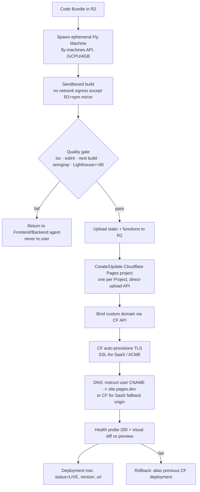

- **Build isolation**: each build is a fresh, single-use Fly Machine destroyed after run. No shared filesystem, no shared node_modules across tenants. Egress firewalled to R2 + a private npm proxy (Verdaccio) — prevents a malicious generated `postinstall` from exfiltrating or attacking. `--ignore-scripts` + allowlisted deps.
- **Custom domain + TLS**: **Cloudflare SSL for SaaS** (`/custom_hostnames`). User points `CNAME app.theirstartup.com → sites.forge.dev`; CF validates ownership (TXT/HTTP) and issues a per-hostname cert automatically. No per-cert ops work; scales to tens of thousands of hostnames. Apex domains use CNAME-flattening or CF-as-registrar.
- **Serving**: static assets + edge functions served from Cloudflare's global edge (Pages). No origin server per tenant → cost ≈ storage + requests only; zero idle compute per site. R2 zero-egress keeps asset cost flat.

### Rollback

| Surface | Mechanism | RTO |
|---|---|---|
| Platform UI (Vercel) | Instant alias rollback to prior immutable deployment | <30s |
| Workers (Fly) | Canary auto-abort; `fly deploy --image <prev>` | <2min |
| DB | Expand/contract = forward-only; PITR restore for disasters | minutes–hours |
| **Tenant site** | Every deploy is an immutable CF Pages deployment; rollback = re-alias previous deployment ID (stored on `Deployment`) | <10s |

Tenant rollback is one API call and needs no rebuild — prior bundles persist in R2 (retain last 10 versions/project).

### Preview deploys

- Platform: Vercel PR previews (standard).
- **Tenant previews**: every GenerationRun publishes to `<run-id>.preview.forge-sites.dev` (CF Pages preview alias) — watermarked for Free tier. The "publish" action on Pro **promotes** that exact immutable deployment to prod + binds the custom domain. Preview == prod artifact, so no "works in preview, breaks live."

### Blast-radius isolation between tenants

1. **One Cloudflare Pages project per Project** — a poisoned/abusive site is paused/deleted independently; cannot affect siblings.
2. **No shared runtime** — static + isolated edge functions (Workers isolates, per-request, no cross-tenant memory).
3. **Per-hostname certs** — one domain's cert/validation failure never touches others.
4. **Builds are single-use VMs** — a build OOM/hang/exploit dies with its machine; concurrency capped per org by tier (Free 1, Business 5, Scale metered) so one tenant can't starve the build pool.
5. **Egress-locked builds + npm proxy** — supply-chain attack from generated code is contained.
6. **Platform/tenant separation** — generated sites never share infra, DB, or network with `app.forge.dev`; a tenant site compromise has no path to platform data (Supabase RLS + separate Cloudflare account/zone for tenant sites).


---

## Monetization Strategy

**Model (per brief §6):** usage credits + subscription tiers. Subscriptions gate *capability and concurrency*; credits gate *marginal compute* (LLM tokens + Flux renders). This decouples the value metric (a shipped site) from the cost driver (tokens/renders), which is the only way to hold margin as model mix shifts.

### 1. Unit of consumption — the Forge Credit (FC)

One **GenerationRun** debits `CreditLedger`. We price in FC, not dollars, so we can re-tune the FC→USD peg without renaming SKUs.

- **Peg:** 1 FC = $0.01 of *budgeted* marginal cost. A full site run is metered, not flat-billed, against a per-run cost ceiling.
- **Metering points (Temporal activity → `CreditLedger` debit):** Claude Opus/Sonnet/Haiku tokens (in+out), Flux renders, build/Lighthouse sandbox minutes.

| Cost component | Real driver | Typical full run | Notes |
|---|---|---|---|
| Opus 4.x (CEO/PM/debate/code) | ~250–400K tok | ~$3.50–5.50 | Bounded to **2 debate rounds** (brief §3) |
| Sonnet 4.x (copy/SEO/content) | ~600K–1M tok | ~$2.00–3.50 | Bulk tier |
| Haiku 4.x (routing/validate) | ~300K tok | ~$0.10–0.20 | Cheap tier |
| Flux via Replicate | 6–12 images | ~$0.30–0.70 | SVG logos synthesized = $0 |
| Sandbox build/Lighthouse (Fly) | 3–6 min | ~$0.05–0.10 | Per quality gate |
| **Total marginal COGS / first full run** | | **≈ $6–10** | Target blended **$7.50** |
| **Regeneration (section/page, cached context)** | | **≈ $1.20–2.50** | Re-uses `GenerationContext` blackboard |

**Credit pricing:** a full new site = **800 FC** (≈$8 cost, sold inside tiers); a section regen = **150 FC**; a full-site regen = **400 FC** (context cached in R2). Overage FC sold at **$0.02/FC** (≈2.5× COGS → ~60% margin on overage).

### 2. Pricing tiers

| | **Free** | **Pro** | **Business** | **Scale (Enterprise/usage)** |
|---|---|---|---|---|
| **Price** | $0 | **$39/mo** ($390/yr) | **$149/mo/seat min 3** ($1,490/yr) | **Custom**, $1.5K+/mo + metered |
| **Included FC/mo** | 800 (1 run) | 4,000 (~5 sites) | 20,000 (~25 sites) | 100K+ pooled, then metered |
| **Projects** | 1 | 25 | Unlimited | Unlimited |
| **Output** | Watermarked preview, **no export/deploy** | Full code export | + A/B variants | + white-label removal |
| **Deploy** | — | Cloudflare Pages, 1 custom domain | 10 domains | Unlimited + dedicated subnet |
| **Concurrency** | 1 run, low priority | 2 runs | 8 runs, **priority queue** | Reserved capacity, SLA 99.9% |
| **Seats / org** | 1 | 1 | 3+ (multi-seat) | SSO/SAML, unlimited |
| **API access** | — | — | ✅ (rate-limited) | ✅ (white-label API) |
| **Overage FC** | n/a | $0.025/FC | $0.020/FC | $0.015/FC (committed-use) |
| **Support** | community | email | priority | SLA + CSM |

Margin check: Pro at $39 ships ~5 sites × $7.50 = $37.50 COGS at *full* utilization — but median user runs ~2 full sites + regens (~$22 COGS), yielding **~44% gross margin**; the included-FC buffer is deliberately sized so the *median* user is profitable and power users push into overage. Business pools FC across seats → predictable ~55–65% margin.

### 3. Anti-margin-erosion controls

1. **Per-run credit budget cap (brief §3, risk #2):** Temporal workflow carries a hard FC ceiling; the CEO router degrades model tier (Opus→Sonnet on non-critical activities) as budget depletes, and aborts before overrun. No run can silently 10× its cost.
2. **Context caching:** `GenerationContext` blackboard + Anthropic prompt caching on stable brief/exemplar context cuts repeat-run input tokens ~40–60%. Regens never re-pay for discovery.
3. **Model routing as a margin lever:** routing/validation on Haiku, bulk content on Sonnet, only reasoning/code/debate/critic on Opus. Tier mix is the single biggest COGS dial.
4. **Quality-gate cost containment:** revision loops (brief §4 Design Critic) are FC-metered and capped (max 2), so the bespokeness guarantee can't become an unbounded token sink.
5. **Flux only for photoreal; logos/icons as SVG** = zero raster cost, also a quality win.

### 4. Deploy / hosting upsell + add-ons

Export-and-deploy is the **primary paywall** — it's the moment of realized value and the cleanest Free→Pro trigger.

| Add-on | Price | Gate / rationale |
|---|---|---|
| Custom domain (registration via integration) | $14–22/yr passthrough + $5/yr mgmt | Pro+ only |
| Managed hosting (per published site) | $9/mo per live site beyond included | Recurring, sticky; Cloudflare Pages COGS ~$0.50 → ~94% margin |
| Extra regeneration packs | 2,000 FC for $30 | Pro buyers nearing limit |
| White-label (remove "Forged by Forge") | $99/mo (Business), included in Scale | High willingness-to-pay, near-zero COGS |
| API access | metered, $0.02/FC, $99/mo min | Business+; programmatic site generation |
| Priority queue / reserved concurrency | $79/mo | Agencies in batch crunch |

### 5. Conversion funnel & paywall placement

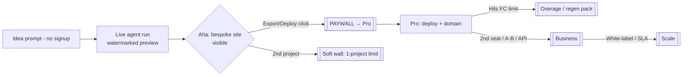

- **Top of funnel is free and instant** — full generation runs *before* signup; the watermarked, non-exportable preview is the hook. Cost of a free run (~$7.50) is the CAC; gated export/deploy is where it converts.
- **Hard walls:** export, deploy, custom domain, watermark removal. **Soft walls:** project count, concurrency, FC depletion (in-product "add credits" nudge, never a hard stop mid-run — finish the run, then bill).

### 6. Expansion revenue (NRR levers)

- **Usage expansion:** overage FC + regen packs (the natural SaaS metered tail).
- **Seat expansion:** Business is per-seat → agencies grow seats as accounts grow.
- **Per-site hosting MRR:** every deployed site is recurring $9/mo — converts one-time generation into an annuity and is the biggest NRR driver.
- **Tier climb:** A/B variants → API → white-label → SLA each map to a discrete upgrade. Target **NRR >120%** driven by hosting annuity + overage, with agencies (Business/Scale) as the >130% cohort.


